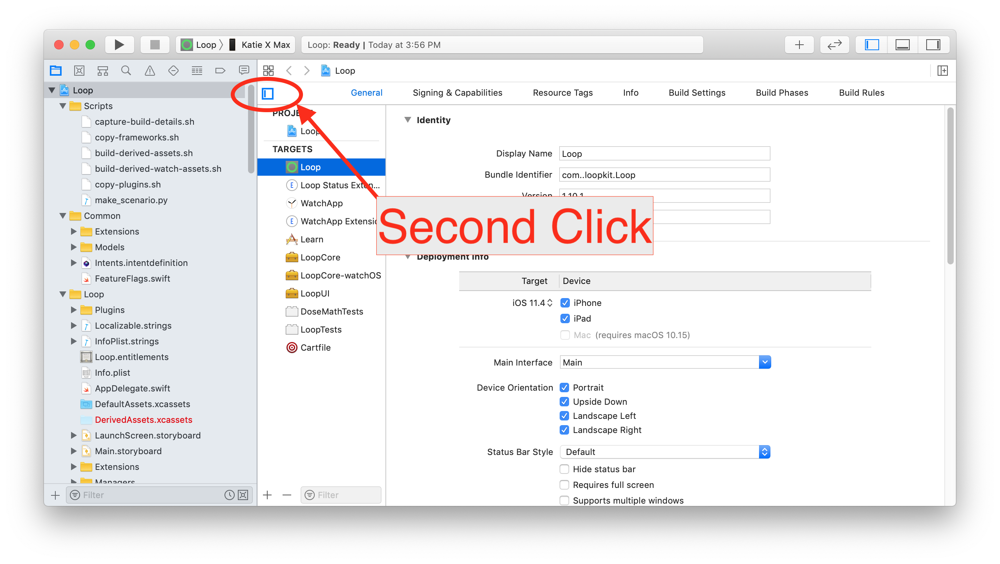
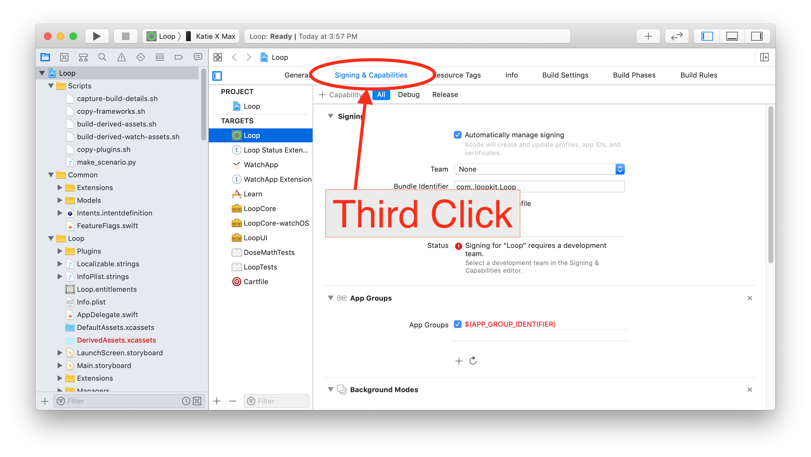
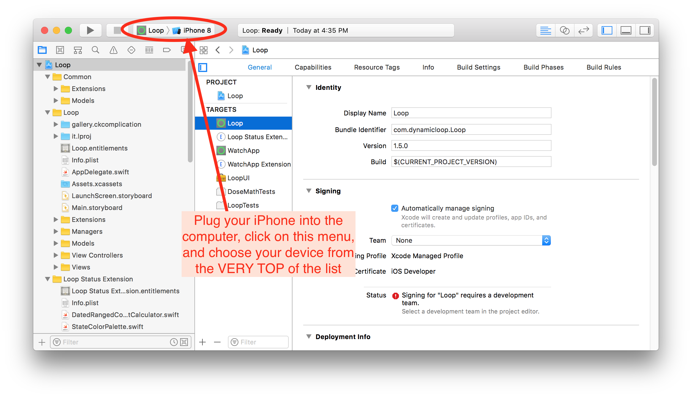
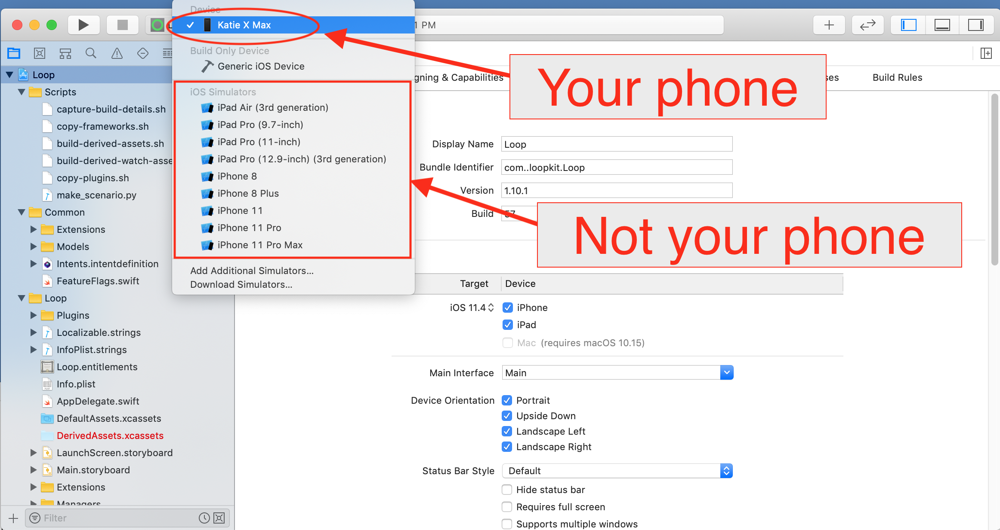
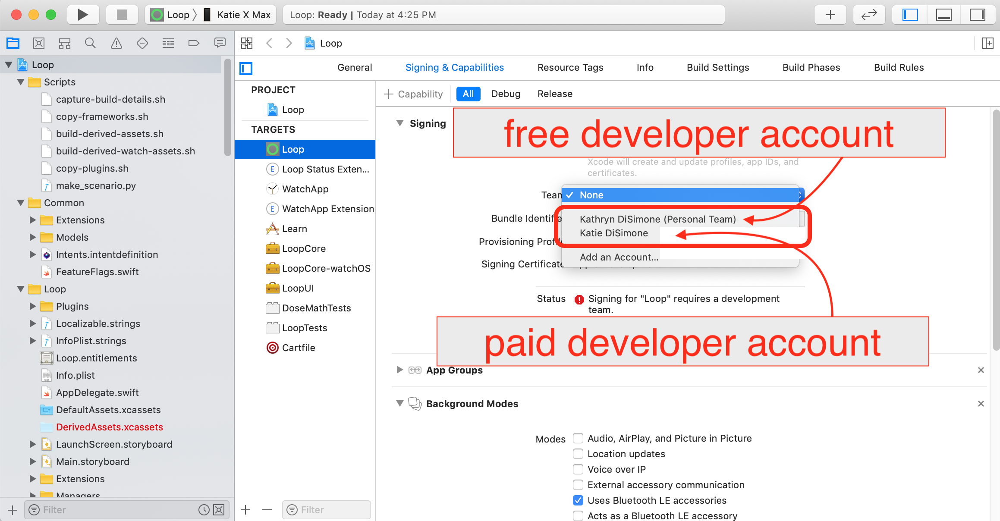
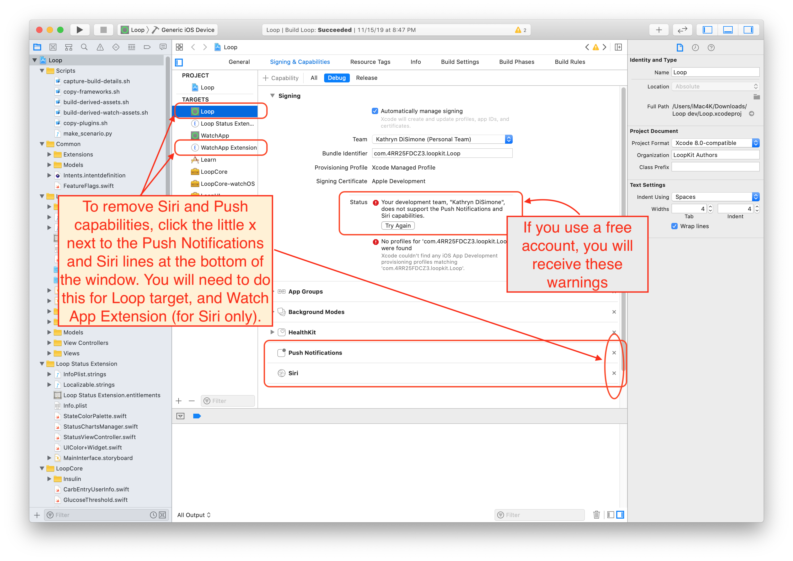
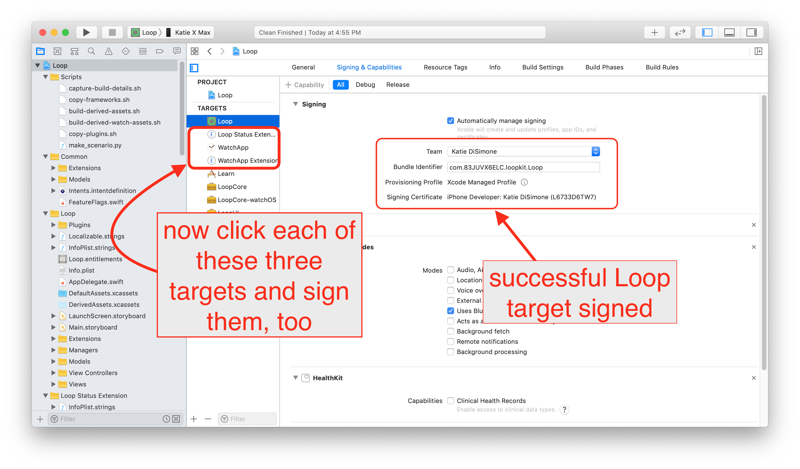
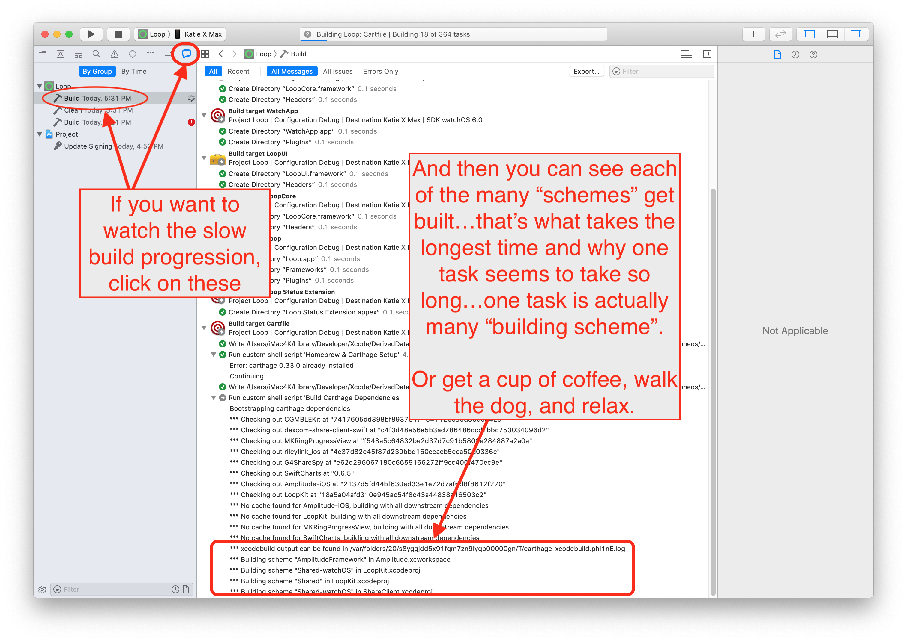
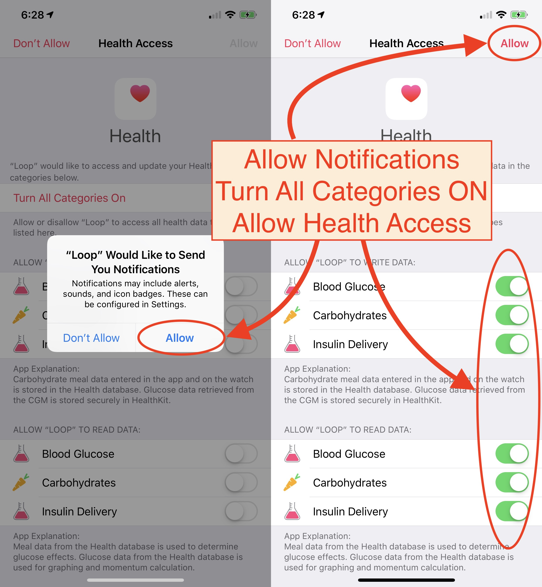

# Step 14: Build Loop app

!!!danger "Time Estimate"
    - 60-80 minutes if first time builder
    - 10-15 minutes if a repeat builder

!!!info "Summary"
    - Open the Loop code you downloaded in [Step 13](step13.md)
    - Connect the phone to the computer
    - Set the phone to not lock for awhile
    - Trust the computer (on the phone)
    - Select your phone from the device list
    - Register the device
    - Sign the 4 targets
    - Press the build button
    - Enter computer password four times during the build (if this is your first ever build)
    - Watch in awe as you just built your very own Loop app

!!!warning "FAQs"
    - **"I got a build error! YIKES...what do I do?"** Check out the [Build Errors](build_errors.md) page for all the solutions you'd need.
    - **"The build seems to take a long time, is that normal?"** Yes, the first build of a new download will take quite a long time. Just be patient...one of the build steps to take *much* longer than all the others. The build process does always end in a success or failure message, so just wait it out until you see one of those displayed.

## Open Loop project in Xcode

Go to your Downloads folder, open your downloaded Loop code folder and double click on Loop.xcodeproj. If you downloaded dev branch, your folder would be named `Loop-dev` and similar for `Loop-master` download.

{width="750"}
{align="center"}

A warning may appear asking if you really want to open it, click Open. Xcode will get itself organized, this may take a few minutes.  

{width="450"}
{align="center"}

Once Xcode has finished indexing, the Loop project's various folders and files will appear in the far left column. We are now going to make three important sets of clicks:

1. First click: At the very top of all the folders and files listed, click on the blue "Loop". This will populate the middle part of the Xcode window with some information. **If a couple of little boxes appear saying "The folder “DerivedWatchAssets.xcassets” doesn’t exist."...just click the ok buttons and ignore those. They will come up a couple of times during your build if you are using dev branch right now...don't worry, won't be a problem.**

    {width="550"}
{align="center"}

2. Second (set of) clicks: Now click on the box in the middle screen to reveal the targets column underneath that box. The four targets we will sign in the upcoming steps are now easily viewable. Now also click on the Loop target like shown in the screenshot below. It will be highlighted in blue to let you know it is selected. Loop, Loop Status Extension, Watch App, and WatchApp Extension are the targets we are interested in later.

    {width="550"}
{align="center"}

3. Third Click: With the Loop target selected, click on the "Signing & Capabilities" up near the top of the screen. After you click on that, you should see a "Signing" section occupying the bulk of your middle window. If you are missing the "Signing & Capabilities" section and didn't have to click somewhere else to see that part...that means you have missed updating to Xcode 11 from an older version of Xcode. Please go back and update Xcode now. Thanks.

{width="550"}
{align="center"}

## Connect your iPhone to Computer

Connect your iPhone via cable to the computer, select your iPhone from the very top of the drop-down list.  Your **iPhone’s personal name** should be at the top of the list. Don't accidentally select the generic iOS simulators listed below your iPhone's name.  

!!!info "Helpful Tips"

    - If your iPhone has a lock enabled, Xcode will not be able to install Loop app once your phone locks during the build progress.  Please temporarily disable the lock until you finish building Loop app.  Go to your iPhone Settings >> Display & Brightness >> Auto-Lock and set it to `Never`.  You can reset your lock once Loop is done building onto the phone. If you can't or don't want to set the auto-lock to never, then please remember to tap your phone screen periodically during the build process later to keep it "awake".
    - If this is the first time your iPhone has been plugged into this computer, you will need to open the iPhone and select "Trust this Computer" before your device will be useable in the menu selection.

!!!danger "Most Common Mistake"

    - The most common mistake in this step is not selecting your actual phone as shown in the second screenshot below. The default list is just a name of general phone models under a subheading called "iOS Simulators"...don't be fooled by those. Your ACTUAL phone will be up above that list of all the various simulator phone models.  You may need to scroll to the top of the list in order to see it.  Make sure you select your actual phone, not just a simulator phone model.

{width="750"}
{align="center"}

{width="650"}
{align="center"}

## Sign Four Targets

Once you select your device (your iPhone's name), we are ready to start signing the four targets. We will start with the Loop target, the first one on the target list.  Under the "Signing" area, ensure that you have "All" selected near the top and then select the dropdown menu where it currently says "none". Choose your team that you'd like to sign with. If you select a team name with (personal team), your app will expire after 7 days. If you select a team name without that (personal team), your app will last a full year.  If you never signed up for a free developer account, you will not have a (personal team) showing. Make sure you keep the "automatically manage signing" box checked above the team selection area.

{width="750"}
{align="center"}

Once you choose your signing team, Xcode will automatically generate provisioning profiles and signing certificates.  If this is the first time you are building on this iPhone with this developer account, you may be prompted to register the device.  Simply click on the "Register Device" button to confirm.

{width="750"}
{align="center"}

!!!danger "Free Developer Account Users: READ ME"

    If you are using a free developer account to sign your targets, you will need to do an extra step. As a free developer, you are restricted from building apps that have Siri or push notification capabilities built-in. Loop has both of these capabilities...so you will need to disable them before proceeding on with signing and building your app. The push notification capability is used for setting remote overrides; disabling it will not affect regular notifications (like ones for Loop not looping). Click on the small x next to the Siri and push notification lines located at the bottom of your Signing & Capabilities page. You need to do this in both the Loop and WatchApp Extension targets.

    {width="750"}
{align="center"}

A successfully signed target will have a provisioning profile and signing certificate similar to the screenshot below.  Click on each of the three remaining targets, and repeat the signing steps by choosing the same team name as you selected in the first target.

{width="750"}
{align="center"}

## Code Customizations

**New Loop users**: Customizations are not a required part of any Loop build. As you gain experience in how you use your Loop app, you may want to customize some of the features. You can always update your Loop app to add customizations at a later time. Really though, building with the standard, the default installation is JUST FINE.

If you want any custom configurations to your Loop or Loop Apple Watch apps, now is the time to make them before you finish with the last step of Loop installation on your iPhone. Follow the step-by-step instructions on the [Code Customizations](code_customization.md) page. If you are a person familiar with Apple's Swift language, feel free to make your own customizations as well.

When you've finished your customizations, come on back to this section and continue on with the rest of the build.

## Pair your Apple Watch

**New Apple Watch users**: If you have an unopened Apple watch and want to use it with Loop, first pair the watch with the iPhone before continuing to the next steps.  If you get a new watch after building the Loop app, you'll need to redo your Loop build. (Don't worry, it's as easy as pressing play on your saved Loop project.)

**Existing Apple Watch users**: Please update your watchOS prior to building the Loop app.  The current version of Loop requires watchOS 4.1 or newer.

## INTERMISSION

STOP STOP STOP

You guys...this is about safety.

People keep ignoring this advice and I'm frankly a little stumped as to why. So, I'm moving this advice up in the process so that you don't ignore it.

!!!warning "DO NOT WING THE SETUP"

    I have warnings all over these instructions to **continue to use these docs to finish setting up your app after it builds. DO NOT IGNORE THAT ADVICE. DO NOT ENTER ONE LOOP APP SETTING WITHOUT HAVING THE DOCS OPEN AND FOLLOWING ALONG AT THE SAME TIME.**

The section in these docs called "Set up App" (See it? Look for it now...at the top of your webpage) needs to be used to input all the settings in your Loop app when it is done building. READ ALONG WITH THE DOCS to enter those settings. There are important safety tips and advice in there. And then after you finish setup, you need to read the "Operate" section...like BEFORE YOU OPERATE LOOP. Don't bolus for a meal, or enter a meal, until you've read through the Operate section.

I'm worried you will fail to heed the advice about using the setup and operate sections. People have ignored it before. They skim read and think that's good enough. DO NOT BE LIKE THAT. Read each section.

BUT, to mitigate the inevitable people who will ignore that advice....here's the two most important safety tips that I feel obliged to present out of order because (damn it), people will ignore my advice still.

!!!warning "TOP TWO SAFETY MISTAKES YOU SHOULD AVOID"
    1. DO NOT ENTER SETTINGS YOU ARE UNSURE OF. If you don't know your settings or know what the terms mean, stop. Read the docs, all the settings entries are explained there. Ask your endo if you don't have established values for those settings. Don't just guess an ISF, carb ratio, basal rate, or maximum delivery limits.

    2. DO NOT ENTER ACCIDENTAL DUPLICATE CARB ENTRIES. When you enter a meal in Loop and press the `save` button...those carbs are saved. Let me repeat: THOSE CARBS ARE SAVED...even if you cancel the bolus for them. This is an automated insulin delivery system and if it thinks you have carbs on board, it will try to give you appropriate insulin for those carbs. Most common new user mistake: enters a meal, saves the carbs, has a change of heart or gets confused, and cancels the bolus screen...thinking they've just canceled the entire meal entry. Then they enter in a new carb entry. AND NOW, when you go to bolus...you'll be bolusing for the meal you wanted AND the meal you are mistakenly thinking you had "canceled". You didn't cancel that carb entry though, you had only canceled the bolus...you didn't "unsave" the carbs. If you make a mistake or change your mind on a carb entry after you pressed save, then tap the green carb chart in Loop's main display and edit or delete that entry. **CANCELING A BOLUS DOES NOT CANCEL THE CARB ENTRY THAT GOT YOU THERE. You must delete or edit a saved carb entry if you no longer want Loop to provide insulin for it.**

Ok, so now that I've got your attention, you can continue on with the last step in building you app...but remember, we just pinky swore that you would use the setup and operate sections to finish this all? Don't break my heart, keep your promise.

## Build Loop

Have you signed the four targets? Are you all done with any customizations? Has your Apple watch been paired and updated? Is your iPhone unlocked and plugged into the computer?

Let’s finish the installation of the Loop app onto your iPhone. Double-check to make sure your iPhone's name is still selected and then press the “build” button to start Xcode on its way.

{width="750"}
{align="center"}

You’ll see the progression of the build in the status window (top middle of Xcode). New builds can take about 40-60 minutes depending on the speed of the computer and the internet.  **Just be patient.**  The progress will get "stuck" on one step/task for a very long time, and then the others will fly by when that one slow step is done. Not every step is equal in duration. Do not give up on the build. **Xcode will ALWAYS tell you eventually that the build either succeeded or failed via a short (self-disappearing) pop-up message on the computer display. If you miss the message, you can look at the top of the Xcode window to see a "Running Loop..." (success) or "Build Failed" (failure) message where the step progress was previously counting down.**

!!!danger "Are you the impatient type?"

    If you just simply can't bear the uncertainty of not seeing that things are progressing, you can take a peek "under the hood" and watch the individual build steps by clicking on the report navigator icon and then the build row at the top of the list. You can watch the slow list of scheme building while you wait.
    
    {width="650"}
{align="center"}

!!!info "First-time builders"

    Be aware though! Sometime during your first ever build on a computer, be ready for a codesign/keychain access prompt that you will see part-way through the build process.

    
    {width="350"}
{align="center"}
    

    This prompt above, when you see it, requires you to enter your computer password and then select "Always Allow". Normal behavior, this prompt will come up four times in a row even after you enter the correct password. In frustration, people think the prompt must be broken because it keeps reappearing and then people will press deny or cancel. **Don't press deny.** Keep entering your computer password and pressing the "Always Allow" button...as many times as it takes (four times to be exact; one for each target that Xcode is saving the password for). After four times of successful password entry, the build will keep proceeding.

!!!warning "While I have you here..."

    While I have you here, I'm going to give you a piece of Loop troubleshooting advice for once you start looping. This is a little out of order, but too many people miss this super simple **troubleshooting step when their Loop turns red**. Try turning your RileyLink off/on at its physical switch on the side of the case. Carrying a paperclip on the keychain can help you access that recessed switch. The other useful troubleshooting step is to simply close the Loop app (upswipe in iPhone app selector) and reopen it. Wait 5 minutes after each of these steps and see if your issue resolves. It usually will. Don't forget to do these two simple steps to get back to a green loop.  For more red loop troubleshooting, you can check out [this page](../troubleshooting/yellow-red-loop.md).
    
    Also, be aware that there's a **troubleshooting page for Pod pairing** issues, too. If you run into any issues during Pod pairing, PLEASE make sure to read [this page](../troubleshooting/pod-pairing.md) to save yourself from wasting Pods unnecessarily.
    
    Ok, back to the building instructions.

## Build Finished

!!!info "First time building on a new device?"

    If this is the first time you have installed an app on your iPhone using your developer account, you may get a warning like below after a successful build. Don't worry, Loop usually installed just fine on the phone but needs you to do an extra step on the phone before Loop app can open. Just follow the directions shown in the warning for what you need to do on your iPhone. Go to Settings->General->Device Management (or profiles, Profiles & Device Management on newer iOS) and enable trust for your Developer Account. If you are missing the Device Management/Profiles option in your iPhone settings, then head over to [this Build Error section](build_errors.md#device-management-could-not-launch-loop) to find the solution.
    
    {width="750"}
{align="center"}

!!!danger "BUILD SUCCEEDED"

    Congrats! If the build is successful, you'll see the message or "Running Loop..." across the top of the Xcode window. Your brand new Loop app will have a screen open immediately on the iPhone asking about allowing Loop notifications and Health App access. `Allow` Loop to send you notifications. In the next screen that follows that, click on the `Turn All Categories On` line and then click `Allow` in the upper right corner.

    
    {width="450"}
{align="center"}

    **You can unplug your phone from the computer now.** And like we promised earlier, you will use the [Setup App section of this website](../operation/overview.md) to keep proceeding safely.

!!!warning "FAQ: But what about those yellow alerts that remain in Xcode? Should I worry about them?"

    If you see yellow alerts after your build is done...those are not an issue. Whether your build succeeded or failed...the yellow warnings play no role in either outcome. Don't try to resolve them or fret about them. They mean nothing to the successful use of your Loop app.
    
    {width="750"}
{align="center"}

!!!danger "BUILD FAILED"

    Don't despair. Build failures are pretty easily fixed. If you get a message that your build failed and see **RED ERROR** messages, just go to the [Build Errors](build_errors.md) page to find the steps to fix your build error based on the message displayed.

    
    {width="750"}
{align="center"}

## Summary

If your build failed, you need to proceed to the [Build Errors](build_errors.md) page to find the solution. Please head there to find the help you need.

If no build errors, you're done building your Loop app...

## Next steps

Remember your promise though? You still owe me that you will use the [`Setup App`](../operation/overview.md) section of this website now to keep proceeding safely.
