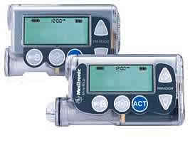
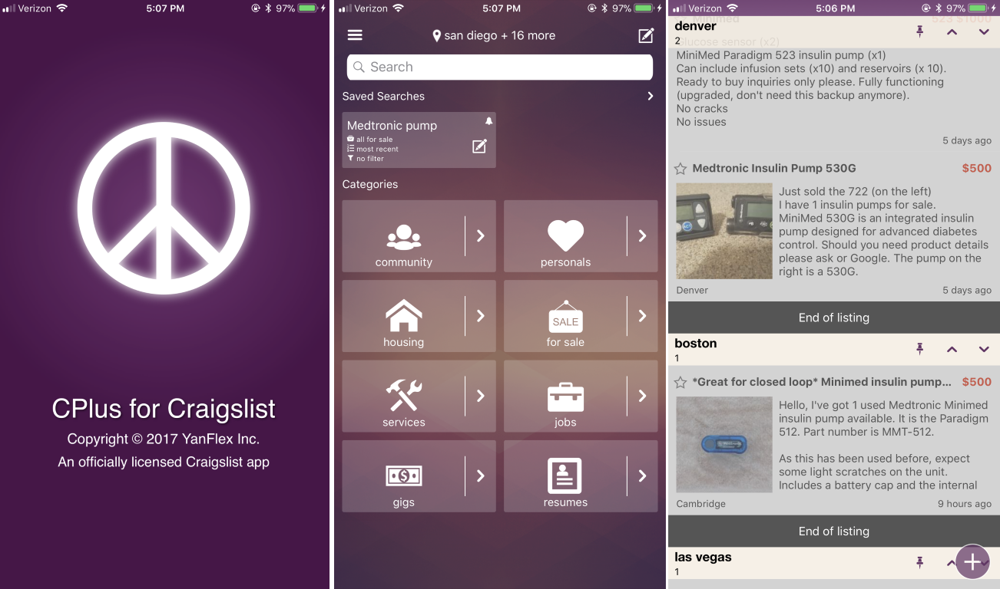
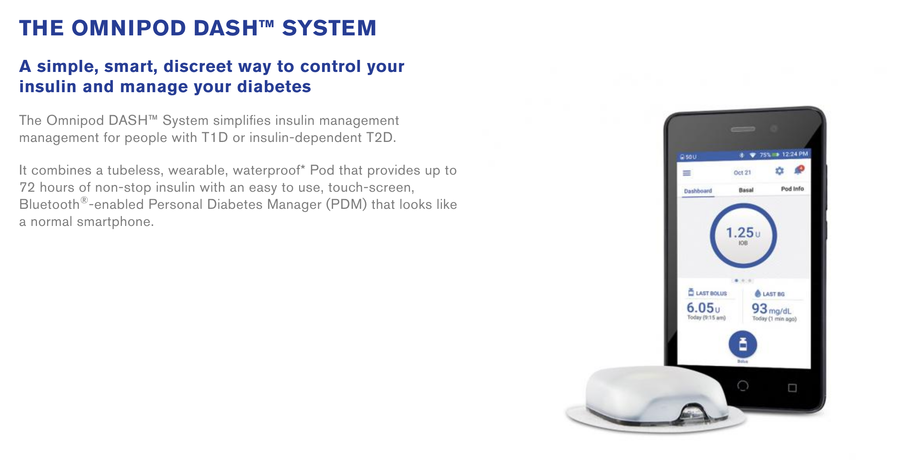

# Step 3: Compatible Pump

!!!danger "Time Estimate"
    - Omnipod users: 3 seconds to remember which PDM you've been using.
    - Medtronic users: 10 minutes to put a battery in and look at model and firmware
    - Other pump users: 5 days to email friends asking them to check closets for their old Medtronic pump or call your insurance to start prior authorization for Omnipod

!!!info "Summary"
    - If you have a big clunky PDM with built-in BG meter...you can use your pods for Loop.
    - If you have a slim touch screen android-looking PDM...you can NOT use your pods for Loop.
    - If you have a Medtronic, check the list to ensure compatible model/firmware.

!!!warning "FAQs"
    - **"How can I find a compatible Medtronic pump?"** That question is answered in the Extra Details section below.
    - **"What are the differences between Medtronic pump models?"** This question is also answered in the Extra Details section below.
    - **"But what about the other types of pumps?"** Too bad, so sad...unless it is a DanaRS, DanaR, Accu-Chek Insight, Accu-Chek Combo. If you have one of those pumps, you could check out [AndroidAPS looping system](https://androidaps.readthedocs.io/en/latest/index.html) instead of Loop. If you have a Medtronic 512 or 712, you could check out [OpenAPS](https://openaps.readthedocs.io/en/latest/) as that system supports the 512 and 712 models in addition to the other Loop-compatible Medtronic pumps. Neither of those systems currently support Omnipod for looping.
    - **"Can I change the firmware of my Medtronic pump?"** Do you work at Medtronic with insider access to the secret tools and firmware versions to do that? Might lose your job, but I'd bet you could do it then. We don't have access to that though.

## Check pump version

This is a pretty simple step...check that you have a compatible pump to use Loop:

* Medtronic 515 or 715 (any firmware)
* Medtronic 522 or 722 (any firmware)
* Medtronic 523 or 723 (firmware 2.4 or lower)
* Medtronic Worldwide Veo 554 or 754 (firmware 2.6A or lower)
* Medtronic Canadian/Australian Veo 554 or 754 (firmware 2.7A or lower)
* Omnipod "Eros" pods

If you have one of the pumps listed above, you are good to go on Loop! Congrats!

## Extra Details on Medtronic

There are a number of Medtronic insulin pumps manufactured between 2006 – 2012 which are Loop compatible.  Compatibility has two requirements; (1) pump model and (2) firmware.

### Medtronic Pump Model

To determine your pump model, look at the backside of your pump.  There should be a sticker on the underside of the pump.  On the right-hand side of the sticker, it says REF MMT-XXXXXX

!!!note ""

    - MMT ---> Pump Manufacturer Model (MiniMed Medtronic)
    - 722 ---> Pump Model Number
    - NA ---> Pump Region (NA=North America, CA=Canada/Australia, WW=Worldwide)
    - S ---> Pump Color (S=Smoke, L=Clear/Lucite, B=Blue, P=Pink/Purple)

Some pumps may have an “L” or “S” or "R" before the pump region, e.g. a model number like MMT-722LNAS.  This does not affect Loop compatibility.

### Medtronic Pump Firmware

A pump’s firmware is the internal software that runs your pump.  Older Medtronic firmware allows Loop to act as a “remote control” to set temp basals and report back pump data.  Newer firmware disabled that “remote control” access and therefore cannot be used with these DIY closed-loop systems.  There is currently no ability to downgrade a pump’s firmware or replace it with older firmware.  Before you buy a used pump, make sure you are getting one with compatible firmware.

!!!note ""

    The firmware on all 515/715 and 522/722 model Medtronic pumps are all compatible with Loop. You will only need to check the firmware version for 523/723 and 554/754 model Medtronic pumps.

    + Medtronic 515 or 715 --> any firmware
    + Medtronic 522 or 722  --> any firmware
    + Medtronic 523 or 723 --> firmware 2.4 or lower
    + Medtronic Worldwide Veo 554 or 754 --> firmware 2.6A or lower
    + Medtronic Canadian/Australian Veo 554 or 754 --> firmware 2.7A or lower

To find your pump’s firmware you will need to power it on. If the pump has not been powered on for some time (i.e., has been in storage without a battery for a while), it will run through a start-up count and the firmware version will appear on the bottom right of the pump’s screen.  Don’t turn away, as the version number will only be displayed for a little while before the screen moves onto other information displays.  

If the pump has been active recently or has a reservoir installed, follow these steps:

1. Press the {width="40"} button on your pump.  

2. Scroll down with the {width="40"} button to the bottom of the status display.  

3. Read the bottom line of the display.

### Medtronic Pump Differences

If you are in the position of being able to shop around for different pump models, there are some slight differences between the Loop-compatible Medtronic pumps.

**500 vs 700**:  The difference between the Medtronic 500 series and the 700 series pumps is the size of the insulin reservoirs.  The 500 series pumps use a 180 unit reservoir, and the 700 series pumps use a 300 unit reservoir (or smaller 180 unit reservoir, if you want).

**x15/x22 vs x23/x54**:  The difference between the x15 and x22 pumps versus the x23 and x54 series pumps has only a few notable mentions:

* The x23/x54 pumps will allow for smaller insulin deliveries in certain situations, if the smaller scroll rate is selected in the Bolus>Setup>Scroll Rate menu.  **Loop will have the insulin delivery automatically rounded by the pump to the units available in the pump model, and any smaller adjustments (to make up for the rounding) will be made through Loop’s use of temp basals.  If you want the smaller increments of basal rates, you can still enter those values in Loop app's settings and Loop will use those values for the purposes of insulin delivery calculations.**

|Pump Model  |Basal increments  |Bolus increments  |Range  |
|---------|---------|---------|---------|
|515/715 and 522/722     |  0.05 0.1       |    0.1 0.1     | deliveries of less than 10 units greater than 10 units        |
|523/723 and 554/754     |  0.025 0.05 0.1       |   0.025  0.05  0.1      | between 0.025 to 0.975 units between 1 to 9.95 units greater than 10 units        |

* Additionally, because of the way Loop fetches information from the pump, the x23/x54 series of pumps are slightly better at conserving battery life through the use of the MySentry packets to collect information from the pump.  x22 pumps do not use MySentry.

* The x23/x54 series pumps are also faster at delivering boluses greater than 10 units.  On an x23 pump, a 13-unit bolus takes 5:00 minutes to complete.  On an x22 pump, a 13-unit bolus takes 8:40 minutes to complete.

### Finding a Medtronic pump

Finding a compatible Medtronic pump is probably the most difficult part for most new Loopers.  Our suggestion:

* Talk to friends in the diabetic community.

* Ask your endocrinologist.  

* Ask at a local JDRF chapter meeting if someone has an old backup pump they'd be willing to donate to you.  

* Join diabetic supply groups on Facebook; both for-trade and for-sale groups.  

* Check Craigslist often and be willing to expand your search area to include larger cities.

* Check out the **HelpAround, NextDoor, OfferUp, and/or LetGo** apps for pumps.

* Search [Medwow](http://medwow.com) for used Medtronic pumps.

Medwow has been fairly frustrating for most people; poor response rate and high prices.  The most success appears to come from either one-on-one discussions with fellow diabetics/doctors or using apps (Craigslist, NextDoor, LetGo, HelpAround).  If you are using Craigslist, you may wish to use an app on your iPhone to make the searching easier.  There are apps to search multiple cities at once for your keywords and set up alerts.

### Safe Purchasing

If you choose to purchase from a remote or unknown seller, here are some tips for safe purchasing:

* Use PayPal and purchase using the "Goods and Services" payment option. This costs nothing for the buyer, but the seller will lose 2.95% of the sale to PayPal fees. PayPal offers some protection for both buyer and seller in the event of fraud.  

* Ask for photos of the pump. Check to make sure the serial number of the pump on the backside matches the serial number of the pump showing in the display menu. Ask for a short video of the pump, or at least a photo of the pump turned on, so that you can see the pump's firmware and model number. Cracks and some wear on these pumps are expected. These pumps are not usually free of marks. Many people are successfully looping on pumps that have cracks and rub marks, but you may want to ask if you are concerned about any you see in photos.

* Beware if the bottom of the reservoir/motor sleeve has the drive support cap pushed out, as shown [here](/troubleshooting/pump-errors/#motor-error). Those pumps will generally not work (or only work intermittently), however some people have successfully repaired those pumps as shown in that link. Just be aware that it should be checked in advance.

* Repairs to cracks or missing bits of plastic on battery cap area and reservoir caps are possible and not very difficult in most situations. You can read more about how to repair those [here](/troubleshooting/pump-errors/#crackmissing-piece-repairs).

* Ask for shipping that includes a tracking number. USPS Priority Mail's smallest box is a great option.  It's only $7.20 domestically in the US and includes tracking. Ask the seller to add a small bit of packing protection such as bubble wrap around the pump to keep it safe during shipping. Make sure you get a tracking number within a reasonable period of time after you have paid.  

Red flags that may indicate a scam:

* Asking for payment through "friends and family" on PayPal, especially if you don't know the person or have any solid references for them. Paying in that way offers you no buyer protection. It's just like giving the seller cash, so you had better trust the seller.  

* Offering an "almost new" pump is a big red flag. These pumps should be at least 5-years-old by now. Do you really think a 5 year old pump should be unused and sitting in shrink wrap at this point? This seems highly suspicious. There are some out there, but they are very infrequent.  

* Not able to provide new pictures of the pump when requested. Sure they posted some pictures with the ad, but what if they just downloaded them from other people's ads? The seller should be able to furnish a couple of "new" photos at your request. A good one to ask for is the battery and reservoir tops so you can see the condition of those.

### Pump Supplies

Medtronic will not typically sell pump supplies directly to customers who have not previously purchased a registered Medtronic pump. Ask your insurance about purchasing pump supplies through a durable medical equipment (DME) provider. Typically, the DME provider will coordinate with your insurance and doctor's office to get the necessary insurance approval and prescriptions for the supplies. If you are brand new to Medtronic infusion sites, you may want to ask for help from friends to try a variety of infusion sets before purchasing a full 90-day supply of any type in particular.

## Extra Details on Omnipods

!!!warning "Reminder and Disclaimer"

    Through the work of the DIY community, Insulet's Omnipod (Eros) system is now Loop compatible. Using Eros pods with Loop is not supported by Insulet. Do not call Insulet asking for help with your Loop build, setup, or operation. This project is not FDA-approved and you are using this project under your own responsibility and risk. Please read these documents and familiarize yourself with Loop before using. 

### Eros - Loop will work with these pods

Eros pods were launched in 2013 and continue to be sold by Insulet. As far as we know, there have been no plans or timelines announced for the discontinuation of Eros pods for existing customers. Insulet doesn't specifically call these "Eros" anymore, they just use the term "omnipod system". For clarity, from [Insulet's webpage](https://www.myomnipod.com/about):

Eros system has that PDM we all recognize from the last several years.

{width="750"}
{align="center"}

### DASH - Loop will not work with DASH pods

Insulet has announced their DASH system as an eventual replacement for Eros/Omnipod System. There has already been a limited release of DASH to a select group of users, with a wider public rollout of DASH expected in 2019. The DASH system has the newer, slimmer locked-android PDM and built-in BLE communications in POD. Loop will not be compatible with the DASH system.

{width="750"}
{align="center"}

## Next Step: Compatible CGM

Now you are ready to move onto Step 4 to check if you have a [Compatible CGM](step4.md).
