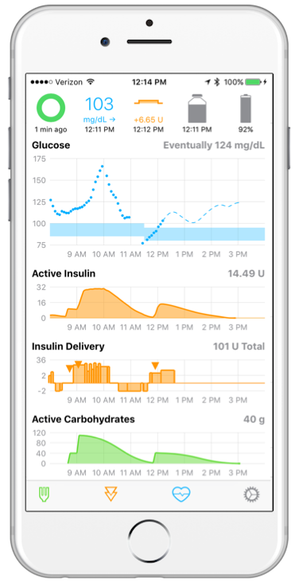
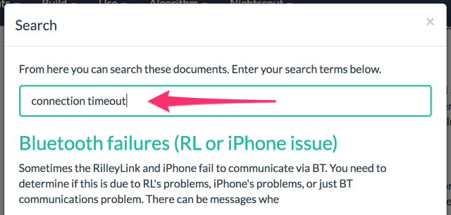

# Welcome to Loop

## Introduction

[Loop](https://github.com/LoopKit/Loop) is an app template for building an automated insulin delivery system. It is a stone resting on the boulders of work done by many others.  
The app is built on top of [LoopKit](https://github.com/LoopKit/LoopKit). LoopKit is a set of frameworks that provide data storage, retrieval, and calculation, as well as boilerplate view controllers used in Loop.

!!!warning "Important"
    Please understand that this project:

    - Is highly experimental
    - Is not approved for therapy

      **You take full responsibility for building and running this system and do so at your own risk.**

Using the open-source Loop app template, you can build an insulin delivery system that uses specific commercial and open-source hardware and software technologies to bring together the insulin pump, continuous glucose monitor (CGM), and insulin dosing algorithm to create a continuous insulin basal dosing “Loop”.  This Loop predicts future glucose based on basal-rate schedules, carbohydrate intake, insulin on board, and current CGM readings.  These glucose forecasts provide Loop with the information needed to recommend a temporary basal rate to attain a targeted glucose range in the future.  The system can either operate as an “open-loop” by making recommendations to the user for their approval before enacting or as a “closed-loop” by automatically setting the recommended temporary basal rate.
You should undertake this project in stages. For example, first “open loop” to familiarize yourself with Loop’s operation. Also, investigate the code to ensure you understand what it is recommending and why. Then when you progress to “closed-loop”, do so safely by starting with appropriate safety limits and only progress to higher limits after several days of no lows. Please ask questions at this point about why Loop is making the recommendations it does.  It should be similar to the therapy decisions you would make yourself.  If the recommendations it makes are different than you would make, try to figure out why.

## Development History

Loop has been developed as an open-source, shared project.  For a really interesting read about the history of Loop development, check out this [History of Loop and LoopKit](https://medium.com/@loudnate/the-history-of-loop-and-loopkit-59b3caf13805) post, written by Loop developer Nate Racklyeft.  The project continues to be a labor-of-love by a community of users; maintained and improved by volunteers.

## How to Use These Docs

* Use the navigation menu at the top of the screen to find the info you are looking for.
* A Table of Contents for the current page is always displayed on the left side of the screen.
* You can search the Loop Docs site by clicking the  icon.

## Stay in the Loop!

[Sign up for the Loop Users announcement list](https://groups.google.com/forum/#!forum/loop-ios-users) to stay informed of critical issues that may arise.
Join the Zulipchat at [https://loop.zulipchat.com](https://loop.zulipchat.com)
There is also a [Looped Facebook Group](https://www.facebook.com/groups/TheLoopedGroup/?fref=nf) that you might wish to join for support.  When you request to join the group, please remember to check your messages box on facebook and respond to the message.

## Contribute

Please consider submitting any updates and improvements to the documentation that you want to share by submitting a Pull Request to the [loopdocs repo](https://github.com/LoopKit/loopdocs). For more information on how to contribute to an open-source project, this [How to Contribute to Open Source](https://opensource.guide/how-to-contribute/) guide may be useful. Also, please review the Loop [LICENSE](https://github.com/LoopKit/Loop/blob/master/LICENSE.md) and Loop [CODE_OF_CONDUCT](https://github.com/LoopKit/Loop/blob/master/CODE_OF_CONDUCT.md).
