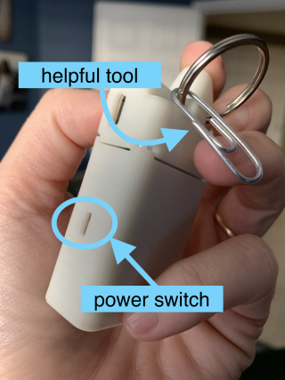
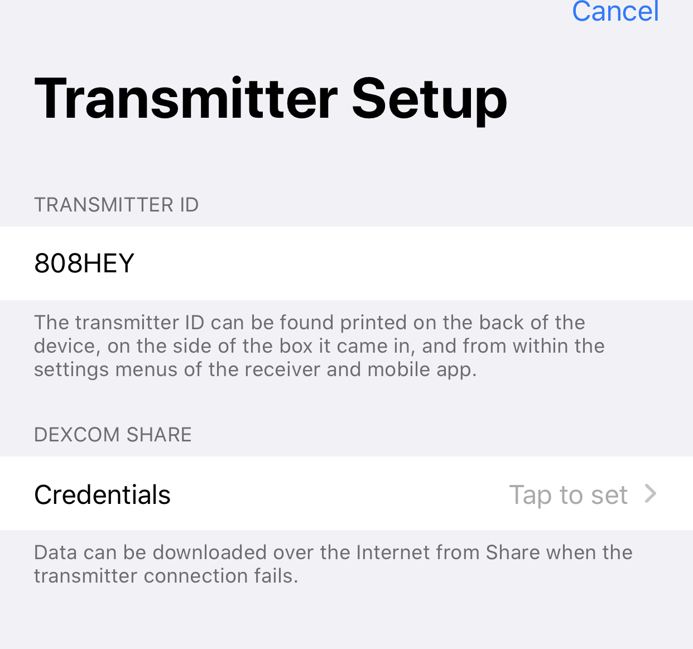

# Red Loops

Let's divide this page up into two parts. The first part deals with individual red loops. Like it just happened and you want to solve it. The second part will deal with situations where you are repeatedly having red loops "more often" than you think is "normal" (both of those of course are subjective terms).

## Resolving a Red Loop

So you are here for help with getting your Loop green again? It's red and not working? Wondering what is happening? You can click on the red loop icon to read an error message that you may or may not understand. If you understand it, great...that should help you fix the problem. If you don't understand it, then there are two options to fix the red loop; the first is quick and easy, the second is more in-depth. Let's look at both.

Quick side note: Do not quickly decide to pull an omnipod that isn't responding and has a red loop. Usually the issue is that the RileyLink needs a reset as described below in Option 1, rather than the pod needing to be changed. If you don't fix the RileyLink's problem first, the problem will likely carry forward to the new pod pairing attempt and you'll get a bunch of problems pairing the new pod because the RileyLink still isn't working. So, please try getting the RileyLink working properly before deciding to ditch a pod because of a red loop.

### Option 1: Easy Steps

!!!danger ""

    You don't care what the heck is causing the issue, you just want to get on with life as quickly as possible? Ok, fair enough, then do the following:

    * Turn your RileyLink off/on at its physical power switch located on the side of the RileyLink. Use a small pointy object to carefully move the slider away from the charging port and then back up towards the charging port. A paperclip on the keyring can provide the help you need to reach the switch in the recessed case, and double as a [screaming pod silencer tool](../../faqs/omnipod-faqs/#what-do-you-do-to-stop-a-screaming-pod).
    * Close your Loop app (upswiping it in the iPhone's app selector) and reopen it.
    
    
    
     

    That's pretty much all you need to do for option 1 to restore a green Loop within 5 minutes, 99% of the time. You can confirm things are back to working order by seeing a green loop again and/or issuing a "test command" or "button press" successfully through the RileyLink menu.

### Option 2: Look for Cause

!!!info ""

    So if Option 1 didn't work to fix your problem...next you'll need to look a little deeper. There can be a variety of causes for why Option 1 did not work to restore your Loop's function, so you'll need to sort out the root cause. There are a few basic categories:

    1. RileyLink is broken
    2. CGM values are not being collected by Loop
    3. Pump is not responding

## RileyLink is broken

How can you tell if your RileyLink has a problem? The answer is mostly within the LED lights that display on the board.

**Red light**: comes on during charging and will turn off/on periodically, while still plugged in, after charge is complete.

**Green light**: Indicates an active BT connection with the phone. You want the green light to stay on all the time on the RileyLink. If the green light is not on, then make sure your iPhone's bluetooth is still switched on.

**Blue light**: The blue light will flash off/on periodically when the RileyLink and pump are actively communicating...it should NOT be always on. If your blue light is stuck on, that is an indication of a problem on the board. Try looking for signs of damage or debris that may be causing a short on the board. Clean the board with rubbing alcohol [(unplug the battery first](https://youtu.be/s2qNPLpfwww)). If you still can't get the blue light off, then contact GetRileyLink about getting a new RileyLink.

## CGM Values are not being collected by Loop

### New transmitter

If you recently changed a transmitter, you need to also update your Loop settings to reflect the new transmitter ID. Go to the CGM section of Loop settings and `Delete CGM` (it's a button on the bottom of that page). Then use the `Add CGM` in Loop settings to include the new transmitter ID.

### Firefly-style transmitter

If you have not updated your Loop app since late July 2019 and use Dexcom G6, you will need to update your Loop app to continue to be able to loop without internet connection. In July 2019, we started to see a new style of Dexcom G6 transmittters on the market. These new transmitters required a rework of some of the Loop's code to continue to "spy" on the transmitter. Without the update, your Loop will not get CGM data unless it is pulling from Share servers (which is not a recommended mode of operation). So, update your Loop app if you have a new transmitter type and haven't updated since July 2019.

### Delete Share account

Finally, we see a lot of errors reported because people have problems with their Share server information in Loop app. **Please delete your Share account information from within Loop settings.** In other words, the credentials portion of the Share account info, as shown in the screenshot below, should say `Tap to Set` and not have your account info. It is unnecessary to have this portion filled out as local, non-internet spying of a transmitter is the preferred CGM source anyways. In fact, by leaving this information out, it will help you remember to change your transmitter ID when you change transmitters because CGM data won't appear in Loop. By not including Share account in Loop, you will prevent yourself from accidentally becoming internet dependent.

## Pump is not responding

The obvious fix is to make sure the RileyLink is not so far away from the pump or Pod that they cannot communicate. Assuming you've addressed this, then you can move on to other steps. For Pod Loopers, Option 1 almost always fixes this issue. For Medtronic Loopers, you will see some times where the pump is not responding and you may see "decoding" errors or various other messages about pump responses. For Medtronic users, try the following:

1. Change pump battery. Low pump battery will cause radio communications to fail.
2. Use the `Change Time` command in the RileyLink menu to update the pump's clock. If you've accidentally changed the pump's time in the pump itself, this will get the Loop app and pump back in sync.
3. If using a x23 or x54 pump, try deleting all the IDs under the "Other Devices" submenu in the pump's "Connect Devices" menu.  Then go to the RileyLink menu and use the MySentry pairing command to get a fresh ID issued. Follow the directions listed in the MySentry pairing command's screen to scan for devices. A fresh ID can help prevent recurring red loops for x23 and x54 users, particularly if they started to occur after a recent Loop update.
4. Make sure the following are checked in the pump:
    * Your pump cannot be suspended.  Resume insulin deliveries.
    * Temp basal type must be set to unit/hour, not percent, in pump's Basal menu.

## Resolving Frequent Red Loops

Here's some things to check if you have frequent red loops:

* Have you [cleaned your mLab database in Nightscout](../nightscout/mlab_cleanup/) recently? If your database gets backlogged (or Nightscout otherwise isn't working properly), Loop can get clogged up with a bunch of unfinished Nightscout uploads. This clogged condition can cause red loops. So, make sure you are periodically checking your mLab and cleaning it. Try deleting your Nightscout account from Loop settings and see if your Loop stops having red loops. If it does, then you'll need to assess what's going wrong in your Nightscout site and fix it. Most of the time that is your mLab database cleanup needing to be done.

* Is your [RileyLink battery plugged in all the way](../build/step5.md#assemble-rileylink) on the board?

* Has your RL been fully charged? Try charging your RL for an hour or two, make sure the red light comes on while charging. Try a new charger.

* Oddly, some people have found that turning off Siri integrations for Loop and Dexcom apps in your iPhone settings has helped. I don't know if this is coincidental or an actual help yet, but I'll mention it here.

* Check for sources of wireless interference. If you have a certain environment that seems to have more drops than others, it is likely that there is a source of wireless communication interfering with your Loop. Lots of Medtronic Loopers in a room together will often interfere with each other and get "cross-talk" red loop error messages. If it is a bedroom at night causing problems, try moving other wireless devices such as routers or baby monitors farther away from where you and your RileyLink are.

## Posting for Help

Before you post on Looped group for help with a red loop, please make sure you've tried Option 1 and have restarted your RileyLink and Loop app.

Before you post for help, please also check your mLab and Nightscout status. This step is often overlooked and yet solves a lot of problems.

When posting for help, include two screenshots of Loop's main screen; one with the red loop's error message and the other just the plain Loop main screen. Include a detailed description of what you have tried doing from the troubleshooting list above. For example, state if you've double checked the transmitter ID, deleted the Share account info from Loop settings, and updated your Loop app since July 19, 2019 so that we can rule out some of the causes of CGM issues.
