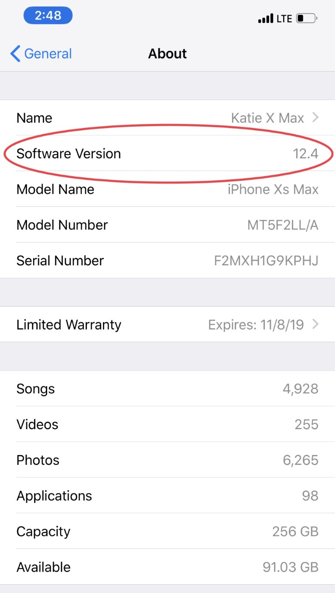

# Trin 2: Kompatibel iPhone eller iPod touch

!!!danger "Tidsestimat"
    - 5 minutter, hvis allerede har iOS 12.4 eller nyere
    - 20 minutter, hvis det er nødvendigt at opdatere din kompatible enhed til iOS 12.4 eller nyere
    - 10 minutter, hvis du har brug for at bestille en enhed fra Apples hjemmeside
    - 0 minutter, hvis du ejer en Android og ikke vil købe Apple-produkter... det er fint, også.

!!!info "Resume"
    - Tjek din iOS-version og sørg for at du har 12,4 minimum.
    - Brug ikke nogen af beta- macOS-versionerne. (Bare rolig ... hvis du ikke ved, hvad det betyder, så er du ikke bruger en.)
    - Hvis du bruger Dexcom CGM, din Looping iPhone / iPod touch skal Dexcom app installeret på den for at Loop uden en internetforbindelse.

!!!warning "FAQs"
    - **"Kan jeg bruge en android?"** Nej.
    - **"Men hvorfor ikke?"** Fordi Loop er skrevet i Apples Swift-sprog, som ikke kompilerer til Android-operativsystemer.  Loop er også afhængig af Apple Health, og Android har ikke en passende native tilsvarende.
    - **"Kan jeg bruge en iPad?"** Nej. iPads understøtter ikke Apple Health, og det er en vigtig del af Loop's funktioner.
    - **"Does my iPhone need cell plan?"** No. Loop will work without an internet connection...however you will not have Dexcom Follow data or Nightscout data if you choose to use a device that doesn't have an internet connection. In other words Loop will work, but remotely watching followers won't see Looping data unless the Loop device has an internet connection.

## Which Devices are compatible? Why those?

Why is Loop limited to just iPhones and iPod touches? Why can't you use an iPad? Because Loop uses the Apple Health app to store and retrieve your blood glucose, carbohydrate, and insulin data records. iPads do not have the Apple Health app, so those devices will not work with Loop. iPhones and iPod touches have the Apple Health app, so they will work with Loop.

The next compatibility check is that we need a minimum version of the operating software, called the phone's "iOS", on those iPhones and iPod touches. Loop is compatible with iPhone and iPod touch devices with iOS 12.4 or newer. Therefore, the compatible devices include:

- iPhone 11, 11 Pro, 11 Pro Max

- iPhone X, XS, XR, XS Max

- iPhone 8, 8+

- iPhone 7, 7+

- iPhone 6s, 6s+

- iPhone SE

- iPod Touch, 7th generation

## Devices that will be incompatible "soon"

- iPhone 5s, 6, 6+

- iPod Touch, 6th generation

Apple has decided that those models have lived their useful life and can no longer be be updated past iOS 12.4. They've reached the end of their "apple supported" update life cycle. Apple released iOS 13 and iOS 14 in the recent past and those models cannot be updated to use them. This does not pose a problem currently...you can still build Loop's master branch so long as your device has iOS 12.4 at a minimum. HOWEVER, there are upcoming Loop changes that will require users to have iOS 13 on their devices to build Loop onto the device. There is no set timeframe for when that minimum requirement will be changed.  We will make an announcement when it does and the docs will be updated here.

Side note for people who are seasoned Loop users and know about branches and such: Currently (as of October 2020), Loop's dev branch requires devices to have iOS 13 or newer. There's no set timeframe for when dev will next be merged into master.

## Find your device's iOS

Your phone's iOS version can be found under the Settings app, General, About as shown below.

## Next Step: Compatible Pump

Now you are ready to move onto Step 3 to check if you have a [Compatible pump](step3.md).
