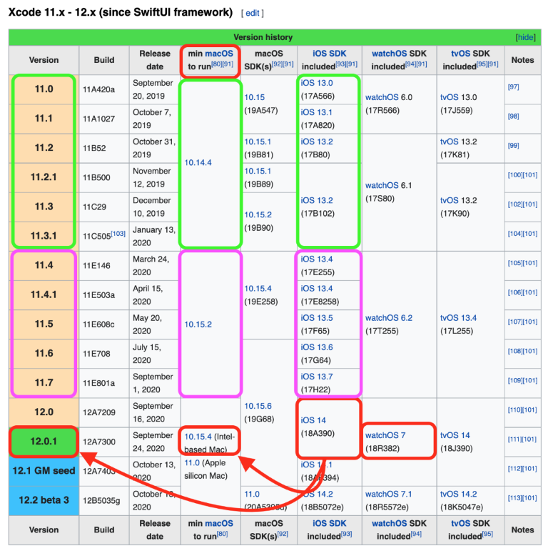
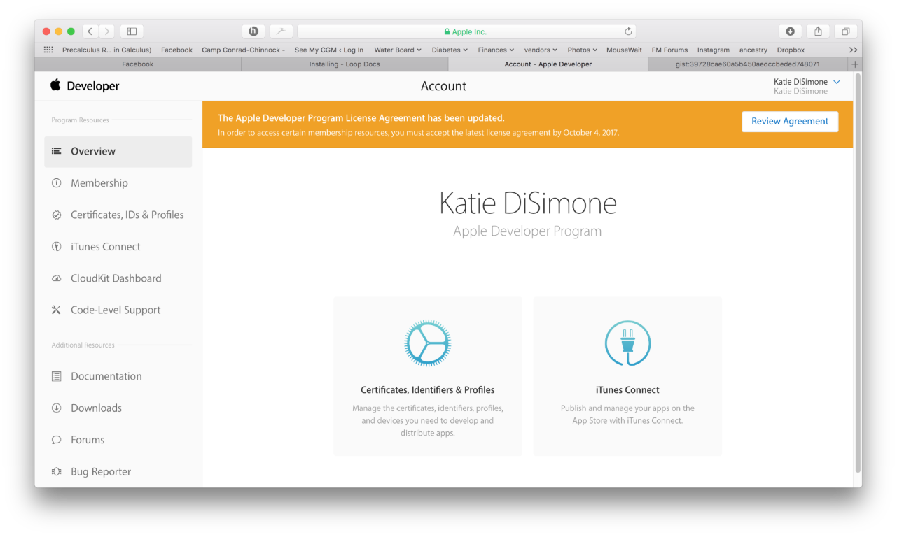
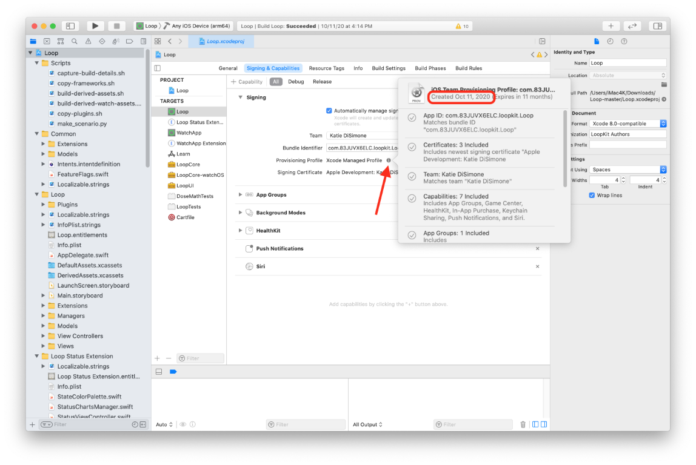
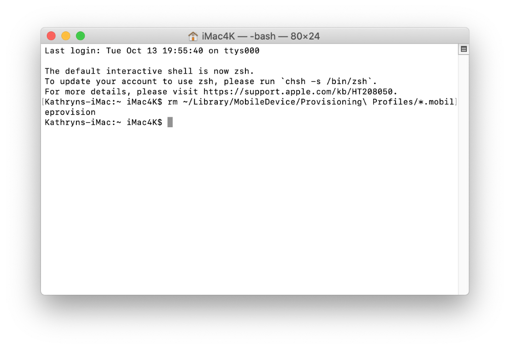
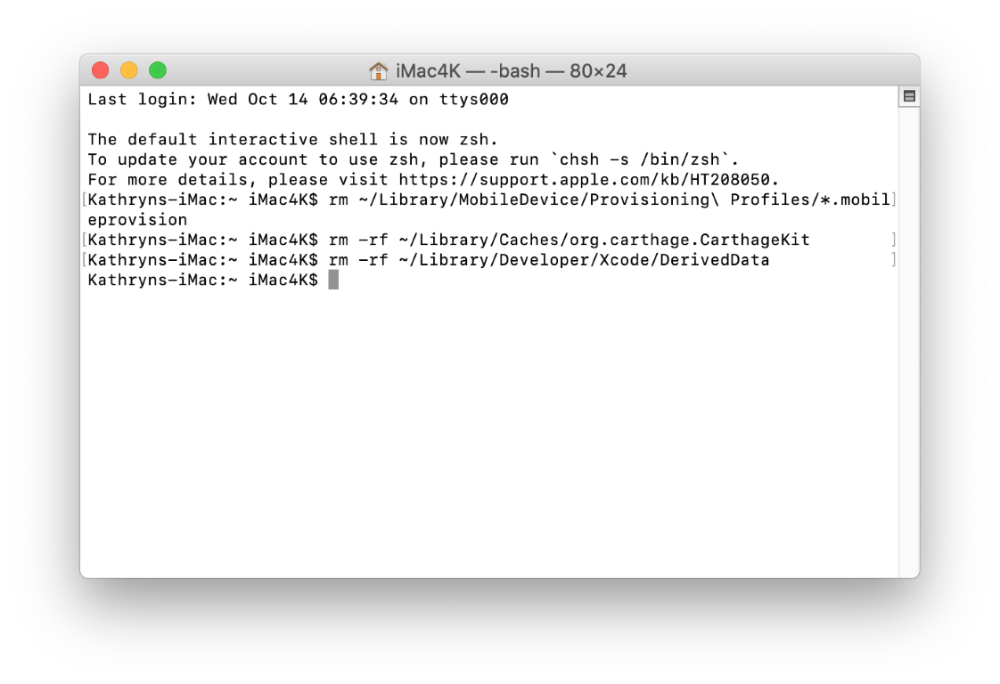

# Updating Loop

!!!danger "Time Estimate"

    - 25 minutes, if already have updates done
    - 40-90 minutes, if need to install Apple update(s)

!!!info "Summary"

    1. Update macOS, Xcode, iOS, and/or watchOS
    2. Download updated Loop code
    3. Open in Xcode, sign targets
    4. Add optional code customizations
    5. Build onto your iPhone
    6. Resolve Build Errors

!!!warning "FAQs"

    - **"What is an update?"** Anytime you want to change branches (i.e., go from omnipod-testing to dev branch), change customizations, or grab updates to the same branch you built with before...that is an "update" of your Loop app.
    - **"Do I delete my old Loop app first?"** Definitely not! If you keep your Loop app on your phone, your Loop settings (and existing pod) will continue to work the same after the update. Seamless.
    - **"Do I need to start a new pod when I update?"** No. Your existing pod session will continue seamlessly if you are using the same Developer Account to sign the Loop app targets as you did the last time you built.
    - **"What if I'm using a new/different developer account?"** If you aren't building with the same developer account as your existing app was built with (this includes going from free to paid), then you will be installing a brand new (second) Loop app on your phone. Your existing pod won't work with the new app, so you might want to time this transition when you are due to change pods. Delete the old app once you get the new one all set up.
    - **"What if it is a new computer but the same developer account?"** No big deal...you just want to make sure the computer has Homebrew installed already and you've added your developer account to Xcode preferences.

## When to Update Loop

You will have to rebuild your Loop app at a minimum once every 12 months. The apps built and signed by you in Xcode with a paid developer account will only last for 12 months before they expire and need rebuilding. So, at least once per year you will have to rebuild your app and go through this update process.

Under ordinary circumstances, you do not *have to* update your Loop app until you are ready to grab new features. However, we encourage regular updates when a new version is released because they often contain bug fixes or improvements which may increase operational stability.

## Step 1: Install macOS and Xcode updates

!!!warning "Update to macOS (10.15.4 minimum currently for iOS 14)"

    Between Loop app builds, there's a high likelihood that Apple has updated one or more of the systems involved in your Loop app. If you miss macOS or Xcode updates, you may run into build problems. For example, the newest iOS 14.1 on your phone requires the newest Xcode version to properly build Loop.  In order to get that update, you need to be running macOS 10.15.4 at a minimum. Check for macOS updates and install as needed.

!!!danger "Update to Xcode (12.1 minimum currently for iOS 14.1)"

    Now that you have updated your macOS, you should have the ability to see the most recent version of Xcode (12.1 is the latest release) in the App Store on your computer. **UPDATE TO XCODE 12.1 BEFORE UPDATING YOUR LOOP APP. ** Phones running iOS 14.1 will not be able to have Loop installed using older Xcode versions.

!!!info "Restart computer after updating Xcode"

        Make sure to restart your computer after updating Xcode. There's a known issue that happens often enough to be frustrating if you don't reboot. Either a build error about missing simulators or a "device not connected" (even when phone is connected). Just restart computer. It's easy enough. It's not always required...but this is a good easy ounce of problem prevention.

If you think you are immune from needing to update and want to skip this Step 1...I HIGHLY recommend actually checking this chart to make sure your macOS and Xcode meet their minimums based on your device's iOS before proceeding.  I cannot emphasize how many people try to build without meeting the minimum versions because they ASSUME they are ok.

## Step 2: Check your Developer Account

Apple updates its License Agreement for the Developer Program frequently. You need to login to your [developer account](https://developer.apple.com/account/) to manually check if there is a new agreeement to accept.  If you see a big red or orange banner across the top of your Developer Account announcing a new license agreement like shown below...please read and accept it before building Loop.

## Step 3: Download Updated Loop Code

After you've finished the updates to your devices listed above, you can move onto downloading updated Loop code. You will not be simply using your old downloaded Loop code (and in fact, you can delete those old folders now if you want). Click on **ONE** of the links below to download an updated version of the Loop code. If you aren't a developer or debugging, stick to Master branch.  Click on ONE of the links below to download Loop code...hint hint...**click on the Master branch for 99% of users**.

[Loop: Master branch](https://github.com/LoopKit/Loop/archive/master.zip)

---

[Dev branch---in very rough shape right now, please only build if developer interested in debugging](https://github.com/LoopKit/Loop/archive/dev.zip)

[Automatic-bolus branch---do your research before using as well, if you are asking what it is then you haven't researched enough yet](https://github.com/LoopKit/Loop/archive/automatic-bolus.zip)

---

## Step 4a: Delete old provisioning profiles

This is a new step in the updating process. Everyone should do this step every time they rebuild or update their Loop apps now. Older versions of Xcode used to automatically create a "provisioning profile" as part of your Loop building process. That provisioning profile, among other things, sets the expiration date for your app. If you sign with a paid team, that profile is set to expire in 12 months. If you sign with a free team, that profile is set to expire in 7 days.

You can always check the expiration date at the time of building your loop app by clicking the little "i" icon next the "Provisioning Profile" line in the target signing area. Add 12 months to the "created" date (paid account), or 7 days (free account), and you'll have your app's date of future spontaneous death.

Here's what started happening about a year ago with Xcode 11...the provisioning profiles weren't updating "created" date with new builds. Instead, Xcode was simply using the old profile's "created" date. This change has resulted in many people's apps expiring (and therefore dying suddenly) despite having updated/rebuilt within less than 12 months ago and having current developer accounts (either manually renewed or automatically renewed, doesn't matter).

To solve this new issue...we have an easy solution. Honest...easy. You can do this. Once you follow the steps in the orange box below, Xcode will have no memory of the old provisioning profiles and will be forced to create a brand new one with the next Loop build. Therefore, you'll get a brand spanking new "created" date that will match the build date.  Simple and straight-forward. (Leave Terminal app open to do Step 4b afterwards too.)

!!!warning "How to delete old provisioning profiles"
    - Find your Terminal app (the same one you used to install Homebrew in Step 7 of the build process if you forgot how to find it).
    - Open your Terminal app.
    - Copy and paste the line in the little grey box below into the Terminal prompt. Press enter after you paste it.

    `rm ~/Library/MobileDevice/Provisioning\ Profiles/*.mobileprovision`   You won't see anything special after you enter the command...your Terminal screen should look as boring as shown below when successful.

    

## Step 4b: Clean cache and dervied data

An ounce of prevention is worth a pound of cure.  Since we already have Terminal app open, let's prevent one of the possible sources of build errors in advance by cleaning out straggler data from previous Loop builds.

!!!danger "Clean cache and derived data"

    Using Terminal app that should still be open from Step 4a just now,   
    1. Copy and paste this command and press return: `rm -rf ~/Library/Caches/org.carthage.CarthageKit` Note: you won't see any message back if the command runs successfully.  
    2. Copy and paste this command and press return: `rm -rf ~/Library/Developer/Xcode/DerivedData` Note: you won't see any message back if the command runs successfully.
      You won't see anything special after you enter the commands...your Terminal screen should look as boring as it did in the previous step 4a.
    
    

## Step 5: Build like normal

From here, go straight to [Step 14 Build Loop app](step14.md) and do just like you did the first time. Open the new Loop code that you just downloaded a couple steps above, plug in the phone, select your phone, sign four targets, code customizations (if wanted), and then build button. Easy peasy.

!!!info "Double check expiration date"

    If you want to make sure that step 4 above (deleting the provisioning profiles) went well...go ahead and check the "created" date on your provisioning profile after you sign your Loop target for this rebuild. It should have the current date as the "created" date and your Loop app will safely function for 12 more months (for paid accounts) so long as you keep your developer account paid/automatically renewed.

Note: If this is a computer that hasn't built Loop before, you would want to make sure to do the [Build Step 7: install Homebrew](step7.md) before trying to build Loop using that computer.

## Step 6: Check Build Errors page if needed

!!!danger "CHECK BUILD ERRORS PAGE"

    If you get a build error...still check the [Build Errors page](build_errors.md). Because even if your exact error isn't there...the information you NEED to provide when asking for help is listed out on that page. And that information is critical. CRITICAL to be able to troubleshoot your build error.
