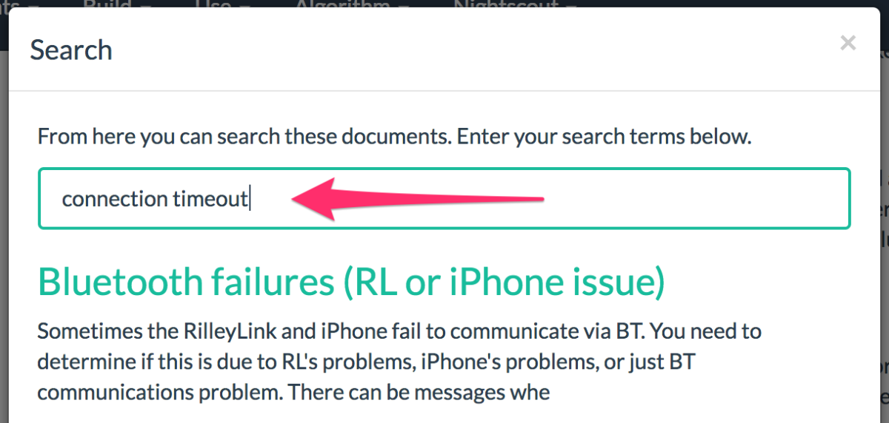

# Velkommen til Loop

 

## Introduktion

[Loop](https://github.com/LoopKit/Loop) er en app-skabelon til opbygning af et automatiseret insulinleveringssystem.   LoopKit er et sæt af rammer, der leverer datalagring, hentning og beregning samt standardvisninger, der bruges i Loop. !!!warning "Vigtigt" Forstå venligst: dette projekt: - Er yderst eksperimentel - Er ikke godkendt til terapi **Du tager det fulde ansvar for at opbygge og køre dette system og gør det på egen risiko.**

Ved hjælp af open source Loop-appskabelonen kan du opbygge et insulinleveringssystem, der bruger specifikke kommercielle og open source-hardware- og softwareteknologier til at samle insulinpumpen, kontinuerlig glukosemonitor (CGM) og insulindoseringsalgoritmen for at skabe en kontinuerlig levering af insulin.  Dette "Loop" forudsiger fremtidig glukose baseret på basalrater, kulhydratindtag, aktiv insulin, og aktuelle CGM-aflæsninger.  Disse glukose prognoser giver Loop de oplysninger, der er nødvendige for at anbefale en midlertidig basalrate for at opnå det ønskede blodsukkerniveau.  Systemet kan enten fungere som en »åben loop« ved at vise anbefalinger til brugeren som skal godkendes eller som en »lukket loop« ved automatisk at indstille den anbefalede midlertidige basale rate. Du bør gennemføre dette projekt i etaper. For eksempel, først “open loop” til at gøre dig bekendt med hvordan Loop virker. Også, undersøge koden for at sikre, at du forstår, hvad det anbefaler og hvorfor. Når du går videre til “lukket-loop”, gøre det sikkert ved at starte med passende sikkerhedsgrænser og kun gå videre til højere grænser efter flere dage uden lavt blodsukker. Stil spørgsmål på nuværende tidspunkt om, hvorfor Loop kommer med anbefalingerne.  Det bør svare til de beslutninger du selv ville træffe.  Hvis Loop kommer med anbefalinger, som er anderledes, end du selv ville gøre, så prøv at finde ud af hvorfor.

## Udviklings Historik

Loop er udviklet som et open source, delt projekt.  For en virkelig interessant artikel om historien bag Loop udvikling, Tjek denne [Historie af Loop og LoopKit](https://medium.com/@loudnate/the-history-of-loop-and-loopkit-59b3caf13805) indlæg, skrevet af Loop udvikler Nate Racklyeft.  Projektet fortsætter med at være et arbejde i et fællesskab af brugere; vedligeholdt og forbedret af frivillige.

## Sådan bruges disse dokumenter

* Er meget eksperimentel
* En indholdsfortegnelse for den aktuelle side vises altid på venstre side af skærmen.
* Du kan søge på Loop Docs-webstedet ved at klikke på  ikonet. 

## Hold dig orienteret!

[Tilmeld dig til Loop-annoncering](https://groups.google.com/forum/#!forum/loop-ios-users) for at holde dig orienteret om kritiske problemer, der måtte opstå. Deltag i Zulipchat på [https://loop.zulipchat.com](https://loop.zulipchat.com) Der er også en [Looped Facebook Group](https://www.facebook.com/groups/TheLoopedGroup/?fref=nf) som du måske ønsker at deltage i til support.  Når du anmoder om at deltage i gruppen, skal du huske at tjekke dine beskeder boks på facebook og svare på meddelelsen.

## Bidrag

Overvej venligst at indsende opdateringer og forbedringer til den dokumentation, du ønsker at dele, ved at indsende en Pull Request til [loopdocs repo](https://github.com/LoopKit/loopdocs). For mere information om, hvordan man bidrager til et open source-projekt, kan denne [Sådan bidrager du til Open Source](https://opensource.guide/how-to-contribute/) guide være nyttig. Læs også Loop [LICENSE](https://github.com/LoopKit/Loop/blob/master/LICENSE.md) og Loop [CODE_OF_CONDUCT](https://github.com/LoopKit/Loop/blob/master/CODE_OF_CONDUCT.md).
