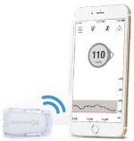

# Schritt 4 Kompatible CGM

!!!Gefahr "Geschätzte Zeit"

    - 10 Minuten um diese Seite zu lesen

!!! Info "Zusammenfassung"

    - Du verwendest einen Dexcom G4, G5 oder G6 CGM System... damit kannst du Loop benutzen.
    - Du verwendest einen Medtronic-Sensor, der mit einer Loop-kompatiblen Medtronic Insulinpumpe arbeitet...damit kannst du Loop benutzen.
    - Du hast einen Eversense Sensor...dann kannst du Loop leider nicht benutzen.
    - Du verwendest einen Libre Sensor... dieser arbeitet nur mit einer modifizierten Loop App.

!!!warning "FAQs"

    - **"Was ist mit Libre Sensoren?"** Libre Sensoren sind nicht konzipiert, um als kontinuierliche Glukosemonitore zu dienen. Die Verwendung von Libre Sensoren zur kontinuierliche Glukoseüberwachung benötigt zwingend den Einsatz von Anwendungen Dritter (Xdrip oder Spike) und von Lesegeräten (BluCon oder Miao Miao). Bisher haben wir noch nicht genug Daten gesehen, die ausreichende Sicherheitsvorkehrungen von diesen Lesegeräten (und den zugehörigen Apps) demonstrieren, um diese in den Programmcode von Loop zu integrieren. Wenn du einen Libre-Sensor verwendest, musst du einen "nicht Hauptzweig" von Loop verwenden, den jemand (oder du selbst) geändert hat, um die Verwendung mit diesen Sensoren/Apps zu ermöglichen.
    - **"Was ist mit Eversense?"** Die Eversense App integriert sich weder in Apple Health, noch wurden die Kommunikationsprotokolle von Eversense rekonstruiert, daher ist Eversense derzeit nicht mit Loop kompatibel.

Ein kontinuierlich messender Glukosesensor (CGM, engl. für continuous glucose monitor) versorgt Loop mit aktuellen Blutzuckerwerten. Mit Hilfe diese Messwerte kann Loop den aktuellen Glukosetrend vorhersagen und, basierend auf den Kohlenhydrateinträgen und deinen Loop-Einstellungen, auch zukünftige Blutzuckerwerte vorhersagen. Im Folgenden werden die Typen von CGMs, die mit Loop kompatibel sind genannt. CGM-Messungen sind zwingend erforderlicher, damit du Loop benutzen kannst. Wenn deine Loop-App keine BG-Daten abrufen kann, kann Loop auch keinen Glukosetrend oder Blutglukosewerte vorhersagen und wird dann auf die programmierte Basalrate zurückfallen.

## Dexcom G5 und G6 CGM 

Bei einem Dexcom G5 und G6 Sensor empfängt die Dexcom App auf deinem iPhone die CGM-Daten direkt über Bluetooth. Keines dieser Systeme erfordert die Verwendung des eigenständigen Empfängers (PDM), aber damit Loop funktioniert, musst du die Dexcom-App laufen haben.

## Dexcom G4 CGM mit Empfänger 

Das Dexcom G4 PLATINUM System überträgt CGM Daten vom Sender an einen Dexcom G4 PLATINUM Receiver. The receiver, in turn, connects to the Dexcom Share2 app on your iPhone via Bluetooth. The Share2 app uploads CGM data to the Dexcom servers. For Loop to function, you will need the Dexcom app running.

## Medtronic CGM 

The Minimed Enlite CGM, available with the Medtronic 522/722, 523/723, and 554/754, wirelessly sends blood glucose readings to the pump. Loop can read the Medtronic CGM data directly from the pump using the RileyLink.

## Offline-Nutzung

Offline use means using Loop when there is no cell data or internet available. Loop does not require any special setup to operate offline. You will not need to do anything special if you go camping or find yourself out in the wilderness. For offline Loop use, the iPhone's Bluetooth still needs to be active; and for Dexcom users, the Share2, G5, or G6 app also still needs to be open (but don't have to be actively "sharing" to the internet). If you put your iPhone into Airplane mode, remember to turn Bluetooth back on to keep your Loop running. If your offline use is failing, chances are you have forgotten to update your transmitter ID in Loop settings when you changed transmitters.

## Dexcom-Server

In some rare instances, the Loop may fail to eavesdrop on the Bluetooth transmissions of the CGM systems.  When that happens, the Loop can pull directly from Dexcom Servers to get the data (assuming you have entered your Share account information in the Loop settings and have Share turned on). When Loop is operating in this mode, you will see a small cloud in the CGM reading in the Loop app. Operating in this mode requires a working internet or cell connection.

## CGMs not natively supported in Loop

Libre (with BluCon or Miao Miao), Eversense, Medtronic Guardian sensors, etc.  Yes, there are other CGM systems available out there. Loop does not natively support those CGMs.  If you would like to use one of those alternate CGMs and Loop...you will need to look into third-party integrations to allow Loop to access the blood glucose data.  These docs do not cover the alternate methods of unsupported CGM systems or apps like Spike.

## Next Step: Order a RileyLink

Now you are ready to move onto Step 5 to [Order a RileyLink](step5.md).
