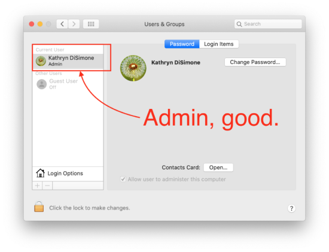
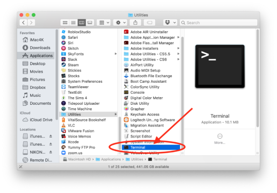
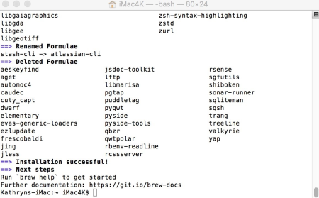

# Schritt 7: Installation von Homebrew

!!!danger "Geschätzte Zeit"

    - 10-15 Minuten vorausgesetzt, du kennst das Passwort deines Computers
    - 35 Minuten, wenn du dein Passwort nicht mehr weist und raten musst

!!!info "Zusammenfassung"

    - Installiere Homebrew einfach, indem du einen langen kauderwelsch Text in die Terminalanwendung kopierst und bestätigst.

!!!warning "FAQs"

    - **"Was passiert, wenn ich keine "Installation erfolgreich" Rückmeldung bekomme?"** Wenn du keine erfolgreiche Installationsnachricht siehst, probiere es bitte einfach noch einmal. Wenn du Homebrew nicht installiert hast, wird auch die Erstellung von Loop fehlschlagen. Diesen Schritt kannst du nicht überspringen. Die häufigste Fehlerursache ist das Nichtkopieren der ganzen -Codezeile ... Manchmal gelingt es den Leuten nicht, das letzte `"` am Ende der Zeile zu erwischen. Außerdem musst du ein Benutzerkonto auf dem Computer mit "Admin"-Rechten verwenden, da Homebrew ein Programm ist und auf dem Computer installiert wird.

Tief durchatmen... dieser Schritt sieht aus wie "Programmiercode". Ist es aber nicht. Na ja, ist es doch... aber wir kopieren einfach nur eine Zeile dieser Seltsamkeit, fügen sie ein und fertig. Wir müssen eigentlich nicht viel über Homebrew selbst wissen, oder was die Zeile Code genau bedeutet.

## Der Benutzer muss ein Admin-Konto auf dem Computer habem

Homebrew ist ein Programm, mit dem wir die benötigten Pakete installieren können, um Loop zu erstellen. Bevor wir Homebrew installieren, müssen wir eine Sache überprüfen... auf dem Computer, den du verwendest um Loop zu erstellen, ** das Benutzerkonto auf dem Computer muss Administratorrechten haben**. "Wie kannst du das herausfinden?" Gehe zur den Systemeinstellungen und öffne Benutzer & Gruppen. Wenn dein Konto, das du verwendest, nicht "Admin" unter deinem Namen anzeigt, dann musst du auf das kleine Schloss klicken und es zu einem Admin-Konto ändern, bevor du weitermachst. Wenn du einen Firmenrechner verwendest, hast du möglicherweise keine Administratorrechte... sei dir also bewusst, dass du auf firmeneigenen Computern möglicherweise Einschränkungen hast.

Bemerkung: Wenn du (1) ein erfahrener Computerbenutzer bist und (2) Homebrew bereits auf einem anderen Benutzerkonto auf dem Computer installiert hast...dann benutze bitte genau dieses Benutzerkonto, um Loop zu erstellen. Oder lösche Homebrew wieder von diesem Benutzerkonto und installiere es auf denem Konto. Homebrew ist da ein bisschen zimperlich.

## Homebrew installieren

Ok, da wir jetzt das Benutzerkonto bestätigt haben, öffne die Terminal-Anwendung auf deinem Computer. Es befindet sich in deinem "Programme" Ordner und dort im Unterordner "Dienstprogramme"... die Terminal-Anwendung ist im folgenden Screenshot zu sehen.

!!!info "Benutzer neuer Apple Computer mit M1 Chip: WICHTIGER SCHRITT"

    Wenn du einen der neuen Apple Computer mit einem M1-Chip gekauft hast, musst du jetzt noch einen kleinen extra Schritt machen. Homebrew läuft nicht nativ auf den neuen M1-Chips...daher müssen wir die Terminal App mittels der "Converter"-App "Rosetta" öffnen. Ganz einfach... finden die Terminal-App wie oben beschrieben und anstatt sie durch Doppelklick zu öffnen...möchte ich, dass du auf den Namen der Terminal App nur einmal klickst, so dass sie hervorgehoben wird. Klicke nun mit der rechten Maustaste auf den Namen der Terminal App, um weitere Optionen anzuzeigen. Thanks! You will want to select the "Get Info" option.  
    
    

    
    

    
    In dem Infofenster, das aufgeht...siehst du ein Kästchen wo "Öffnen mit Rosetta" steht.  Klicke das Kästchen an...dadurch wird die Terminal-Anwendung so geöffnet, dass wir in den nächsten Schritten Homebrew installieren können. Du kannst das Informationsfenster wieder schliessen, wenn du das Häckchen bei "Öffnen mit Rosetta" gesetzt hast und machst dann ganz normal mit dem Rest der Anleitung weiter.
    
    

    
    

Jetzt, wo du die Terminal-Anwendung im Dienstprogramme Ordner gefunden hast (und bereits Rosetta aktiviert hast, wenn du ein M1-Benutzer bist)...doppelklicke auf den Namen der Terminal-Anwendung , damit sie geöffnet wird. Die Terminal-App sieht wirklich sehr simple aus, wenn du sie geöffnet hast, das ist richtig so. Kopiere und füge die Zeile in aus dem kleinen grauen Feld unten hinter die Terminal Eingabeaufforderung ein.

 `/bin/bash -c "$(curl -fsSL https://raw.githubusercontent.com/Homebrew/install/HEAD/install.sh)"`

Dein Bildschirm sollte so aussehen, nachdem du es kopiert hast... wenn ja, dann mache weiter und bestätige mit der Eingabetaste, um mit dem Installationsbefehl fortzufahren.

Es wird eine Aufforderung angezeigt und gefragt, ob du fortfahren möchtest.  Bestätige wieder mit der Eingabetaste um fortzufahren, dann wirst du nach deinem Passwort gefragt.  **Das Passwort ist das Passwort deines Computers.**

!!!danger "Keine Panik"

    **Keine Panik, dass du nicht dass Passwort während der Eingabe sehen kannst. das ist richtig so. Die Terminal-App zeigt keine Tastatureingaben, wenn Passwörter eingeben werden, aber sie erfasst trotzdem deine Eingabe. If you think you messed up because you were confused, press the delete key a bunch of times and then start fresh with the password entry.

Warte, während das Skript läuft...du siehst den Fortschritt und dann wird es eine Weile pausieren. Am Schluss ist es erledigt und du siehst dann so etwas wie „Installation erfolgreich“ und dann wieder die Terminal Eingabeaufforderung.

!!!info "Wenn du eine Fehlerrückmeldung bekommst, dass "homebrew-core" ein "shallow clone" ist"

    musst den Anweisungen in der Fehlerbeschreibung folgen und deine Homebrew Installation mit folgendem Befehl aktualisieren:
    
    `git -C "/usr/local/Homebrew/Library/Taps/homebrew/homebrew-core" holen Sie --unselow`

## Carthage installieren

Zum Schluss müssen wir noch eine letzte Installation durchführen, von etwas namens "Carthage" (Karthago). Es unterstützt ein paar Schritte während der Erstellung von Loop. Technisch gesehen hat Loop ein automatisiertes Skript, das Homebrew verwendet, um Carthage zu installieren, wenn du Loop zum ersten Mal erstellst.

Jetzt, da Homebrew erfolgreich installiert wurde, kopiere und füge die Zeile in dem kleinen grauen Feld unten hinter die Terminal Eingabeaufforderung ein (genauso, wie du es für die Homebrew Installation weiter oben gemacht hast).

`brew install carthage`

Du solltest so etwas wie unten sehen, wenn der Befehl erfolgreich ausgeführt wurde. Deine Rückmeldungen können etwas anders aussehen (z.B. eine neuere Versionsnummer anzeigen), aber die Zusammenfassung sollte soetwas, wie Carthage-Version installiert und vollständig.

Du kannst jetzt die Terminal-Anwendung schließen. Du bist damit fertig und musst diese Schritte NICHT mehr für weitere Loop Erstellungen wiederholen. Dies ist einer der "nach einem Mal erledigt" Schritte beim einem neuen Computer. Nur wenn du einen neuen Computer bekommst, musst du diesen Schritt wiederholen.

## Homebrew deinstallieren

Wenn bei dir etwas mit der Homebrew Installation schief gegangen ist, du es löschen und on vorne anfangen möchtest, ist der Deinstallations-Befehl:

`/bin/bash -c "$(curl -fsSL https://raw.githubusercontent.com/Homebrew/install/master/uninstall.sh)"`

Kopiere und füge diese ganze Zeile in die Terminal-Anwendung ein. Dann kannst du die Installation von Homebrew mit dem zuvor auf dieser Seite aufgelisteten Installationsbefehl erneut versuchen.

## Nächster Schritt: Herunterladen von Xcode

Jetzt kannst du mit Schritt 8 weitermachen [Herunterladen von Xcode](step8.md).
