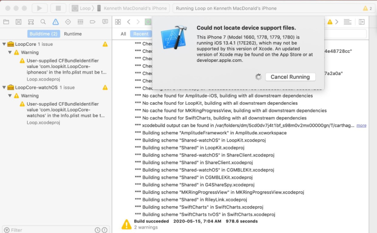

# Schritt 8: Herunterladen von Xcode

!!!danger "Geschätzte Zeit"
    - 45 Minuten bis 2 Stunden, abhängig von deiner Internetverbindung...aber du brauchst beim Runterladen ja nicht zuzuschauen.

!!!info "Zusammenfassung"
    - Nachdem du überprüft hast, dass deine MacOS Version zu der iOS Version deines iPhones kompatibel ist (siehe die grosse Tabelle unten), lade Xcode aus der App Store herunter.

!!!warning "FAQs"
    - **"Warum wird mein Xcode nicht installiert?"** Ich kann deinen Computer nicht sehen, um genau zu wissen, warum... aber die beiden häufigsten Gründe sind (1) eine schlechte Internetverbindung oder (2) nicht genügend freier Speicherplatz auf der Festplatte deines Computers. Der Xcode Download ist ganz schön gross...und benötigt noch ein wenig mehr Platz, um sich selbst zu entkomprimieren und zu installieren. Um auf der sicheren Seite zu sein, solltest du versuchen, etwa 20-25 Gb freien Speicherplatz auf deiner Festplatte zu haben. Ich habe Installationsfehler gesehen, wenn weniger freier Speicherplatz vorhanden war. Du kannst den freien Speicherplatz überprüfen, indem du auf `Über diesen Mac` (wie in Schritt 1) klickst und auf den Tab `Festplatten` klickst.

Dieser Schritt ist super einfach, aber wahrscheinlich der längste aller Schritte mit Bezug auf die Zeit...weil der Download eine Weile dauert. Die gute Nachricht ist, du musst dabei nicht zugucken. Starte einfach den Download und dann kannst du weggehen.

Xcode ist eine kostenlose Anwendung für Apple-Computer. Xcode verwandelt den Loop "raw" Code in eine iOS-Anwendung und installiert ihn auf deinem iPhone/iPod. **Stelle sicher, dass du dein macOS aktualisiert hast UND das keine `Software-Updates` fällig sind, bevor du weitermachst...mit anderen Worten, stelle sicher, dass du Schritt 1 erledigt hast.**

Öffnen Sie Ihren App Store auf deinem Computer und suchen nach Xcode...laden es entweder neu herunter oder aktualisieren eine bestehende Installation. Die minimale Version, die du benötigst, hängt von dem iOS auf deinem iPhone ab. Die Versionsnummer sollte in der Beschreibung "Was ist neu" angezeigt werden, wie im Bild unten gezeigt. Dieses ist ein großer Download, erwarte also nicht, dass es schnell geht.

!!!warning "Zwei wichtige Fakten"

    1. Die minimale Version von Xcode ist abhängig von der iOS Version auf deinem iPhone. Je neuer die Version vom iOS, desto neuer muss auch die Version von Xcode sein.   Die aktuellste Version von iOS (14+) benötigt Xcode 12 und mindestens macOS 10.15.4  
    2. Die neueste Xcode Version **erfordert möglicherweise auch eine Aktualisierung deiner macOS Version**. Wenn du eine alte macOS Version hast, wird dir der App Store nicht zeigen, dass eine neuere Version von Xcode verfügbar ist. Dies kann Verwirrung stiften, da dein iOS zwar einen neueres Xcode benötigt, der App Store es dir aber nicht als verfügbar anzeigt.

## Wie sind diese minimalen Versionen miteinander verknüpft?

Most often what happens is that people will update their iOS on the iPhones more often than they update their macOS or Xcode.  You know how it goes...you're tapping on your phone one day and it says there's a new version of iOS available for your phone. Want to update it now? Or be reminded of it later? Or maybe you even have the setting on your phone set to automatically install iOS updates.

Because the update looks so innocuous and we all lead busy lives, we forget that there might be consequences to iOS updates.

!!!danger "Loop- und iOS-Updates"

    For Loopers...the consequence to an iOS update is nothing immediate. Your Loop app won't die, it will keep humming along.   BUT, before you ***<u>update or rebuild</u>*** your Loop app on that phone, you will likely need to update your macOS and Xcode applications because of the newer iOS.  And you will need to do the updates/checks in a certain order:  
    1st: Check if your macOS has updates  
    2nd: Check for an Xcode update.  

The chart below is a helpful visual of the minimum versions you'll need based on your iOS.

* macOS: If you are running an iPhone with iOS 14, you need to make sure your macOS is 10.15.4 at a minimum as the first step. If you don't have the minimum version, go to [Step 1 Compatible Computer](step1.md#check-your-macos) and follow directions for updating your macOS.

* Xcode: Now that your macOS is updated to 10.15.4 minimum, the App Store in your computer will have Xcode 12.0.1 (or newer) available for you to download/update.

If you have a brainfart and leave your macOS back at 10.15.2...the App Store won't even tell you Xcode version 12 or newer exists. That's why it is important to do the macOS updates FIRST. I can't tell you how many people post for help saying "I'm trying to update my Loop app but am getting errors." If I ask what Xcode version they have and if they've updated, the response is "I don't have any Xcode updates available in the App Store...so I must be running the most current version." When actually what's happened is they have forgotten to check for macOS updates FIRST and therefore cannot see the needed Xcode update yet.

(Source for the chart is [wikipedia](https://en.wikipedia.org/wiki/Xcode))

## What happens if you try using too old of Xcode?

It isn't some catastrophic failure if you try to build with an outdated Xcode without realizing it. You'll see a pretty obvious error message during your Loop build that says "Could not locate device support files." That messages is telling you that your iOS on the phone requires you to get a newer version of Xcode to be able to build Loop onto that phone.

So, if you see that error message realize you may have to update your macOS to be able to see the newest Xcode version that you will need. Make sure to check that chart to see what your minimum versions are for the iOS you are running on your iPhone.

## Next Step: Xcode Preferences

Now you are ready to move onto Step 9 to [work on Xcode Preferences](step9.md).
