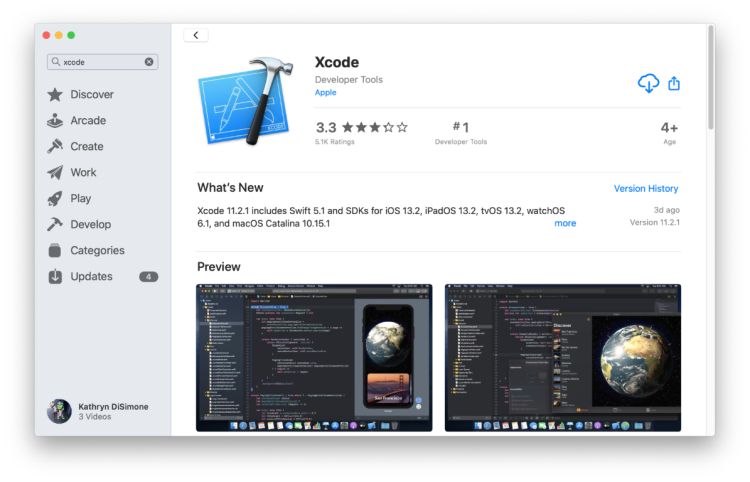

# Schritt 8: Herunterladen von Xcode

!!!danger "Geschätzte Zeit"
    - 45 Minuten bis 2 Stunden, abhängig von deiner Internetverbindung...aber du brauchst beim Runterladen ja nicht zuzuschauen.

!!!info "Zusammenfassung"
    - Nachdem du überprüft hast, dass deine MacOS Version zu der iOS Version deines iPhones kompatibel ist (siehe die grosse Tabelle unten), lade Xcode aus der App Store herunter.

!!!warning "FAQs"
    - **"Warum wird mein Xcode nicht installiert?"** Ich kann deinen Computer nicht sehen, um genau zu wissen, warum... aber die beiden häufigsten Gründe sind (1) eine schlechte Internetverbindung oder (2) nicht genügend freier Speicherplatz auf der Festplatte deines Computers. Der Xcode Download ist ganz schön gross...und benötigt noch ein wenig mehr Platz, um sich selbst zu entkomprimieren und zu installieren. Um auf der sicheren Seite zu sein, solltest du versuchen, etwa 20-25 Gb freien Speicherplatz auf deiner Festplatte zu haben. Ich habe Installationsfehler gesehen, wenn weniger freier Speicherplatz vorhanden war. Du kannst den freien Speicherplatz überprüfen, indem du auf `Über diesen Mac` (wie in Schritt 1) klickst und auf den Tab `Festplatten` klickst.

Dieser Schritt ist super einfach, aber wahrscheinlich der längste aller Schritte mit Bezug auf die Zeit...weil der Download eine Weile dauert. Die gute Nachricht ist, du musst dabei nicht zugucken. Starte einfach den Download und dann kannst du weggehen.

Xcode ist eine kostenlose Anwendung für Apple-Computer. Xcode verwandelt den Loop "raw" Code in eine iOS-Anwendung und installiert ihn auf deinem iPhone/iPod. **Stelle sicher, dass du dein macOS aktualisiert hast UND das keine `Software-Updates` fällig sind, bevor du weitermachst...mit anderen Worten, stelle sicher, dass du Schritt 1 erledigt hast.**

Öffnen Sie Ihren App Store auf deinem Computer und suchen nach Xcode...laden es entweder neu herunter oder aktualisieren eine bestehende Installation. Die minimale Version, die du benötigst, hängt von dem iOS auf deinem iPhone ab. Die Versionsnummer sollte in der Beschreibung "Was ist neu" angezeigt werden, wie im Bild unten gezeigt. Dieses ist ein großer Download, erwarte also nicht, dass es schnell geht.

!!!warning "Zwei wichtige Fakten"

    1. Die minimale Version von Xcode ist abhängig von der iOS Version auf deinem iPhone. Je neuer die Version vom iOS, desto neuer muss auch die Version von Xcode sein.   Die aktuellste Version von iOS (14+) benötigt Xcode 12 und mindestens macOS 10.15.4  
    2. Die neueste Xcode Version **erfordert möglicherweise auch eine Aktualisierung deiner macOS Version**. Wenn du eine alte macOS Version hast, wird dir der App Store nicht zeigen, dass eine neuere Version von Xcode verfügbar ist. Dies kann Verwirrung stiften, da dein iOS zwar einen neueres Xcode benötigt, der App Store es dir aber nicht als verfügbar anzeigt.

## Wie stehen diese Mindestanforderungen miteinander in Beziehung?

Meistens passiert es, dass Benutzer ihr iOS auf den iPhones häufiger aktualisieren, als das macOS oder Xcode auf ihrem Computer.  Du weist, wie es ist...eines Tages schaust du auf dein Telefon und es heißt, eine neue iOS Version ist für ihr Telefon verfügbar. Möchten Sie es jetzt aktualisieren? Oder später daran erinnert werden? Vielleicht hast du auch die Einstellung auf deinem Telefon so gewählt, das es iOS-Updates automatisch installieren darf.

Weil Update so harmlos wirken und wir alle ein geschäftiges Leben führen, vergessen wir, dass es durch iOS-Updates auch Konsequenzen geben kann.

!!!danger "Loop- und iOS-Updates"

    Für jemanden der Loop benutzt...ist die Folge eines iOS-Updates nicht gleich zu spüren. Deine Loop App geht davon nicht kaputt, sie wird fröhlich weiter funktionieren.   ABER, bevor du ***</u>*** deine Loop-App auf diesem Telefon aktualisierst oder neu erstellst<u>, musst du wahrscheinlich dein macOS und Xcode aufgrund des neueren iOS auf deinem Telefon aktualisieren.  Du musst die Updates/Überprüfungen in einer bestimmten Reihenfolge machen:  
    1. Prüfe, ob es für dein macOS Updates gibt  
    2. Prüfe, ob es ein Xcode Update gibt  

Die folgende Tabelle ist hilfreich, um die Mindestvoraussetzungen für dein macOS und Xcode basierend auf deinem iOS festzustellen.

* macOS: Wenn du ein iPhone mit iOS 14 hast, musst du erst einmal sicherstellen, dass dein macOS mindestens 10.5.4 ist. Wenn du nicht mindestens diese Version hast, gehen zu [Schritt 1 Kompatibler Computer](step1.md#check-your-macos) und folge den Anweisungen zum Aktualisieren deines macOS.

* Xcode: Jetzt, wo dein macOS auf mindestens 10.15.4 aktualisiert wurde, wird der App Store auf deinem Computer Xcode 12.0.1 (oder neuer) zum Herunterladen/Aktualisieren verfügbar haben.

Wenn du es verpennt hast und dein MacOS bei 10.15.2 belässt...wird dir der App Store nicht einmal sagen, dass eine Xcode Version 12 oder neuer gibt. Das ist der Grund, warum es so wichtig ist, die macOS Updates ZUERST durchzuführen. Ich kann dir nicht sagen, wie viele Leute um Hilfe bitte: "Ich versuche, meine Loop App zu aktualisieren, aber ich bekomme eine Fehlermeldung." Wenn ich dann frage, welche Xcode Version sie haben und ob sie aktualisiert haben, lautet die Antwort: "Ich habe keine Xcode-Updates im App Store verfügbar...also muss ich ja die aktuellste Version haben." Was tatsächlich passiert ist, sie haben vergessen, zuerst nach macOS Updates zu suchen und bekommen daher das benötigte Xcode Update noch nicht einmal angezeigt.

(Quelle für das Diagramm ist [wikipedia](https://en.wikipedia.org/wiki/Xcode))

## Was passiert, wenn du versuchst eine zu alte Version von Xcode zu verwenden?

Es passiert nichts schlimmes, wenn du, ohne es zu bemerken, versuchts Loop mit einer veralteten Xcode Version zu erstellen. Du wirst eine offensichtliche Fehlermeldung während des Loop Erstellungsprozesses sehen, die sagt: "Konnte die Geräteunterstützungsdateien nicht finden." Diese Nachrichte sagt dir, dass für das iOS auf deinem Telefon eine neuere Version von Xcode erforderlich ist, um Loop erfolgreich zu erstellen.

Also, wenn du diese Fehlermeldung siehst, musst du möglicherweise dein macOS aktualisieren, um dann die neueste Xcode Version angezeigt zu bekommen, die du benötigst. Benutze also diese Tabelle, um zu bestimmen, welche minimalen Versionen für das iOS auf deinem iPhone verwenden werden müssen.

## Nächster Schritt: Xcode Einstellungen

Jetzt kannst du mit Schritt 9 weitermachen [Xcode Einstellungen](step9.md).
