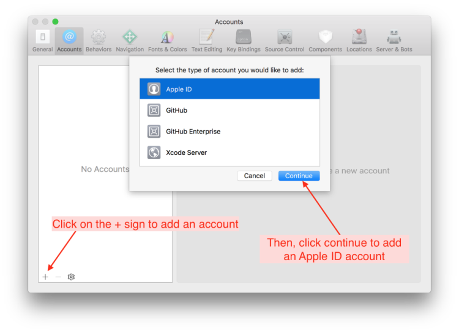
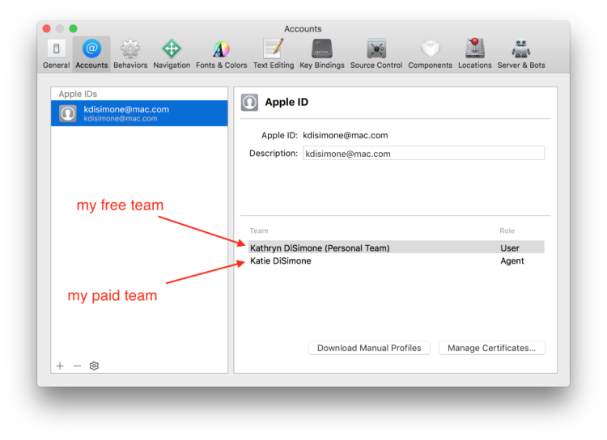

# Schritt 9: Xcode Einstellungen

!!!danger "Geschätzte Zeit"
    - etwa 10-15 Minuten für die Installation der Kommandozeilen-Programme
    - 5 Minuten, um deine Apple-ID hinzuzufügen, vorausgesetzt, du erinnerst dich an dein Passwort

!!!info "Zusammenfassung"
    - Öffnen Sie Xcode Einstellungen und füge deine Apple-ID unter dem Accounts Tab hinzu.
    - Überprüfe, dass die Kommandozeilen-Programme in den Xcode Einstellungen und dort in der Registerkarte "Locations" korrekt installiert wurden.

!!!warning "FAQs"
    - **"Ich sehe immer noch nur ein Konto mit `(personal team)`, obwohl ich mich für das bezahlte Entwicklerkonto eingeschrieben habe...was soll ich machen? "** Bitte überprüfe deine Spam-Mailbox für den Fall, dass die E-Mail von Apple dort gelandet ist. Stellen Sie sicher, dass du die 48 Stunden gewartet hast, die Apple sagt, dass es dauern kann, um dein Konto zu aktivieren. Wenn bereits 48 Stunden vergangen sind und du noch keine E-Mail bekommen hast, kontaktiere den Apple Support und fragen nach dem Status deiner Anmeldung. Vielleicht steckt es bei Apple fest und ihr könnt es zusammen klären.

Da du alles der Reihe nach gemacht hast, hast du Xcode in Schritt 8 auf deinem Computer installiert. Du hast dich auch in Schritt 6, wenn dies deine Wahl war, für das Apple Developer-Programm mit einem kostenpflichtigen Konto registriert. Dann müssen wir noch in Xcode dein Entwicklerkonto angeben. Übrigens gibt es Xcode nur in der englischen Version, deshalb übersetzte ich das, was du in Xcode angezeigt bekommst und hier beschrieben wird nicht.

Öffne Xcode in deinem Ordner Programme.

## Kommandozeilen-Programme (Command Line Tools)

Beim allerersten Öffnen von Xcode kann es einen kleinen Moment dauern, da noch ein paar Hilfsprogramme installiert werden. Schließe dieses Fenster nicht, lasse es fertig werden...wir brauchen diese Komandozeilen-Programme. Ein Tipp: Wenn die Installation der Komandozeilen-Programme abgeschlossen ist und das Pop-up-Fenster geschlossen wurde, überprüfe, ob die Komandozeilen-Programme auch ordnungsgemäß installiert wurden. Öffnen Sie Xcode's Einstellungen, indem du auf das Wort **`Xcode`** in der oberen Menüleiste (rechts neben dem Apple-Symbol in der oberen linken Ecke) klickst und `Preferences` im Dropdown-Menü auswählst. Das Tastaturkürzel zum Öffnen der Xcode Einstellungen ist `Strg-Komma` wenn das für dich einfacher ist. Wähle dann die Registerkrate `Locations` in den Preferences aus, dort siehst du das Dropdown-Menü für die Kommandozeilen-Programme. Achte darauf, dass dort Xcode 12.0.1 (oder neuer) ausgewählt ist.

## Apple-ID hinzufügen

Gehe zu Xcode Preferences von oben, klicke auf die Registerkarte `Accounts` und drücke dann `+` in der unteren linken Ecke, um ein Apple-ID-Konto hinzuzufügen.

Wenn du ein kostenloses Entwickler-Konto verwenden möchtest gib einfach deine Apple-ID dort ein und Xcode wird deine Apple-ID automatisch in dem kostenlosen Entwicklerprogramm registrieren. Wenn du dich aber bereits für das kostenpflichtige Konto registriert hast und auch die Bestätigung hast, dass dein Konto aktiv ist, gib die Apple-ID des kontopflichtigen Entwicklerkontos ein. Das folgende Bildschirmfoto zeigt, wie die Team-Namen beschriftet sind, die entweder von einem Gratis-Konto oder bezahltem Konto sind. Bei Gratis Teams steht `(personal team)` hinter dem Namen.

Du bist nun mit der Einrichtung von Xcode fertig.  Gut gemacht!  Du musst die Kontoeinrichtungsschritte bei späteren Erstellungen oder Updates deiner Loop App nicht wiederholen.  Xcode merkt sich diese Einstellungen.

## Nächster Schritt: Test der Einstellungen

Du kannst jetzt mit Schritt 10 weitermachen [Testen der Einstellungen](step10.md).
