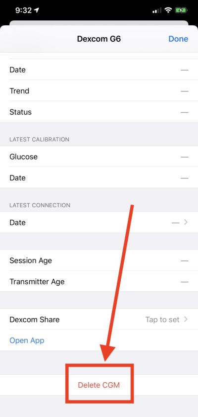

# CGM FAQs

## Mit welchem CGMs spielt die Loop-App zusammen?

Loop arbeitet mit Dexcom G4 mit share, G5, G6, Share und dem Medtronic CGM System zusammen, welches zu den Loop-Pumpen kompatibel ist.

Details hierüber findest du [hier](../build/step4.md).

## Muss ich einen neuen Sensor setzen, um die Loop zu schließen?

Nein, du kannst mit dem Loopen auch mit einem bereits in Benutzung befindlichen Sensor starten. Es gibt keinen Grund, irgendetwas Spezielles bezüglich deines CGMs zu tun, wenn du die Loop schließst oder öffnest.

## Was muss ich beachten, wenn sich der Sensor in der Aufwärmphase befindet?

Während der Aufwärmphase des Sensors kehrt die Loop-App zur normalen zeitlichen Basalrate zurück (innerhalb von 30 Minuten oder schneller). Es werden keine temporären Basalratenanpassungen während der Aufwärmphase des Sensors vorgenommen. Solltest du in dieserm Zeitraum einen Bolus benötigen und von der Loop-App einen Bolusvorschlag benötigen, musst du blutig messen und den Wert von Hand in die Health-App eingeben. Die Loop-App liest den Wert aus der Health-App und wird dir dann einen entsprechenden Bolusvorschlag machen. Wirklich ambitionierte Menschen messen während der Aufwärmphase alle 15 Minuten blutig und geben die Werte dann von Hand in die Health-App ein. Damit erreicht man eine Art Looping während des Aufwärmens, auch wenn die blutigen Werte weit von den normalen Werten abweichen.

## Was muss ich tun, wenn ich den Empfänger wechsle?

Wenn du den Empfänger auswechselst, musst du deine Empfänger-ID in den Einstellungen der Loop-App anpassen. Das geht sehr einfach.

Zum Wechseln des Empfängers, benutzt du den `CGM löschen` Knopf am unteren Ende der CGM-Info-Seite der Loop-App. Dann wählst wiederum dein Dexcom System und fügst die neue Empfänger-ID hinzu. Leider kannst du die Empfänger-ID nicht durch einfaches Tippen auf deine alte Empfänger-ID anpassen.

Solltest du die Empfänger-ID nicht aktualisieren, wenn du den Empfänger wechselst, muss die Loop-App deine CGM-Werte über den Dexcom-Server ermitteln, was nur mit Internetempfang funktioniert. Wenn die Loop-App den Dexcom-Server als Datenquelle benutzt, erscheint eine kleine Wolke oberhalb des BZ-Wertes in der Loop-App-Anzeige, die dich daran erinnern soll, dass du vergessen hast, deine Empfänger-ID zu aktualisieren.

## Kann ich Libre-Sensoren mit einem Miao-Miao-Reader verwenden?

Solltest du einen Libre Sensor verwenden wollen, musst du den Source Code von Loop entsprechend anpassen. Der Loop-Source-Code unterstützt weder diese Sensoren, noch die Reader nativ.

## Kann ich Eversense verwenden?

Nein. Eversense schreibt nicht in die Health-App und das BlueTooth-Kommunikationprotokoll wurde auch nicht auf die gleiche Weise reverse engineered, wie das bei Dexcom der Fall ist.

## Kann die Loop-App die CGM-Daten aus Nightscout lesen?

Die Loop-App liest keine CGM-Daten aus Nightscout. Du brauchst dazu einen Lösungsansatz über den Nightscout-ShareServer und musst den Loop-Code so anpassen, dass es die Daten von dort lesen kann. Du solltest in der Looped-Gruppe in Facebook für diesbezügliche Posts suchen. Auch dies ist kein Standardfeature der Loop-App und es handelt sich hierbei um eine Anpasssung aus der Internetgemeinde. Du solltest deine Hausaufgaben erledigen und dies untersuchen, falls du nach einer Lösung suchst. Zur Zeit gibt es keine aktive oder modifizierte Version der Loop-App, die dies unterstützt.

## Kann ich Spike oder Xdrip benutzen, um die Loop-App zu betreiben?

Spike und Xdrip werden von der Loop-App nicht unterstützt. Du musst Anpassungen aus anderen Communities verwenden, um diese Apps mit der Loop-App einzusetzen. Ein kliener Tipp: Benutze den Suchbegriff `spike loop` in der looped-Gruppe von Facebook, um Informationen über die Loop-Version für Spike zu finden. Die Links zu solchen modifizierten Loop-Version werden von uns nicht aktualisiert, da wir (die LoopDocs aktualisieren und die Loop-Entwickler) nicht aktiv auf diese Version achten und sicherstellen, dass diese auf dem neuesten Stand sind.
