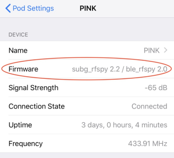
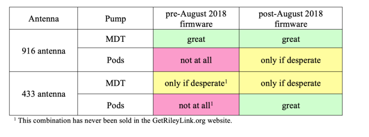

# RileyLink FAQs

## Was ist der RileyLink? Brauche ich den überhaupt?

Ja, RileyLink ist ein notwendiger Bestandteil der Loop. Er ist ein kleines Gerät, welches deinem iPhone hilft, mit deiner Pumpe (oder deinem Omnipod, was ja auch eine Pumpe ist) zu sprechen. The RileyLink ist ein wiklich kritischer Teil des Loop-Systems, da die Pumpe über Funk angesprochen wird und das iPhone nur in BlueTooth-Form sprechen kann. Der RileyLink ist wie ein Übersetzer, der beide Sprachen sprechen kann, so dass die Pumpe und das iPhone zusammen kommen können. Der RileyLinke holt/sendet Information von/zu der Pumpe per Funk und von/zu deinem iPhone per BlueTooth.

## Wo kann ich einen RileyLink kaufen?

Die RileyLinks werden in Chargen hergestellt, d.h., dass sie manchmal im Lieferückstand sind, weil gerade eine neue Charge produziert wird. Sie können [hier](https://getrileylink.org/) bestellt werden.

* If you want to buy a RileyLink for Omnipods, click [here](https://getrileylink.org/product/rileylink433).
* If you want to buy a RileyLink for Loop-compatible Medtronic pumps, click [here](https://getrileylink.org/product/rileylink916).

## Muss ich den RileyLink immer mit mir herumtragen?

Die einfache Antwort ist ja. Wenn du möchtest, dass Loop immer automatisch deine Basalraten anpasst und Kommandos an deine Pumpe sendet kann, wirst du den RileyLink benötigen, damit die Kommunikation stattfinden kann. Steck ihn in den Geldbeutel, Hosen- oder Gürteltasche. Klemm ihn an den Rucksack, Gürtel oder BH, aber bitte, nimm ihn mit.

## Welche Möglichkeiten gibt es, den RileyLink mitzunehmen?

Ich bin wirklich erstaunt, wie häufig diese Frage auftaucht, aber hier sind mal ein paar Vorschläge. Stellt bitte keine neuen Ideen in die Loop-Gruppe oder den Zulip-Chat. This horse has been well-beaten, so use the search function in Looped group to see the previous responses. But, here's some samples for those of you who won't use the search function. ;)

[Post 1](https://www.facebook.com/groups/TheLoopedGroup/permalink/2340802992803020/)

[Post 2](https://www.facebook.com/groups/TheLoopedGroup/permalink/2470906669792651/)

[Post 3](https://www.facebook.com/groups/TheLoopedGroup/permalink/2469724099910908/)

[Post 4](https://www.facebook.com/groups/TheLoopedGroup/permalink/2324172164466103/)

## Wie weit entfernt kann ich mich vom RileyLink entfernen?

Die Antwort ist umgebungsabhängig. Im Allgemeinen funktioniert der RileyLink in den meisten Umgebungen gut über eine Distanz von drei bis vier Meter. In manchen Situationen geht das auch über sechs bis acht Meter gut. In anderen Fällen musst du aber wieder näher an den RileyLink ran. Welche Einflussfaktoren sind das? Der größte Einfluss ist (1) die Abschirmung durch den Körper und (2) eine "verschmutzte" Umgebung. Der menschliche Körper enthält viel Wasser und Wasser blockiert drahtlose Funkverbindungen stark.  Also auf dem RileyLink zu schlafen und ihn vollständig mit deinem Körper zu ersticken, wird definitiv die Möglichkeiten deines RileyLinks mit dem Pod zu kommunizieren eingrenzen. Umgebungen mit einer hohen Konzentration drahtloser Funksignale werden sich auch störend auf die Kommunikation auswirken und machen ein Näherkommen vorteilhaft. Wo könnten solche Situationen auftreten? Konzerte, Konferenzen, Sport Arenas sind wirklich empfänglich für solche Interferenzen.

## Was passiert, wenn ich mich von meinem RileyLink entferne?

Sobald du außerhalb des Kommunikationsbereichs deines RileyLinks bist, wird die aktuell eingestellte temporäre Basalrate weiterlaufen, bis sie fertig ist (die längsten temporären Basalraten gehen über 30 Minuten. Deine Pumpe wird also innerhalb dieser Zeitspanne wieder auf ihre normale Basalrate zurückgehen). Wenn du wieder in den Funkbereich deines RileyLinks kommst, wid die Loop-App wieder innerhalb von fünf bis zehn Minuten übernehmen, ohne dass du etwas tun musst.

## Welche Unterschiede gibt es zwischen dem Medtronic und dem Omnipod RileyLink?

Es gibt momentan zwei Arten von RileyLinks. Die Unterschiede liegen aber nur in der Antenne, die auf die jeweilige Funkfrequenz deiner Pumpe angepasst ist. Ansonsten sind sie identisch.

## Ist die neue Antenne eine Verbesserung für die Loop-App?

Die Bezeichnung "Verbesserung" durch die Verwendung einer Kupferspulenantenne trifft die Sache nicht genau. Sie ist nur eine Verbesserung in Bezug auf eine Loop mit einem Pod. Eigentlich verschlechtert diese Antenne den Empfang bei der Verwendung einer Medtronic Pumpe.  Die nächste FAQ erläutert den Punkt etwas genauer.

## Was passiert, wenn ich einen RileyLink mit einer 916MHz-Antenne bei einem Omnipod verwende oder umgekehrt? Or vice versa?

Die Antwort hängt zuerst davon ab, wie alt der RileyLink ist und welche Firmware darauf installiert ist.

Vor August 2018 hatte der RileyLink eine Firmware, die nur mit Medtronic Pumpen kommunizieren konnte. Wenn du also einen RileyLink mit einer Firmware vor diesem Datum hast, kannst du keinen Omnipod damit aktivieren. Es gibt einen [RileyLink firmware Update Service](https://getrileylink.org/product/rileylink-fw-update/), falls du eine eine Firmware installiert haben willst, die auch mit dem Omnipod kommuniziert.

RileyLinks, die nach August 2018 hergestellt wurden, haben bereits eine Firmware, die auch mit den Omnipods kommunizieren kann. Diese Firmware wird im RileyLink Menü als `subg_rfspy 2.2/ble_rfspy 2.0` angezeigt, wie unten im Bild zu sehen ist.

Angenommen du hast diese neue Firmware auf deinem RileyLink, dann kannst du *technisch* gesehen mit beiden Pumpen in der Loop-App arbeiten. Du wirst aber starke Frustrationen erleiden mit dem Umstand, dass du die beiden immer sehr nahe zusammenbringen musst, falls dein RileyLink noch die alte Antenne hat. Selbst wenn du den RileyLink nur in der falschen Hosentasche trägst, kann das zu Problemen führen, wenn du die 916MHz Antenne hast. Mit der falschen Pumpen-/Antennenkombination muss man den RileyLink sehr nahe an die Pumpe halten und das alles noch in einer gerade Linie, was den täglichen Gebrauch sehr schwierig gestaltet. Bei der richtigen Pumpen-/Antennenkombi kann die Entfernung größer sein, was die Sache deutlich alltagstauglicher gestaltet.

Zusammengefasst ist die Benutzung des richtigen RileyLinks besser, da es weniger frustriert. Im Notfall kann der alte RileyLink als Ersatz dienen, aber du wirst es nicht lieben.

## Kann man die alte Antenne eines RileyLinks austauschen?

Ja, der Austausch der Antenne ist keine große Sache und erfordert keine besonderen Lötkenntnisse. Die alte Antenne kann durch Erhitzen des Lötzinns leicht ausgebaut werden. Eine 433MHz Antenne und einen passenden Deckel dazu findest du auf der [GetRileyLink Webseite](https://getrileylink.org/product/433diyupgrade/). Tipp: Benutze Flußmittel und säubere den Antennenanschluss, bevor du ihn einlötest. Schlecht eingelötete Antennen können zu einem Rückgang der Reichweite und häufigen Kommunikationsabbrüchen zwischen der Loop-App und den Pods führen.

## Wie lange kann ich den RileyLink benutzen, bevor ich ihn wieder aufladen muss?

RileyLinks halten rund 30-32 Stunden nach dem vollständigen Laden durch. Es gibt keine Möglichkeit, den aktuellen Ladezustand zu einzusehen. Die meisten Leute haben sich daher angewöhnt, ihn über Nacht, während des Schlafens, zu laden. The actual time to fully recharge is about 1 or 2 hours; you'll know it is fully charged when the red light turns off. Nach dem vollständigen Laden erlischt die rote LED und leuchtet immer wieder periodisch kurz auf, solange wieder nachgeladen wird.

## Wie lange funktioniert die RileyLink Batterie?

Letztendich verliert eine Lithium Polymer Batterie mit der Zeit an Kapazität und du solltest die Batterie austauschen, falls sie keinen ganzen Tag mehr durchhält. Wir benutzen die Batterien ohne irgendwelche Probleme schon seit mehr als zwei Jahre.

## Woher weiss ich, wie lange meine Batterie noch hält?

You can't. There is no charge level indicator. Lade sie über Nacht und du wirst keine Probleme haben. Eine volle Batterie hält, abhängig vom Alter der Batterie, rund 30-32 Stunden. Das Laden braucht weniger als zwei Stunden.

## Wie soll ich den RileyLink mit mir herumtragen? Gibt es da unterschiedliche Möglichkeiten?

Im Allgemeinen wirst du deinen RileyLink mit dir herumtragen wollen. Ein Täschchen, am Karabiner, am Halsband, SPIbelt, ... es gibt unendlich viele Möglichkeiten. Du solltest den RileyLink aber nicht in eine Tasche stecken, die RFID-Kommunikation abschirmt (einige Bauchtaschen tun so etwas). Die mögliche Distanz zwischen deinem RileyLink und deiner Pumpe hängt stark von der Umgebung ab, in der du dich bewegst.

## Ist der RileyLink wasserfest?

Nein. Er ist auch nicht spritzwassergeschützt. Sei also vorsichtig!

## Welche häufigen Probleme treten mit dem RileyLink auf?

Leute [drücken den Stecker der LiPo Batterie](../build/step5.md#assemble-rileylink) nicht vollständig in die Halterung, wenn sie den RileyLink das erste Mal zusammenbauen. Es braucht schon ein bischen Druck, den Stecken weit genug reinzudrücken. If not secured well, Loop will have more frequent problems.

## Kann ich mehr als einen RileyLink auf einmal verwenden? Wird das irgendetwas helfen?

Ja, du kannst zwei benutzen, es wird dir aber nicht wirklich helfen. Die Loop-App benutzt immer nur einen RileyLink zur Zeit. Wenn du mehrere RileyLinks in den Loop-Einstellungen aktiviert hast, sucht die Loop-App nur 15 Minuten nach einem Fehler in der Kommunikation mit der Pumpe nach einem neuen RileyLink. Meiner Erfharung nach kommt es sehr selten vor, dass die Loop länger als 15 Minuten nicht funktioniert und der zweite RileyLink arbeitet ja auch in der gleichen Umgebung. Falls ein RileyLink kaputt geht, kannst du ihn gegen den zweiten ohne Probleme austauschen.

## Funktioniert die Loop ohne RileyLink?

Nein.
