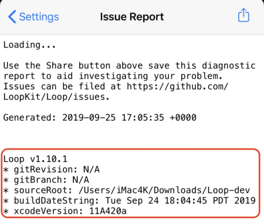

# Updating/Rebuilding Loop FAQs

SOOOO many questions about updating or rebuilding Loop. The general answer is that people tend to overthink this. Rebuilding your Loop app is really quite easy...so a short read of these questions should help a lot.

First, please take a minute to understand what the words mean.

"Updating Loop" is the process of getting a new download of Loop's code and using that to update your Loop. You do this when you want to switch branches. You do this when you want to get fixes or new features from the same branch. The process doesn't care if you are moving from omnipod-testing -> dev or jojo -> dev or master -> dev or any other combination.

Updating Loop is the same idea as what happens to your other apps on your iPhone when you update them from the App Store on the phone. A refreshed version of the same app appears on the phone, simply replacing-in-place the same Loop you were using with an updated version.

## Where should I start when I want to update my Loop?

**ALWAYS start with the [Update Loop page](../build/updating.md) before any new build that you'd be doing.** That page is important because it will offer information on the updates you need to do before building, as well as any late breaking things that might need to be considered.

Do not simply build with your old downloaded folder from months ago. There is a high likelihood that your original code from awhile ago is outdated. Grab new code and you will get the version that has all the latest and greatest features and bug fixes.

## When do I have to update/rebuild?

Absolute minimum: 1 year from when you last built (paid account).

Good idea minimum: If on dev branch, frequently. I've found valuable updates to dev branch at least once a week lately...but I'd say monthly minimum at least for dev right now. Master and omnipod-testing branch do not have changes frequently.

Issue specific minimum: There are also times where you may need to update for "hot-fixes" to keep your Loop working when other things change. For example, the new style Dexcom transmitters changed their Bluetooth protocol. Loop's code was updated for the new transmitters so that offline looping can continue to work. If you don't update to get that fix, you will be forced to rely on internet-required looping because older versoin of Loop won't have the updated protocols.

## Will I have to delete my old Loop app?

No. No. No. No. No. No. Do not delete your old Loop. In fact, that is a bad idea as you will lose your currently paired pod and/or settings if you do that. So, don't delete (except for two situations below):

1. You broke it: There is a glitch in Loop where if you enter the target correction range backwards, then your Loop app will stop working. Correction range needs to be in minimum-maximum, for example 100-120 mg/dL. If you entered that as 120-100 mg/dL, Loop will not work during the time that backwards correction range is supposed to be active. In this case you would need to delete the app and rebuild.  
2. Moving from dev branch back down to jojo branch. The way the new dev branch is coded will require you to delete your dev build prior to going back jojo branch.

## Does updating make a separate, second Loop app?

Yes. So long as you use the same developer team as you originally built the app with before.

The only exception to this is if you update/build using a different developer signing team than your original Loop app was built with. The app's identity on your phone is defined by the developer team that you signed the app with. That team has a unique ID to identify the app. So, if you change that unique ID, your phone interprets that as a unique app as well...giving you two Loop apps on the phone. Therefore, if changing developer accounts...you will get a new Loop app, and you would need a new Pod. You'll need to transfer your settings manually to the new app and delete your old app.

## Will my settings be saved when I update?

Yes. That's why we don't delete the app. Your settings will be saved.

## Will my pod still work when I update?

Yes. So long as you use the same developer team as you originally built the app with before.

## How can I confirm what version was installed?

The Loop's version is given at the top of the Loop settings page. Even better though, the new dev branch has very detailed info about the version of Loop you are using at the top of your Loop's Issue Report. This is a great new addition to help identify where, what, and when of your Loop version.

## What if I'm changing branches? Does that matter?

Does not matter. Moving between branches is an "updating Loop" action. Nothing about the information above changes.

## What if I'm changing phones?

Changing phones is a little different than updating. You will need to change pods in order to move to the new phone's Loop. And you will have to enter all your setting in again. Loop will not be "restored from backup" the way other apps are when switching phones...so you will have to actually build it fresh.

## How long does it take?

Assuming your macOS and Xcode updates are done, then plan on about 30 minutes.
