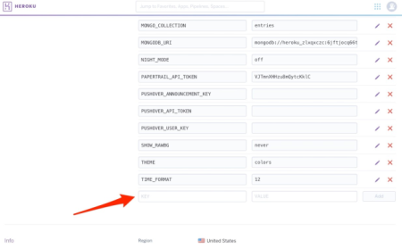
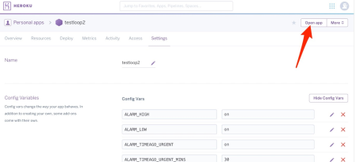
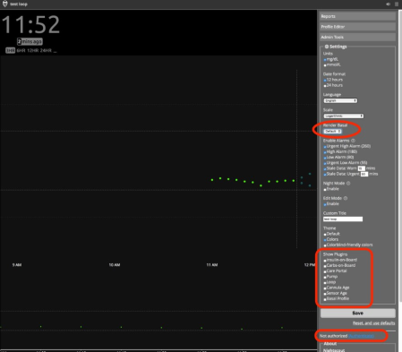
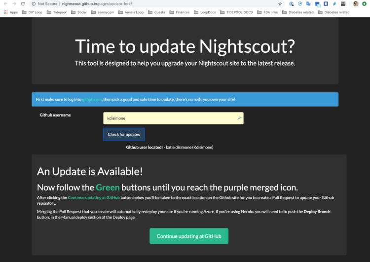
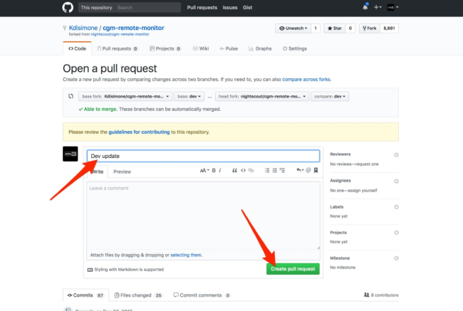
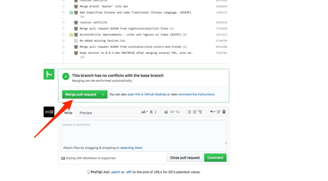
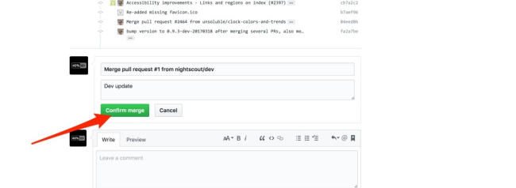
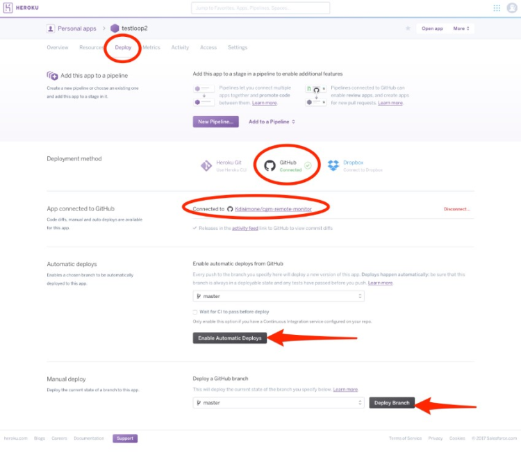

# Adding Loop to Existing NS

Many people may already have an existing Nightscout site setup from before adding Loop to their management strategies. In order to make the most of your Looping setup, you will need to modify your existing Nightscout site a bit specifically for Loop. The process is pretty easy and should not take long.

## New Loopers Variables

The modifications for retrofitting an existing NS site for new Loop users will require you to make some edits to your Heroku site.  There are five steps:

1. Login to Heroku, Open Settings Tab
2. Edit/Add Config Vars
3. Open Nightscout Site
4. Turn on Plugins
5. Update Profile Settings

### Step 1: Login to Heroku, Settings Tab

[Login to your Heroku account](https://id.heroku.com/login), select the `Settings` tab near the top of the screen on your Heroku app.

### Step 2: Edit/Add Config Vars

Click on `Reveal Config Vars`.  Scroll down the bottom of the Config Vars lines until you find the last blank one.  You are going to add several additional lines of config vars for Loop use; the DEVICESTATUS_ADVANCED and ENABLE lines are required, the others just make Nightscout more useful when Looping.

bridge loop pump iob cob basal careportal sage cage bage override dbsize   **(Note: If you are an existing NS user, you likely already have an ENABLE line in this section of Heroku. Don't add a new one. Simply find the existing ENABLE line, click on the little pencil icon to the right of it, and add the words shown on the ENABLE line above to the existing words already on the enable line.  Avoid duplicates. The remainder of the lines are likely going to be brand new additions to your Heroku settings.)</b></td> </tr> 

</tbody> </table> 20  (This is the minutes since Loop last successfully looped, the t1d will have a similar notification at this time through the Loop app.  This will be a yellow alert in NS.) 

### Step 3: Open Your NS Site

Click on `Open App` in the top right corner of your Heroku site.

### Step 4: Turn on Plugins

Click on the settings (those three horizontal lines in the upper right corner).  Now check that your basal render is selected to either default or icicle (personal preference for how the temp basals show as blue lines in NS site), check the boxes that you’d like display pills in the SHOW PLUGINS (usually all of them), and then click save. If you have not authenticated your site previously, you may be prompted to provide your API Secret prior to Nightscout saving your changes.

### Step 5: Update Profile Settings

Double-check that your NS Profile settings are current and that you have a basal profile entered, if you want to see the temp basals that Loop is setting. The values in your Nightscout Profile settings will not impact or affect your Loop, but it is just nice to have them match up in the event you are looking at your data with an endocrinologist or retrospectively looking at data.

## Nightscout Version Update

If you are new to Loop and haven’t updated your NS site since before December 1, 2016, you will want to update your NS site. You can run either the "master" or "dev" branches of cgm-remote-monitor with Loop.  To check what version your Nightscout site is running, go to your Nightscout site and pull open the site settings by clicking on the three horizontal lines at the top right of the screen.  The version number is at the bottom.

Nightscout has a tool to help you update your Nightscout site and you can find the [directions using to the update tool here](http://www.nightscout.info/wiki/welcome/how-to-update-to-latest-cgm-remote-monitor-aka-cookie).

Simply put, the [Update tool](http://nightscout.github.io/pages/update-fork/) will look at your GitHub repository and check if your Nightscout code is old and needs updating.  You will have to be logged into your GitHub account in order for the tool to work, so do that before starting this process.

You'll click on the green `Continue updating at GitHub` button, read the directions that will appear as a pop-up and then finish the update process.

Click the big green `Create pull request` button.

* For most people, another screen will appear like shown in the screenshots below with a green `Able to merge` message. Fill in a title and click the button to create the pull request, and then you can `Merge pull request`, and finally `Confirm merge`. 

* However, for some of you may encounter a red error message `x Can't automatically merge` message. If you have that message, you may want to post in FB for help on resolving that error message before proceeding any further.

---

---

---

---

Your cgm-remote-monitor repository is now up-to-date.  Nice work, and almost done.

If you don’t have your Heroku set-up to automatically update when your repository is updated, you will have to go into your Heroku `Deploy` section and manually deploy your branch now that your repository has been updated.  Make sure you are connected to your GitHub cgm-remote-monitor repository.

