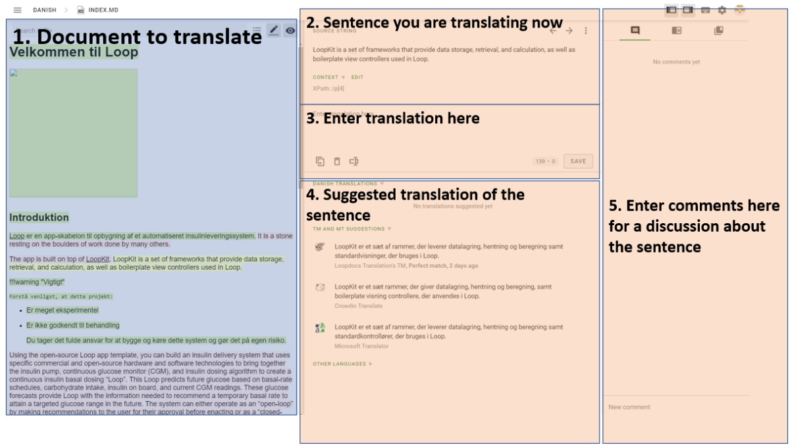

# Translate Loopdocs

This guide will explain how you can help translating Loopdocs.

First check to see if your language is in the Loopdoc language page. The language page can be found here: [Loopdocs language page](https://loopdocs.github.io/loopdocs/)

If your language is listed here the translation-project is already setup and you can join the translation team by follow the guide below.

!!!note "Is your language not there?"

    If your language is not listed and you want to start translating Loopdocs into a new language, please submit an issue on github [here](https://www.github.com/LoopDocs/loopdocs/issues/new?title=New language request&body=Can you please add [ENTER COUNTRY] for translation.).
    
    The translation team will then setup it up for you. Once it ready for translation, we will notify you in the issue and then you can join the Crowdin Team.

## Join the Crowdin Team

1. Goto [Crowdin](https://crowdin.com/project/loopdoctranslation)
2. Login (or sign up by creating a new login or use your github, facebook or other account)
3. Choose your language
4. Select a file to translate.

And you are ready to translate.

If you have not use crowdin before there is a short introduction to Crowdin below.

If you want a more detailed explanation of how to use Crowdin, please visit [Crowdin - for translators](https://support.crowdin.com/online-editor/)

## Crowdin introduction

When you have selected your language and a file, the Crowdin editor opens.

The Crowdin editor has 5 main areas which are highlighted below: 

**1. Document to translate** - contain all the sentences in the document.You translate one sentence at the time. You can click the sentence you want to translate. When you click a sentence the 4 other areas change.

The sentences are colored in:

- Red: Sentences that needs translating.
- Yellow: the sentence you are translating.
- Green: Sentences that has been translated.

**2. Sentence you are translating now** - Shows the sentence you have selected in the document.

**3. Enter translation here** - this is where you enter you translation. After you have entered your translation click the save button. Crowdin will then take you to the next sentence.

!!!important "Save your work!"

    Remember to click the save button otherwise your translation will not get saved.

**4. Suggested translation of the sentence** - here you will see a list of sentences that Crowdin suggest to use for your translation. You can even see the translation for other languages at the bottom of the list. If you want to use the suggested translation you can just click it and the sentence goes into the "Enter your translation". Then you can edit the sentence and click save. If you just want to use the suggested sentence and not edit it, you can just click "Use and save".

**5. Comments** - Here you can enter you comments about the translation that you are doing. Other users can see it and you can have a discussion about the usage of the sentence.

!!!info "All translators read the comments"

    It is standard practice to use the source language for comments in this case you should use english.

## To translate or not to translate

In most files there is sections the text "!!!note" or "!!!danger" or something other text with "!!!" in front. It is shown like this in Crowdin:

You should NOT translate the text just after the "!!!" in this case "warning", but you should translate "FAQs" in this case. Sometimes there is no text after "!!!warning" you should still NOT translate this. Some of Crowdins translation suggestions would like to translate the "warning" text.
