# Medtronic Pump Errors

The Medtronic pumps are used and typically not under warranty.  Use this section at your own risk.  However, that said, some of the most common pump errors are repairable, or not actually a real problem.

## A21 error

This error message is common when a pump has been stored for a period of time without a battery.  Most pumps will show an A21 error when you first purchase them on the used market.  Not a big deal.  Press the down arrow (also has the symbol of a light bulb on it) and the pump screen message will scroll down to let you know how to clear that error message (press ESC then ACT).  If the message is coming up on a pump that hasn't been in storage, pull the battery out and replace with a fresh, new battery.  Chances are your battery or battery cap are old.  Look for signs of dirt or rust in the battery cap, give it a little cleaning.

!!!info "Display Tip"

    When the pump screen has a little black/white bar on the right side, that is a scroll bar.  Use the arrow keys on the right of the pump screen to scroll and see the additional information.

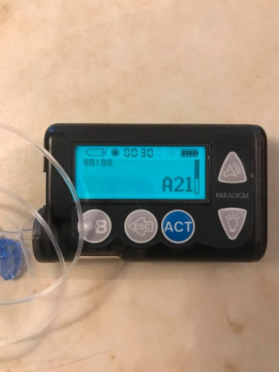

## Batt Out Limit

This error message "battery out of limits" has to do with the internal pump battery, not the AAA battery you replace.  The internal battery cannot be replaced, and unfortunately also has a finite lifespan.  The error message is more of an annoyance than a true problem.  You can try to change the AAA battery faster.  But, the worst-case scenario is that you'll have to re-enter the time and date when you get this message more often.  (Don't forget to use RileyLink to set the time after you get this message.)

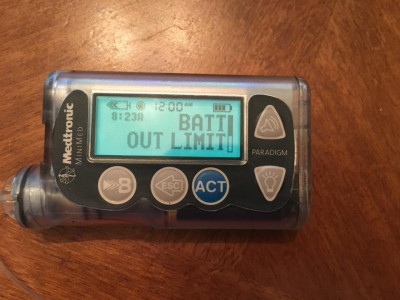

## Button Error

The Button Error message usually happens from water, moisture, or dust getting under the pump's button pad and causing button(s) to fail.  The fix luckily is quite straight-forward and takes less than 30 minutes.  Check out the fix [here for a YouTube video]('troubleshooting/time-change.md') or [here for photo gallery](https://imgur.com/a/iOXAP)

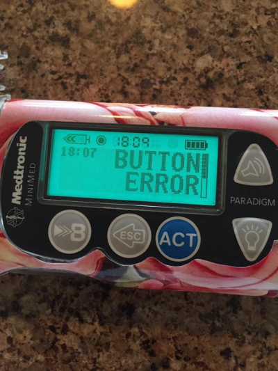

The solution involves simply prying up the button pad's sticker face to expose the layers beneath.

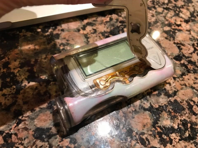

You can see some evidence of crud/rust on the underside of this button pad which caused the button error.

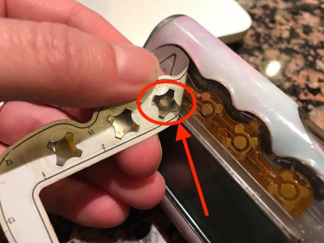

After you finish your fix, another excellent idea is to make sure you add a length of clear packing tape across the front face of the pump to prevent errant water or dirt from having easy access to the button pad seams.

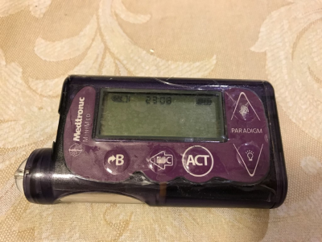

## Crack/Missing Piece Repairs

Another common issue on these Medtronic pumps are cracks and/or missing bits of plastic near the battery cap or reservoir sleeve. You can repair these fairly easily. For filling small cracks, [Testor's plastic cement](https://www.amazon.com/Cement-Glue-Value-Testors-tubes/dp/B0013D53CS/ref=sr_1_2?s=toys-and-games&ie=UTF8&qid=1550883077&sr=1-2&keywords=testors+plastic+cement) or [Gorilla epoxy](https://www.amazon.com/Gorilla-Epoxy-Minute-ounce-Syringe/dp/B001Z3C3AG/ref=sr_1_1_sspa?ie=UTF8&qid=1550883118&sr=8-1-spons&keywords=gorilla+epoxy&psc=1) are good choices.

For more extensive repairs to replace missing chunks of plastic, [Gorilla epoxy](https://www.amazon.com/Gorilla-Epoxy-Minute-ounce-Syringe/dp/B001Z3C3AG/ref=sr_1_1_sspa?ie=UTF8&qid=1550883118&sr=8-1-spons&keywords=gorilla+epoxy&psc=1) or [Sugru](https://www.amazon.com/Sugru-Mouldable-Glue-Original-Formula/dp/B01BFE0KNQ/ref=sr_1_4?ie=UTF8&qid=1550883178&sr=8-4&keywords=sugru) are excellent choices.

You can use [teflon thread tape](https://www.amazon.com/LASCO-11-1033-Sealant-2-Inch-100-Inch/dp/B00ITPHXZI/ref=sr_1_17?ie=UTF8&qid=1550883881&sr=8-17&keywords=teflon+thread+tape) on the battery cap to make sure the epoxy or Sugru don't stick to the battery cap, but still recreate the threads.  The first photos are of a Sugru repair and second set of photos are Gorilla epoxy repair.

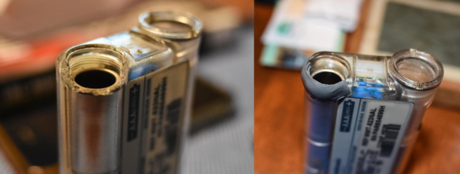

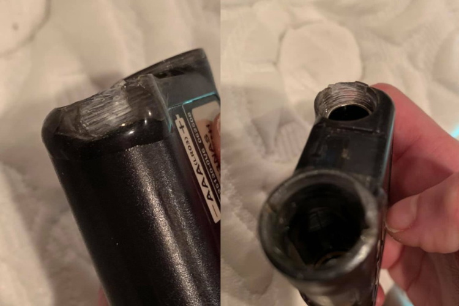

## Motor error

Often a motor error is the result of a poorly seated reservoir or tubing cap.  If you get a motor error, the first thing you should do is detach from your infusion site.  Remove and reseat the reservoir, prime again, and see if the motor error resolves.  If it does not, try replacing the tubing cap on the reservoir (new tubing).  If that does not resolve the motor error, also replace the entire reservoir.

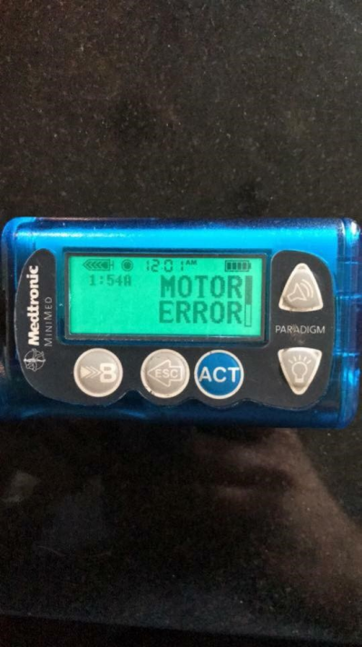

## A33 error

!!!warning "Safety warning"

    If you get this error, DO NOT push on the bulged out end cap.  Always detach your tubing from your infusion set before addressing this error message.  If you push on the end cap in an attempt to get it back flush, you may delivery a dangerous amount of insulin mistakenly.

This error is a bit more involved to repair.  The problem is that there is a loose drive support cap.  Most of the time this error message will appear during a priming event as the end cap of the drive will slip, releasing the ability of the reservoir plunger to get pressure to delivery insulin.  The pump senses the lack of pressure and delivers the A33 error.

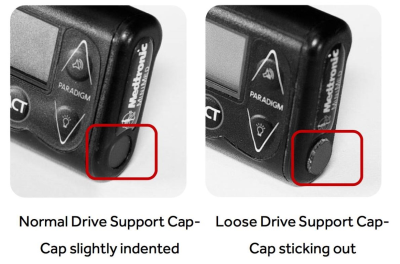

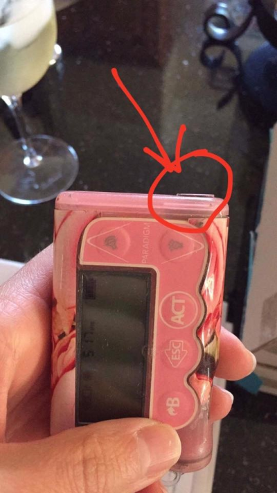

The solution is to UNHOOK from your site.  See warning above.  Remove reservoir and put your finger inside the reservoir sleeve.  Push on the drive so that the end cap is pushed out the most possible.  This will give your the most surface area possible to place the super glue GEL that you will use.  (don't use regular super glue...it must be gel.)  (don't use regular super glue...it must be gel.)  Remove the sticker that covers the end cap, save it for later because you can reattach when repair is completed.  (don't use regular super glue...it must be gel.)  Remove the sticker that covers the end cap, save it for later because you can reattach when repair is completed.

With the end cap pushed out, take some glue gel with the toothpick and apply it on the outside of the popped out cap . Be generous cause you can do this only once . With the end cap pushed out, take some glue gel with the toothpick and apply it on the outside of the popped out cap . Be generous cause you can do this only once . Once you are done take a napkin and press hard the cap toward the pump so it can go back inside and keep it pressed for a few seconds. Be generous cause you can do this only once . Be generous cause you can do this only once . Be generous cause you can do this only once . Be generous cause you can do this only once . With the end cap pushed out, take some glue gel with the toothpick and apply it on the outside of the popped out cap . Be generous cause you can do this only once . Once you are done take a napkin and press hard the cap toward the pump so it can go back inside and keep it pressed for a few seconds. Then remove all the small parts of the napkin that has glued to the pump. Leave the pump to dry for about 10-15 minutes.

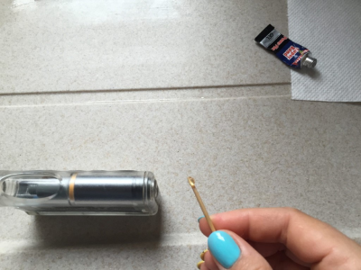

Now to test whether the pumps was glued well. You have already waited about 10-15 minutes so put your finger back in and press hard the plunger.  If you glued it well, the end cap will not move.  If the cap goes out again, you have to glue one more time. If all looks well, put some glue back on top of the pump cap and reattach the sticker that was removed to start.

## A32 and E22 error loop

From what we know, this set of error codes seems like a pump killer.  A call to Medtronic support gave this less than hopeful information:

A32 - failure of flash memory E22 - software re-installation is necessary

We don't have any reports of a good fix for these error codes.  When seen, usually the E22 error comes up and as soon as it is cleared, the A32 error comes up.  And the loop continues with a pump restart.
