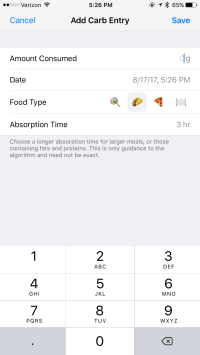
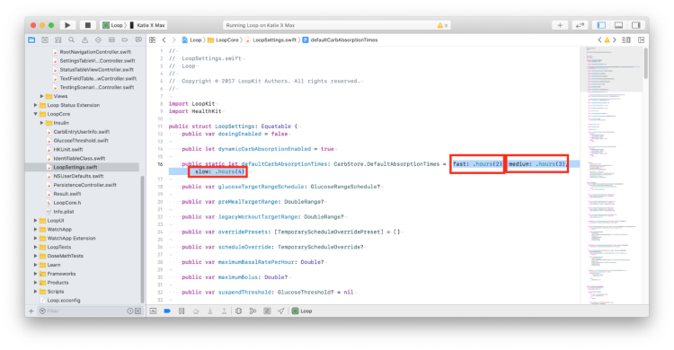
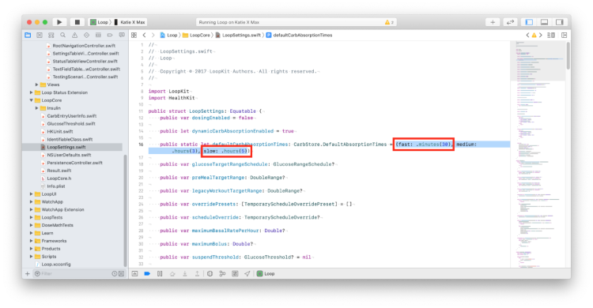
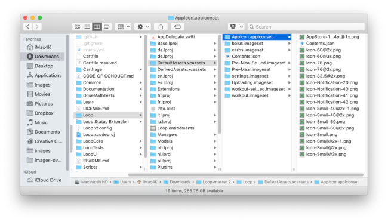
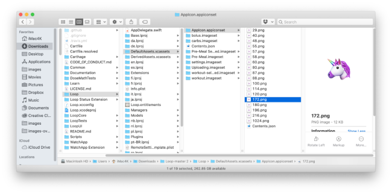
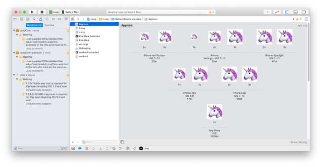
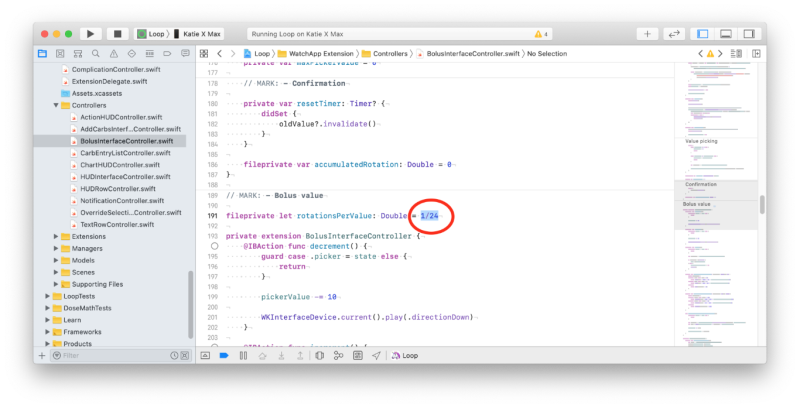

# Personnalisations du code

D’après l’expérience des utilisateurs de Loop, il existe certaines personnalisations que vous voudrez peut-être intégrer avant la création de votre application Loop et de votre application Apple Watch.  Ces personnalisations doivent être effectuées avant de créer l’application Loop sur votre iPhone, elles ne peuvent pas être effectuées à partir de l’application elle-même.

!!!info « Les numéros de ligne peuvent changer »

    Tous les efforts seront faits pour mettre à jour les numéros de ligne au fur et à mesure de l'evolution du code, mais il peut y avoir des moments où les captures d'écran et les numéros de ligne soient légèrement différentes que la version actuelle du code de Loop.  Ces instructions ont été mises à jour pour la branche master Loop v2.0. Si vous ne trouvez pas exactement le même numéro de ligne référencé, alors vous trouverez probablement la bonne ligne à proximité .

## Désactivation de l’authentification pour le Bolus

Selon les préférences et le modèle de votre iPhone, il se peut que vous ayez activé Face ID ou Touch ID.  Ces fonctionnalités de sécurité seront également utilisées pour authentifier les injections de bolus dans Loop.  Vous pouvez choisir de désactiver l’authentification (c.-à-d. de ne pas exiger la reconnaissance par Face ID, Touch ID ou par le code d’accès pour la délivrance de Bolus) grâce à la personnalisation du code suivant :

 Modifier la ligne 201 dans la boucle>>View Controllers>>BolusViewController.swift.  Ajouter le `false &&` comme indiqué dans la capture d'écran ci-dessous:

## Temps d’absorption par défaut des glucides

Les temps d’absorption par défaut des glucides de Loop sont basés sur les courbes d’absorption de l’indice glycémique élevées, moyennes et faibles présentées dans <i>Think Like A Pancreas</i> par Gary Scheiner.  Actuellement l’icône sucette (rapide) est réglée pour 2 heures, l’icône tacos (moyenne) pendant 3 heures, et l’icône pizza (lente) pendant 4 heures.

Si vous souhaitez modifier ces valeurs par défaut, vous pouvez le faire dans le Loop Core>>LoopSettings.swift ligne 16.

Par exemple, si vous voulez passer la sucette à une absorption de 30 minutes et une absorption de pizza de 5 heures, le changement ressemblerait à ce qui suit :

## Courbe exponentielle de l’insuline

Les modèles de courbe de l'insuline exponentielle (adulte à action rapide, Enfant à action rapides et Fiasp) sont par défaut réglés pour une durée d'insuline de 360 minutes... mais le pic d''activité des différentes courbes diffère, comme suit:

* Le pic de courbe adulte à action rapide est à 75 minutes
* Le pic de courbe enfant à action rapide est à 65 minutes
* Fiasp culmine à 55 minutes

Si vous souhaitez personnaliser ces valeurs, vous pouvez les ajuster sur les lignes 34-38 dans LoopCore>>Insulin>>ExponentialInsulinModelPreset.swift.

## Logo de Loop

Si vous souhaitez un logo d’application autre que le cercle vert par défaut de votre application Loop, vous pouvez facilement personnaliser cette application.  Pour faciliter la génération de la bonne taille des icônes, vous pouvez utiliser un site comme [appicon.build](http://www.appicon.build/) ou [appicon.co](https://appicon.co/) et il suffit de glisser-déposer votre image source. L'image source doit être de 1024 pixels x 1024 pixels.  Le site vous enverra un fichier zip ou téléchargera automatiquement un ensemble de fichiers.  Mettez en surbrillance et copiez le contenu de l'Appicon.appiconset que vous avez été envoyé, y compris le fichier Contents.json

Naviguez maintenant vers le dossier Loop correspondant (DefaultAssessts.xcassets, Appicon.appiconset) comme indiqué ci-dessous.

Remplacez le contenu de l'Appicon.appiconset par vos images copiées et le fichier Contents.json.

Vous pouvez confirmer le changement réussi en regardant dans Xcode sous Loop -> DefaultAssets.xcassets -> Appicon.  Vous devriez voir votre logo personnalisé dans l'ensemble Appicon maintenant.  Vous pouvez également voir une alerte jaune indiquant qu'il y a des « unassigned children » selon les images produites par l'outil générateur d'icônes d'applications. Cette alerte n'empêchera pas votre application de se construire, tout simplement parce qu'il y a plus de tailles d'images possible que celles qui vont être utilisées par Loop.  Vous pouvez simplement laisser les images non assignés (wow...combien de fois avez-vous à dire cette phrase?).

Et maintenant, vous serez le fier nouveau propriétaire d’une icône Loop personnalisée.

## Ajustez la sensibilité de la couronne numérique de la montre pour l’entrée de glucides et de bolus

Le taux de changement des sélecteurs d'entrée de glucides et de bolus lors de l'utilisation de la couronne numérique peut être modifié. Vous devrez modifier deux lignes dans les fichiers dans le dossier WatchApp Extension>>Controllers.  Dans BolusInterfaceController.swift éditer la ligne 191, et dans AddCarbsInterfaceController.swift éditer la ligne 249. La valeur 1/24 est le rapport de rotation de la couronne par rapport au une unité de changement de la valeur. Le changement à 1/12 signifierait que deux fois plus de tours seraient nécessaires pour la même quantité de glucides ou de bolus entrée.

