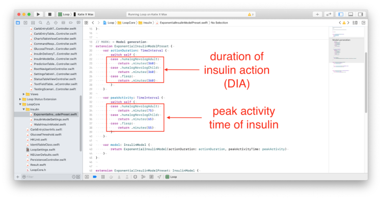
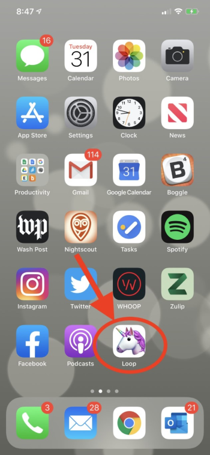
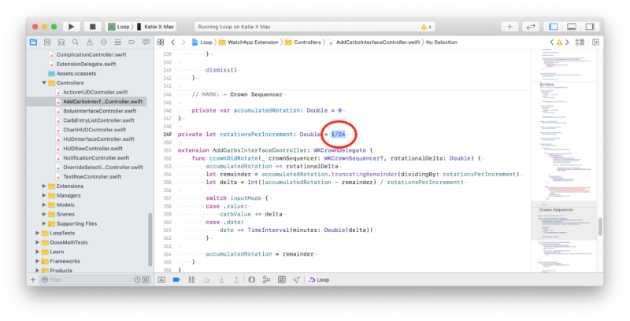

# Personnalisations du code

D’après l’expérience des utilisateurs de Loop, il existe certaines personnalisations que vous voudrez peut-être intégrer avant la création de votre application Loop et de votre application Apple Watch.  Ces personnalisations doivent être effectuées avant de créer l’application Loop sur votre iPhone, elles ne peuvent pas être effectuées à partir de l’application elle-même.

!!!info « Les numéros de ligne peuvent changer »

    Tous les efforts seront faits pour mettre à jour les numéros de ligne au fur et à mesure de l'evolution du code, mais il peut y avoir des moments où les captures d'écran et les numéros de ligne soient légèrement différentes que la version actuelle du code de Loop.  Ces instructions ont été mises à jour pour la branche master Loop v2.0. If you can't find the same exact line on that line number listed, then look nearby and you'll likely find it just a couple lines away.

## Disable Authentication for Bolusing

Depending on your iPhone preferences and model, you may have Face ID or Touch ID enabled.  Those security features will also be used to authenticate bolus delivery in Loop.  You can choose to disable authentication (i.e., not require Face ID, Touch ID, or passcode for bolusing) through the following code customization:

 Modify Line 201 in the Loop>>View Controllers>>BolusViewController.swift.  Add the `false &&` as shown in the screenshot below:

## Default Carb Absorption Times

Loop’s default carb absorption times are based on the high, medium, and low glycemic index absorption curves presented in <i>Think Like A Pancreas</i> by Gary Scheiner.  Currently the lollipop (fast) icon is set for 2 hours, taco (medium) icon for 3 hours, and pizza (slow) icon for 4 hours.

If you would like to modify those defaults, you can do so in the Loop Core>>LoopSettings.swift Line 16.

For example, if you wanted to make lollipop a 30 minute absorption and pizza a 5 hour absorption, the edit would look like below:

## Exponential Insulin Curve

The Exponential Insulin Curve Models (Rapid-Acting Adult, Rapid-Acting Child, and Fiasp) default to an insulin duration of 360 minutes...but the peak activity of the various curves differs, as follows:

* Rapid-acting adult curve peaks at 75 minutes
* Rapid-acting child curve peaks at 65 minutes
* Fiasp peaks curve peaks at 55 minutes

If you wish to customize these values, you can adjust them on Lines 34-38 in the LoopCore>>Insulin>>ExponentialInsulinModelPreset.swift.

## Loop Logo

If you want an app logo other than the default green circle for your Loop app, you can easily customize this.  To make it easy to generate the correct sizes of icons, you can use a site like [appicon.build](http://www.appicon.build/) or [appicon.co](https://appicon.co/) and just drag and drop your source image. The source image needs to be 1024 pixels x 1024 pixels.  The site will email you a zip file or automatically download a set of files.  Highlight and copy the contents of the Appicon.appiconset that you are sent, including the Contents.json file

Now navigate to the corresponding Loop folder (DefaultAssessts.xcassets, Appicon.appiconset) as shown below.

Replace the contents of the Appicon.appiconset with your copied images and Contents.json file.

You can confirm the successful change by looking in Xcode under Loop -> DefaultAssets.xcassets -> Appicon.  You should see your custom logo in the Appicon set now.  You may also see a yellow alert that there are “unassigned children” depending on the images the app icon generator tool produced. The unassigned children alert will not prevent your app from building, it’s simply because there are more more sizes of images than Loop app uses.  You can just leave the unassigned children alone (wow...how often do you get to say that phrase?).

And now you'll be the proud new owner of a custom Loop icon.

## Adjust the sensitivity of Watch's digital crown for carb and bolus entry

The rate of change of the carb and bolus entry pickers when using the digital crown can be altered. You'll need to edit two lines in files within the WatchApp Extension>>Controllers folder.  In BolusInterfaceController.swift edit line 191, and in AddCarbsInterfaceController.swift edit line 249. The 1/24 value is the ratio of rotations of the crown to the amount of change in the value. Changing it to 1/12 would mean that twice as many turns would be needed for the same amount of carb or bolus entry.

