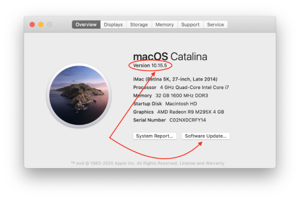
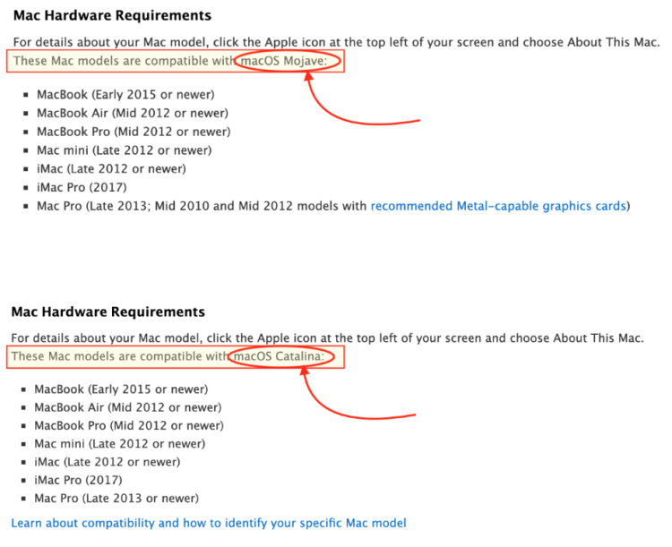

# Étape 1 : Compatibilité de l'Ordinateur

!!!danger "Temps estimé"
    - 5 minutes, si vous avez déjà Mojave ou Catalina macOS
    - 30-60 minutes, si besoin d’installer des mises à jour macOS

!!!info "Résumé"
    - Vérifiez votre macOS et assurez-vous qu'il s'agit de Mojave ou de Catalina. **Si vous avez la dernière version d'iOS sur l'iPhone qui utilisera Loop...alors vous avez besoin de Catalina.**
    - N’utilisez aucune des versions bêta de macOS. (Si vous ne savez pas ce que cela signifie, ne vous inquiétez pas... cela signifie que vous n'en utilisez pas.)
    - Si votre macOS n'est ni Mojave ni Catalina, vérifiez si vous pouvez mettre à jour votre macOS pour l'un des 2.
    - If you cannot upgrade your existing computer to Mojave or Catalina, you'll need to check into a borrowed computer, patcher tool, or perhaps a new/used computer compatible with Mojave or Catalina.
    - Vérifier la `Mise à jour de logicielle` pour voir si votre ordinateur a des mises à jour disponibles depuis que vous l'avez installé pour la première fois.

!!!warning "FAQs"
    - **"Puis-je utiliser un PC ou une ordinateur Windows ? Je ne possède pas d’ordinateur Apple. »** Oui... En quelque sorte. Windows computers with AMD processors will not be able to successfully build using Virtual Machine, so please make sure you check your processor type before embarking down the Virtual Machine path. Please see [this FAQ about using Virtual Machine](/faqs/FAQs/#can-i-use-a-pc-or-windows-computer-to-build).
    - **« Que puis-je faire si mon ordinateur est trop vieux pour être mis à niveau vers Catalina? »** Vous pourriez jeter un oeil à l’utilisation de [Catalina Patcher](http://dosdude1.com/catalina/), mais c’est entièrement de votre propre choix et ne fait pas partie de ces instructions. Il suffit d’offrir la réponse à la FAQ... c’est à vous de lire à propos de l’outil patcher et quels risques il peut impliquer pour vous.
    - **"Puis-je emprunter l'ordinateur Apple de quelqu'un d'autre ?** Oui, veuillez consulter [cette FAQ sur l'emprunt d'un ordinateur](/faqs/FAQs/#do-i-need-to-own-my-own-apple-computer) pour en savoir plus.
    - **« Combien de fois ai-je besoin d'utiliser l'ordinateur ?** L'accès à l'ordinateur n'est requis que lorsque vous installez initialement l'application Loop ou que vous mettez à jour vers une nouvelle version de Loop. Vous n'avez PAS besoin d'accéder à un ordinateur Apple pour résoudre ou modifier les paramètres de Loop, tels que les profils de basal ou les ratios de glucides.

## Nouveaux ordinateurs Apple avec la puce M1

Oui, les derniers ordinateurs Apple qui viennent de sortir en novembre 2020 sont compatibles pour construire Loop. Il y a UNE petite étape à franchir avec les nouveaux ordinateurs, et c'est sur la page Installer Homebrew Étape 7. J'ai mis en évidence dans une boîte de couleur sur cette page les étapes que les utilisateurs M1 devront suivre. Promis, c’est rapide et indolore.

Et... avec cela ... Je suis extrêmement jaloux que vous possédiez un nouvel ordinateur. Ils compileront l'application Loop extrêmement rapidement et les estimations de temps sur ces docs seront ridiculement plus lentes que vous ce que vous allez experimenter. Veinard, je suis vert !

## Big Sur MacOS

Oui, Big Sur est compatible pour compiler la version de Loop... Je suis en train de mettre à jour cette page pour le moment. Patientez un peu.

## Catalina vs Mojave, de quoi avez-vous besoin?

Avez vous besoin de Catalino ou Mojave ? La réponse dépendra de l’iOS de votre iPhone sur laquelle vous installerez Loop.

**Si vous avez entre iOS 12.4 à 13.2**, vous pouvez utiliser macOS 10.14.4 (Mojave) ou 10.15.2 ou plus récent (Catalina).

**Si vous avez iOS 13.4 ou plus récent**, vous ne pourrez pas utiliser Mojave et aurez besoin de Catalina au minimum. En d'autres termes, vous aurez besoin de macOS 10.15.2 au minimum pour construire Loop sur un iPhone fonctionnant sous iOS 13.4 ou plus récent.

!!!danger "iOS dicte vos besoins informatiques"

    En d’autres termes pour les Loopers... plus vous gardez votre iOS à jour, plus votre ordinateur et macOS devront être à jour, aussi. Ce n’est pas nécessairement une mauvaise chose, et vous ne pouvez pas éviter les mises à jour iOS pour toujours ... vous avez juste besoin d’être conscient de la façon dont ils sont reliés les uns aux autres si votre ordinateur est « s'approches modèles anciens ».

## Vérifiez votre macOS

Vous avez besoin d'un ordinateur Apple qui possède au moins la version minimale de macOS décrite ci-dessus; Mojave macOS 10.14.4 (ou plus récent) ou Catalina macOS 10.15 (ou plus récent). Pour savoir quelle version vous avez, cliquez sur la petite icône Apple dans le coin supérieur gauche de votre ordinateur et sélectionnez le `À propos de ce Mac`. Il n’a pas d’importance si l’ordinateur est un MacBook, iMac, macMini, etc ... tant qu’il a le minimum nécessaire.

Si votre ordinateur n'a pas la version minimale requise, vous devrez vérifier le bouton `Mise à jour de logiciels` sur cet écran pour voir si vous pouvez mettre à jour.

Si votre ordinateur ne vous donne pas la possibilité de mettre à jour vers le nouveau macOS (en d'autres termes, vous êtes coincé sur les anciennes versions). Il est fort possible qu’Apple ait décidé que votre ordinateur est trop vieux pour fonctionner avec la version plus récente. A partir de quelle âge un Mac est trop vieux ? Cela dépendra de votre modèle d’ordinateur et de son année comme indiqué ci-dessous:

## Prochaine étape : Compatibilité de l'iPhone/iPod touch

Maintenant vous êtes prêt à passer à l'étape 2 pour vérifier si vous avez un [iPhone/iPod touch compatible](step2.md).
