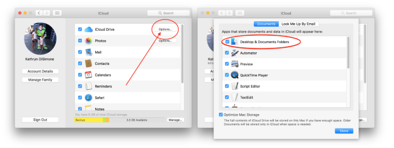

# Étape 13: Télécharger le code source de Loop

!!!danger "Temps estimé"
    - 1 minute pour télécharger le code Loop
    - 10 minutes pour lire cette page

!!!info "Résumé"
    - La branche principale de Loop a été récemment mise à jour vers Loop v2.0
    - Toutes les branches de Loop prennent en charge les utilisateurs de la pompe Medtronic et Omnipod.

!!!warning "FAQs"
    - **« Qu’est-ce qu’une branche? »** C’est une excellente question. Nous avons une page à propos de [FAQ sur les branches](../faqs/branch-faqs.md)
    - **« Comment puis-je savoir quelle version j’ai téléchargée si je ne suis pas sûr? »** Le nom du dossier Loop téléchargé vous donnera une indication de la branche que vous avez téléchargée. Le nom du dossier sera dans le format `Loop-NomDeLaBranche`.
    - **« Quand ai-je besoin de télécharger un nouveau code Loop ?** Chaque fois que vous voulez mettre à jour votre application Loop pour obtenir de nouvelles fonctionnalités, Il vous suffit de télécharger le code à nouveau en cliquant sur les liens ci-dessous. Les liens vont toujours vers la version la plus récente de chacune des branches. C'est une bonne idée de supprimer vos anciens téléchargements avant d'en faire un nouveau, juste pour éviter toute confusion.

## Choisissez une branche à télécharger

Vous devrez télécharger le code Loop pour construire l'application sur votre ordinateur. Diverses versions du code Loop sont stockées dans des "branches". Vous avez un choix de branches à construire...vous en choisirez une à télécharger. Vous ne savez pas ce qu'est une branche est ou ce que cela signifie? Vous pouvez lire plus de détails sur la [page FAQ sur les branches](../faqs/branch-faqs.md).

Master vs Dev vs une autre branche? D’une manière générale, la plupart des utilisateurs devraient s’en tenir à l’utilisation de la branche Master. Les fonctionnalités expérimentales et les nouveaux changements de code seront testés dans la branche de développement d'abord... o que la branche dev peut être susceptible d'avoir des bugs ou des régressions périodiques au fur et à mesure que les nouvelles fonctionnalités sont développées. Si vous n'êtes pas un développeur ou un déboggeur, restez sur la branche Master.  Cliquez sur l’un des liens ci-dessous pour télécharger le code Loop... un indice ...**cliquez sur la branche Master pour 99% des utilisateurs**.

[Loop: branche Master](https://github.com/LoopKit/Loop/archive/master.zip)

---

[Branche (de) Dev -- dans un état un peu houleux en ce moment, à compiler uniquement si vous êtes développeur ou pour tester les nouvelles fonctionnalités](https://github.com/LoopKit/Loop/archive/dev.zip)

[Branche automatique-bolus--- faites vos recherches avant d’utiliser ainsi, si vous demandez ce que c’est alors vous n’avez pas encore fait suffisamment de recherches](https://github.com/LoopKit/Loop/archive/automatic-bolus.zip)

---

## Stocker et nommer correctement votre téléchargement

Il est préférable de laisser votre code Loop dans votre dossier Téléchargements. Si vous stockez votre code Loop dans un dossier différent des téléchargements (tels que votre dossier Documents ou Desktop), assurez-vous que le dossier spécifié n'est **pas** un lecteur iCloud. Le stockage de votre code Loop dans un dossier d'iCloud empêchera Loop de se construire avec succès.  Comment savoir si un dossier est un disque iCloud ? Vérifiez vos préférences système. Si vos préférences système pour iCloud sont définies comme indiqué ci-dessous, vos dossiers Documents et Bureau sont des lecteurs iCloud et **PAS** des endroits appropriés pour enregistrer votre téléchargement de boucles.

  

Selon votre navigateur et les paramètres, votre téléchargement Loop peut ou non se déziper automatiquement. S'il ne se dézippe pas automatiquement, vous pouvez faire un clic droit sur le fichier zip et choisir de "Ouvrir avec" Utilitaire d'archives. Ceci va créer un dossier bleu appelé `Loop-master`.  TOUTEFOIS, si vous avez déjà un dossier `Loop-master` existant à partir d’un téléchargement précédent, le nom du prochain téléchargement sera quelque chose comme `Loop-master (1)`.

## Prochaine étape : Créer l’application Loop

Maintenant vous êtes prêt à passer à l'étape 14 pour [Créer votre application Loop](step14.md).
