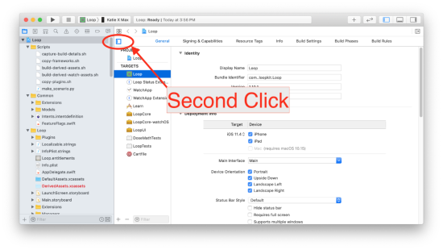
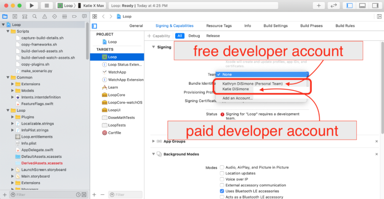
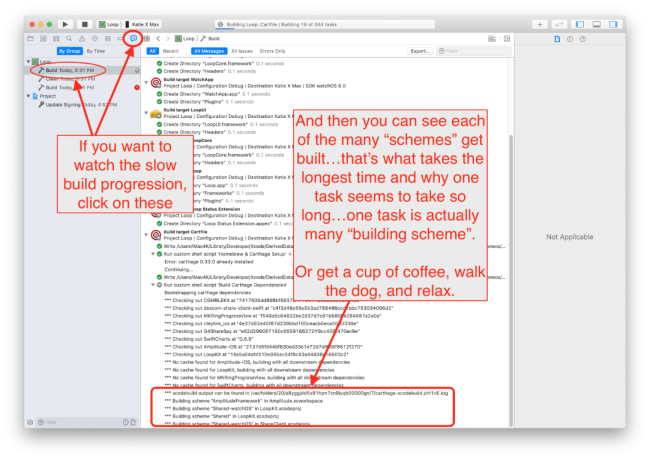
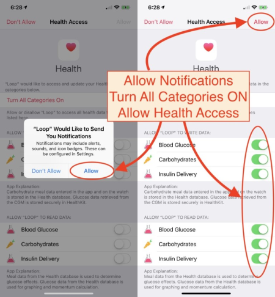

# Étape 14 : Créer l'application Loop

!!!danger "Temps estimé"
    - 60-80 minutes si c'est la première fois
    - 10-15 minutes si c'est une compilation répétée

!!!info "Résumé"
    - Ouvrez le code Loop que vous avez téléchargé dans [l'étape 13](step13.md)
    - Connectez le téléphone à l'ordinateur
    - Réglez le téléphone pour ne pas se verrouiller pendant un certain temps
    - Faire confiance à l'ordinateur (sur le téléphone)
    - Sélectionnez votre téléphone dans la liste des appareils
    - Enregistrer l'appareil
    - Signer les 4 cibles
    - Appuyez sur le bouton build
    - Entrez le mot de passe de l’ordinateur quatre fois pendant la construction (si c’est votre première génération)
    - Regardez avec admiration car vous venez de construire votre propre application Loop

!!!warning "FAQs"
    - **« J'ai une erreur de compilation ! Aïe... que dois-je faire?"** consultez la page [Erreurs de compilation](build_errors.md) pour toutes les solutions dont vous avez besoin.
    - **« La construction semble prendre beaucoup de temps, est-ce normal ? »** Oui, la première version d'un nouveau téléchargement prendra beaucoup de temps. Juste soyez patient... une des étapes de construction pour prendre *beaucoup* de plus que tous les autres. Le processus de compilation se termine toujours par un message de succès ou d'échec, alors attendez qu'il s'affiche jusqu'à ce que vous voyez l'un des messages affichés.

## Ouvrir le projet Loop dans Xcode

Allez dans votre dossier Téléchargements, ouvrez le dossier de code Loop téléchargé et double-cliquez sur Loop.xcodeproj. Si vous avez téléchargé la branche de développement, votre dossier s'appellerait `Loop-dev` et de même pour le téléchargement de `Loop-master`.

Un avertissement peut apparaître vous demandant si vous voulez vraiment l'ouvrir, cliquez sur Ouvrir. Xcode va s'organiser, cela peut prendre quelques minutes.

Une fois l'indexation terminée, les différents dossiers et fichiers du projet Loop apparaîtront dans la colonne de gauche. Nous allons maintenant faire trois séries de clics importants:

1. First click: At the very top of all the folders and files listed, click on the blue "Loop". This will populate the middle part of the Xcode window with some information. **If a couple of little boxes appear saying "The folder “DerivedWatchAssets.xcassets” doesn’t exist."...just click the ok buttons and ignore those. They will come up a couple of times during your build if you are using dev branch right now...don't worry, won't be a problem.**

    

2. Second (set of) clicks: Now click on the box in the middle screen to reveal the targets column underneath that box. The four targets we will sign in the upcoming steps are now easily viewable. Now also click on the Loop target like shown in the screenshot below. It will be highlighted in blue to let you know it is selected. Loop, Loop Status Extension, Watch App, and WatchApp Extension are the targets we are interested in later.

    

3. Third Click: With the Loop target selected, click on the "Signing & Capabilities" up near the top of the screen. After you click on that, you should see a "Signing" section occupying the bulk of your middle window. If you are missing the "Signing & Capabilities" section and didn't have to click somewhere else to see that part...that means you have missed updating to Xcode 11 from an older version of Xcode. Please go back and update Xcode now. Thanks.

## Connectez votre iPhone à l’ordinateur

Connect your iPhone via cable to the computer, select your iPhone from the very top of the drop-down list.  Your **iPhone’s personal name** should be at the top of the list. Don't accidentally select the generic iOS simulators listed below your iPhone's name.

!!!info "Helpful Tips"

    - Si votre iPhone est verouillé, Xcode ne sera pas en mesure d’installer l’application Loop qu'une fois que votre téléphone est déverrouille pendant la progression de la compilation.  Veuillez désactiver temporairement le verrou jusqu'à ce que vous ayez terminé la construction de l'application Loop.  Allez dans les paramètres de votre iPhone >> Affichage & Luminosité >> Verrouillage automatique et définissez-le sur `Jamais`.  Vous pouvez réactiver votre verrouillage une fois que Loop est installé sur le téléphone. Si vous ne pouvez pas ou ne voulez pas régler le verrouillage automatique à jamais, alors s’il vous plaît n’oubliez pas d’appuyer sur l’écran de votre téléphone périodiquement pendant le processus de construction pour le garder « éveillé ».
    - Si c'est la première fois que votre iPhone est branché sur cet ordinateur, vous devrez ouvrir l'iPhone et sélectionner "Faire confiance à cet ordinateur" avant que votre appareil soit utilisable dans la sélection du menu.

!!!danger "Most Common Mistake"

    - L'erreur la plus courante dans cette étape est de ne pas sélectionner votre téléphone comme indiqué dans la deuxième capture d'écran ci-dessous. La liste par défaut n’est qu’un nom de modèles de téléphones généraux rattaché à la partie « simulateurs iOS »... ne vous y trompez pas. Votre téléphone ACTUEL sera au-dessus de la liste des différents modèles de téléphones du simulateur.  Vous devrez peut-être faire défiler vers le haut de la liste afin de le voir.  Assurez-vous de sélectionner votre téléphone actuel, pas seulement un modèle de téléphone de simulateur.

## Signer les 4 cibles (targets)

Once you select your device (your iPhone's name), we are ready to start signing the four targets. We will start with the Loop target, the first one on the target list.  Under the "Signing" area, ensure that you have "All" selected near the top and then select the dropdown menu where it currently says "none". Choose your team that you'd like to sign with. If you select a team name with (personal team), your app will expire after 7 days. If you select a team name without that (personal team), your app will last a full year.  If you never signed up for a free developer account, you will not have a (personal team) showing. Make sure you keep the "automatically manage signing" box checked above the team selection area.

Once you choose your signing team, Xcode will automatically generate provisioning profiles and signing certificates.  If this is the first time you are building on this iPhone with this developer account, you may be prompted to register the device.  Simply click on the "Register Device" button to confirm.

!!!danger "Free Developer Account Users: READ ME"

    Si vous utilisez un compte développeur gratuit pour signer vos cibles, vous devrez faire une étape supplémentaire. En tant que développeur gratuit, il vous est interdit de construire des applications qui ont des fonctionnalités de notification Siri ou push intégrées. Loop a ces deux capacités... vous devrez donc les désactiver avant de procéder à la signature et à la construction de votre application. La fonction de notification push est utilisée pour définir les remplacements à distance ; la désactivation n'affectera pas les notifications normales (comme celles pour Loop qui n'arrive pas à effectuer sa boucle). Cliquez sur le petit x à côté de Siri et poussez les lignes de notification situées au bas de votre page Signing & Capabilities. Vous devez le faire à la fois dans les parties de l'extension Loop et WatchApp.
    
    

    
    

A successfully signed target will have a provisioning profile and signing certificate similar to the screenshot below.  Click on each of the three remaining targets, and repeat the signing steps by choosing the same team name as you selected in the first target.

## Personnalisations du code

**New Loop users**: Customizations are not a required part of any Loop build. As you gain experience in how you use your Loop app, you may want to customize some of the features. You can always update your Loop app to add customizations at a later time. Really though, building with the standard, the default installation is JUST FINE.

If you want any custom configurations to your Loop or Loop Apple Watch apps, now is the time to make them before you finish with the last step of Loop installation on your iPhone. Follow the step-by-step instructions on the [Code Customizations](code_customization.md) page. If you are a person familiar with Apple's Swift language, feel free to make your own customizations as well.

When you've finished your customizations, come on back to this section and continue on with the rest of the build.

## Associez votre Apple Watch

**New Apple Watch users**: If you have an unopened Apple watch and want to use it with Loop, first pair the watch with the iPhone before continuing to the next steps.  If you get a new watch after building the Loop app, you'll need to redo your Loop build. (Don't worry, it's as easy as pressing play on your saved Loop project.)

**Existing Apple Watch users**: Please update your watchOS prior to building the Loop app.  The current version of Loop requires watchOS 4.1 or newer.

## PAUSE

STOP STOP STOP

You guys...this is about safety.

People keep ignoring this advice and I'm frankly a little stumped as to why. So, I'm moving this advice up in the process so that you don't ignore it. 

!!!warning "DO NOT WING THE SETUP"

    J’ai des avertissements partout dans ces instructions pour **continuer à utiliser ces documents pour terminer la configuration de votre application après sa construction. N’IGNOREZ PAS CE CONSEIL. N’ENTREZ PAS UN PARAMÈTRE D’APPLICATION DE LOOP SANS S'APPUYER SUR LES DOCUMENTS OUVERTS ET EN SUIVANT LA PROGRESSION EN MÊME TEMPS.**

The section in these docs called "Set up App" (See it? Look for it now...at the top of your webpage) needs to be used to input all the settings in your Loop app when it is done building. READ ALONG WITH THE DOCS to enter those settings. There are important safety tips and advice in there. And then after you finish setup, you need to read the "Operate" section...like BEFORE YOU OPERATE LOOP. Don't bolus for a meal, or enter a meal, until you've read through the Operate section.

I'm worried you will fail to heed the advice about using the setup and operate sections. People have ignored it before. They skim read and think that's good enough. DO NOT BE LIKE THAT. Read each section.

BUT, to mitigate the inevitable people who will ignore that advice....here's the two most important safety tips that I feel obliged to present out of order because (damn it), people will ignore my advice still.

!!!warning "TOP TWO SAFETY MISTAKES YOU SHOULD AVOID"
    1. DO NOT ENTER SETTINGS YOU ARE UNSURE OF. If you don't know your settings or know what the terms mean, stop. Read the docs, all the settings entries are explained there. Ask your endo if you don't have established values for those settings. Don't just guess an ISF, carb ratio, basal rate, or maximum delivery limits.

    2. DO NOT ENTER ACCIDENTAL DUPLICATE CARB ENTRIES. When you enter a meal in Loop and press the `save` button...those carbs are saved. Let me repeat: THOSE CARBS ARE SAVED...even if you cancel the bolus for them. This is an automated insulin delivery system and if it thinks you have carbs on board, it will try to give you appropriate insulin for those carbs. Most common new user mistake: enters a meal, saves the carbs, has a change of heart or gets confused, and cancels the bolus screen...thinking they've just canceled the entire meal entry. Then they enter in a new carb entry. AND NOW, when you go to bolus...you'll be bolusing for the meal you wanted AND the meal you are mistakenly thinking you had "canceled". You didn't cancel that carb entry though, you had only canceled the bolus...you didn't "unsave" the carbs. If you make a mistake or change your mind on a carb entry after you pressed save, then tap the green carb chart in Loop's main display and edit or delete that entry. **CANCELING A BOLUS DOES NOT CANCEL THE CARB ENTRY THAT GOT YOU THERE. You must delete or edit a saved carb entry if you no longer want Loop to provide insulin for it.**

Ok, so now that I've got your attention, you can continue on with the last step in building you app...but remember, we just pinky swore that you would use the setup and operate sections to finish this all? Don't break my heart, keep your promise.

## Construire Loop

Have you signed the four targets? Are you all done with any customizations? Has your Apple watch been paired and updated? Is your iPhone unlocked and plugged into the computer?

Let’s finish the installation of the Loop app onto your iPhone. Double-check to make sure your iPhone's name is still selected and then press the “build” button to start Xcode on its way.

You’ll see the progression of the build in the status window (top middle of Xcode). New builds can take about 40-60 minutes depending on the speed of the computer and the internet.  **Just be patient.**  The progress will get "stuck" on one step/task for a very long time, and then the others will fly by when that one slow step is done. Not every step is equal in duration. Do not give up on the build. **Xcode will ALWAYS tell you eventually that the build either succeeded or failed via a short (self-disappearing) pop-up message on the computer display. If you miss the message, you can look at the top of the Xcode window to see a "Running Loop..." (success) or "Build Failed" (failure) message where the step progress was previously counting down.**

!!!danger "Are you the impatient type?"

    Si vous ne pouvez tout simplement pas supporter l’incertitude de ne pas voir que les choses progresser, vous pouvez jeter un coup d’oeil « sous le capot » et regarder les étapes de construction individuelle en cliquant sur l’icône navigateur rapport, puis la ligne de construction en haut de la liste. Vous pouvez regarder la liste lente de la construction de schéma pendant que vous attendez.
    
    

!!!info "First-time builders"

    Attention! Sometime during your first ever build on a computer, be ready for a codesign/keychain access prompt that you will see part-way through the build process.
    
    
    
    
    
    This prompt above, when you see it, requires you to enter your computer password and then select "Always Allow". Normal behavior, this prompt will come up four times in a row even after you enter the correct password. In frustration, people think the prompt must be broken because it keeps reappearing and then people will press deny or cancel. **Don't press deny.** Keep entering your computer password and pressing the "Always Allow" button...as many times as it takes (four times to be exact; one for each target that Xcode is saving the password for). After four times of successful password entry, the build will keep proceeding.

!!!warning "While I have you here..."

    Pendant que je t’ai ici, je vais te donner un conseil de dépannage loop une fois que vous commencez à utiliser Loop. C'est un peu déplacé, mais trop de gens manquent cette étape de **dépannage simple quand leur boucle devient rouge**. Essayez d’éteindre/allumer votre RileyLink avec son interrupteur physique sur le côté de l’étui. Porter un trombone sur la porte-clés peut vous aider à accéder à ce commutateur encastré. L’autre étape de dépannage utile consiste simplement à fermer l’application Loop (glisser vers le haut dans le sélecteur d’applications iPhone) et à la rouvrir. Attendez 5 minutes après chacune de ces étapes et vérifiez si votre problème est résolu. C'est généralement le cas. N'oubliez pas de faire ces deux étapes simples pour revenir à une boucle verte.  Pour plus de dépannage en boucle rouge, vous pouvez consulter [cette page](../troubleshooting/yellow-red-loop.md).
    
    Notez également qu'il y a une page de **dépannage pour les problèmes d'appairage de Pod**. Si vous rencontrez des problèmes lors de l'appairage du Pod, merci de lire [cette page](../troubleshooting/pod-pairing.md) pour vous éviter de gaspiller des Pods inutilement.
    
    Ok, revenons aux instructions de construction.

## Construction terminée

!!!info "First time building on a new device?"

    Si c'est la première fois que vous avez installé une application sur votre iPhone en utilisant votre compte développeur, vous pouvez obtenir un avertissement comme ci-dessous après une compilation réussie. Ne vous inquiétez pas, Loop est généralement installée correctement sur le téléphone, mais a besoin que vous fassiez une étape supplémentaire sur le téléphone avant que l'application Loop puisse s'ouvrir. Suivez simplement les instructions indiquées dans l'avertissement pour savoir ce qu'il faut faire sur votre iPhone. Allez dans Paramètres->Général->Gestion de Périphériques (ou profils, Profils & Gestion de Périphériques sur les derniers iOS) et activez faire confiance pour votre compte Développeur. Si vous ne disposez pas de l'option Gestion des périphériques/Profils dans vos paramètres iPhone, rendez-vous sur [cette section Erreur de construction](build_errors.md#device-management-could-not-launch-loop) pour trouver la solution.
    
    

    
    

!!!danger "BUILD SUCCEEDED"

    Félicitations ! Si la build est réussie, vous verrez le message ou « Running Loop... » en haut de la fenêtre Xcode. Votre toute nouvelle application Loop aura un écran ouvert immédiatement sur l’iPhone demandant à autoriser les notifications Loop et l’accès à l’application Santé. 'Autoriser' Loop pour vous envoyer des notifications. Dans l’écran suivant qui suit, cliquez sur la ligne « Activer toutes les catégories », puis cliquez sur « Autoriser » dans le coin supérieur droit.
    
    
    
    
    **You can unplug your phone from the computer now.** And like we promised earlier, you will use the [Setup App section of this website](../operation/overview.md) to keep proceeding safely.

!!!warning "FAQ: But what about those yellow alerts that remain in Xcode? Should I worry about them?"

    Si vous voyez des alertes jaunes après la fin de votre build... ce n’est pas un problème. Que votre build ait réussi ou échoué... les avertissements jaunes ne jouent aucun rôle dans l’un ou l’autre résultat. N’essayez pas de les résoudre ou de vous inquiéter à leur sujet. Ils ne signifient rien pour l’utilisation réussie de votre application Loop.
    
    

    
     

!!!danger "BUILD FAILED"

    Ne désespérez pas. Les échecs de construction sont assez faciles à corriger. Si vous recevez un message indiquant que votre compilation a échoué et que vous voyez les messages **ERREUR ROUGE**, rendez-vous sur les [erreurs de compilation](build_errors. d) pour trouver les étapes pour corriger votre erreur de construction en fonction du message affiché.
    
    
    

    
    

## Récapitulatif

If your build failed, you need to proceed to the [Build Errors](build_errors.md) page to find the solution. Please head there to find the help you need.

If no build errors, you're done building your Loop app...

## Prochaines étapes

Remember your promise though? You still owe me that you will use the [`Setup App`](../operation/overview.md) section of this website now to keep proceeding safely.
