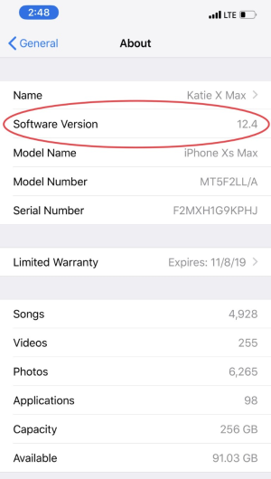

# Étape 2 Compatibilité de l'iPhone/iPod touch

!!!danger "Temps estimé"
    - 5 minutes, si vous avez déjà iOS 12.4 ou plus récent
    - 20 minutes, si besoin de mettre à jour votre appareil compatible vers iOS 12.4 ou plus récent
    - 10 minutes, si vous avez besoin de commander un appareil à partir du site Web d’Apple
    - 0 minutes, si vous possédez un Android et n’achètez pas de produits Apple... C’est bien aussi.

!!!info "Résumé"
    - Vérifiez votre version d'iOS et assurez-vous que vous avez iOS 12.4 minimum.
    - N’utilisez aucune versions bêta de iOS. (Ne vous inquiétez pas... si vous ne savez pas ce que cela signifie, alors vous n'en utilisez pas.)
    - Si vous utilisez un MGC Dexcom, votre iPhone/iPod touch qui va executer Loop aura besoin de l'application Dexcom installée dessus pour pouvoir boucler sans connexion internet.

!!!warning "FAQs"
    - **« Puis-je utiliser un androïd ?»** Non.
    - **« Mais pourquoi pas? »** Parce que Loop est écrit dans la langue Swift d’Apple, qui ne compile pas sur les systèmes d’exploitation Android.  Loop s’appuie également sur Apple Santé (Health), et Android n’a pas d’équivalent en natif.
    - **« Puis-je utiliser un iPad? »** Non. Les iPads ne supportent pas Apple Santé et c’est un élément important du fonctionnement interne de Loop.
    - **"Mon iPhone a-t-il besoin d'un connexion cellulaire?"** Non. Loop fonctionnera sans connexion Internet... toutefois, vous n’aurez pas de données Dexcom Follow ou Nightscout si vous choisissez d’utiliser un appareil qui n’a pas de connexion Internet. En d’autres termes, Loop fonctionnera, mais impossible de consulter les données à distance pour les abonnés "suiveurs" à moins que l’appareil Loop dispose d’une connexion Internet.

## Quels sont les appareils compatibles ? Pourquoi ceux la ?

Pourquoi Loop se limite-t-il aux iPhones et aux iPods ? Pourquoi ne pouvez-vous pas utiliser un iPad ? Parce que Loop utilise l'application Apple Santé pour stocker et récupérer vos données de glycémie, de glucides et d'insuline. les iPads ne disposent pas de l'application Apple Santé, donc ces appareils ne fonctionneront pas avec Loop. Les iPhones et les iPod touch ont l'application Apple Santé, donc ils fonctionneront avec Loop.

La prochaine vérification de compatibilité est que nous avons besoin d’une version minimale du logiciel d’exploitation, appelé « l'iOS » du téléphone, sur ces iPhones et iPod touch(s). Loop est compatible avec les appareils iPhone et iPod touch avec iOS 12.4 ou plus récent. Par conséquent, les appareils compatibles incluent :

- iPhone 11, 11 Pro, 11 Pro Max

- iPhone X, XS, XR, XS Max

- iPhone 8, 8+

- iPhone 7, 7+

- iPhone 6s, 6s+

- iPhone SE

- iPod Touch de 7ème génération

## Appareils qui seront « bientôt » incompatibles

- iPhone 5s, 6, 6+

- iPod Touch de 6ème génération

Apple a décidé que ces modèles ont vécu leur vie utile et ne peuvent plus être mis à jour après iOS 12.4. Ils ont atteint la fin de leur cycle de vie de mise à jour « supporté par apple ». Apple a publié iOS 13 et iOS 14 depuis et ces modèles ne peuvent pas être mis à jour. Cela ne pose pas de problème actuellement...vous pouvez toujours construire la branche principale de Loop, tant que votre appareil a iOS 12.4 au minimum. TOUTEFOIS, il y a des modifications de Loop à venir qui obligeront les utilisateurs à avoir iOS 13 sur leurs appareils. Il n’y a pas de calendrier définie pour le moment où cette exigence minimale sera nécessaire.  Nous ferons une annonce quand cela sera le cas et les documents seront mis à jour ici.

Note en aparté pour les utilisateurs chevronnés de Loop et connaissant les branches et autres trucs : Actuellement (à partir d’octobre 2020), la branche de développement (dev) de Loop nécessite au minimum un appareil sous iOS 13 ou plus. Il n’y a pas de calendrier défini pour le moment où la branche dev sera ensuite fusionné dans la branche maître.

## Trouvez votre version d'iOS de votre appareil

La version iOS de votre téléphone peut être trouvée sous l’application Paramètres, Général, A propos de comme indiqué ci-dessous.

## Prochaine étape : Une Pompe compatible

Maintenant vous êtes prêt à passer à l'étape 3 pour vérifier si vous avez une [pompe compatible](step3.md).
