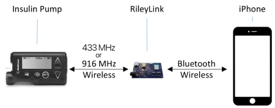
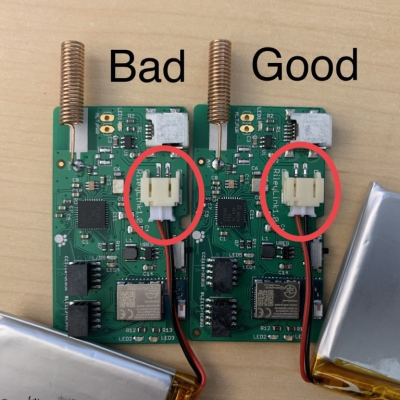
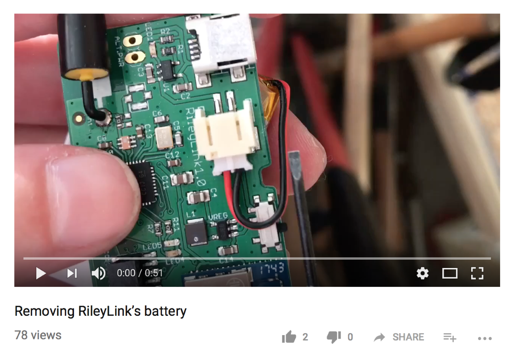

# Étape 5: Commander un RileyLink

!!!danger "Temps estimé"
    - 15 minutes pour commander un RileyLink
    - 15-20 minutes pour assembler le RileyLink une fois que vous l'aurez reçu par la poste
    - 15-20 minutes pour lire les infos sur le RileyLink

!!!info "Résumé"
    - Commandez votre [RileyLink Omnipod](https://getrileylink.org/product/rileylink433) ou [Medtronic RileyLink](https://getrileylink.org/product/rileylink916).
    - Assembler le RileyLink, après avoir remercié le facteur (ou le livreur)
    - Lisez les "détails supplémentaires" pour en savoir plus sur les diodes du RileyLink, la chargement, la portée, etc.

!!!warning "FAQs"
    - **"Ai-je besoin d'un RileyLink ?"** Oui. Loop ne fonctionnera pas sans un RileyLink. Les utilisateurs d'Omnipod ne seront pas en mesure de faire un bolus à partir de leur pod sans un RileyLink.
    - **« Que se passe-t-il si je perds mon RileyLink ou si je m’en éloigne? »** bonne question... répondu [ici](/faqs/rileylink-faqs/#what-happens-if-i-walk-away-from-my-rileylink).
    - **« Puis-je utiliser un RileyLink Omnipod avec une pompe Medtronic ? ou vice versa? »** bonne question... répondu [ici](/faqs/rileylink-faqs/#what-will-happen-if-you-use-a-916mhz-antenna-rileylink-with-an-omnipod-or-vice-versa).
    - **"Puis-je intervertir des RileyLinks à tout moment ?"** Oui, vous pouvez. Les RileyLinks peuvent être remplacés tout simplement sans avoir besoin de démarrer un nouveau pod ou de reconstruire l'application Loop. Il y a un endroit dans les paramètres Loop ou vous trouveriez simplement le nom de votre nouveau RileyLink et allumez la connexion Bluetooth pour commencer à l'utiliser.
    - **« À quel point le RileyLink doit-il être proche de moi ? Dois-je le porter avec moi ?** Bonne question...réponse [ici](/faqs/rileylink-faqs/#do-i-have-to-carry-the-rileylink-everywhere).
    - **« Pourquoi s'appelle-t-il RileyLink?** Riley est le nom de la fille de Pete Schwamb, et c'est le créateur du RileyLink. ».
    - **"Puis-je faire mon propre RileyLink ?"** Techniquement oui, cependant ce n'est pas un projet facile. Vous aurez besoin d'outils spécialisés et de patience. Si vous voulez explorer cette option, Je vous recommande vivement de consulter [Zulipchat](https://loop.zulipchat.com/#narrow/stream/148542-RileyLink) avec d'autres personnes qui ont fait leurs propres versions avec succès au cours des dernières années. Seulement 3 personnes ont construit leur propre RileyLinks jusqu'à présent...mais je suppose que techniquement cela est possible. Les fichiers PCB et le logiciel avec des instructions sur la façon de construire votre propre module matériel peut être trouvé sur le dépôt [RileyLink Github](https://github.com/ps2/rileylink).

## Qu'est-ce que RileyLink

Le RileyLink (RL) est un matériel open-source qui permet de relier une connexion Bluetooth Low Energy (BLE) à une communication sans fil à 916MHz ou 433MHz. Qu'est-ce que cela signifie pour vous? Cela signifie que RileyLink est l'élément de communication central entre votre pompe à insuline, votre CGM et votre iPhone.  

La boucle ne fonctionnera pas sans le RileyLink.</b>  

## Commander un RileyLink

C'est une étape facile. Vous devez commander un RileyLink à partir du site Web [GetRiley](https://getrileylink.org).

Il y a deux types de RileyLink ; [un pour les utilisateurs d'Omnipod](https://getrileylink.org/product/rileylink433) et [un pour les utilisateurs de Medtronic](https://getrileylink.org/product/rileylink916). Commandez le RileyLink spécifiquement pour la pompe avec laquelle vous allez utiliser Loop.

## Assembler le RileyLink

Votre RL sera livré avec la batterie déconnectée et les pièces qui ne sont pas déjà à l'intérieur du boîtier. Ce sera à vous de mettre la RL dans le boitier et de brancher la batterie.

Assurez-vous que la batterie lipo est bien branchée sur le connecteur. Alignez la petite teton correctement, et poussez assez fermement pour que la connexion soit serrée.  Une mauvaise connexion au câble de la batterie peut faire échouer les communications avec Loop.  Voir les photos ci-dessous, pour exemple.

!!!info "Les erreurs courantes des nouveaux utilisateurs"

    Les deux erreurs les plus courantes pour les nouveaux détenteurs de RL sont (1) ne pas enfoncer complètement le connecteur du câble de la batterie lipo et (2) ne pas charger la RL. Comparez votre câble de batterie lipo avec les photos; il faut un peu de vigueur pour pousser complètement cette prise comme dans les photos ci-dessous. N’oubliez pas de recharger votre RL chaque nuit.

<figcaption>Cable mal connecté à gauche, correctement inséré à droite</figcaption>

Enfin, la carte et la batterie s'insère assez bien dans le boîtier mince.  Cliquez sur l'image ci-dessous pour regarder une [vidéo d'assemblage](https://www.youtube.com/watch?v=-GHxxEJMCZc&feature=youtu.be) utile.

## Détails supplémentaires sur le RileyLink

### Les Communications radio

Le RL communique avec la pompe par le biais de communications par radiofréquences.  De nombreux facteurs peuvent influer sur le bon fonctionnement de ces communications...les interférences d'autres dispositifs, la température, le blocage physique, etc.

Lorsque votre RL et votre pompe sont jumelés pour la première fois, Loop effectue une série de tests que vous ne verrez pas... Ce sont des tests de réglage. Fondamentalement, RL envoie des petites messages de test à la pompe et attend une réponse. Le RL essaie ce même « ping » à la pompe sur une gamme de différentes fréquences radio. La gamme de fréquences radio qu’il essaie est basée sur le type de pompe déclaré (Omnipod, Medtronic NA / CA, ou Medtronic WW).  Le RL enregistre ensuite les fréquences radio qui ont fourni la réponse la plus forte et utilise cette fréquence pour les futures communications avec la pompe.

Habituellement, cette meilleure fréquence est assez constante pour n’importe quelle couple pompe déclaré+RL, mais pendant les changements de température, il se peut que la meilleure fréquence n’est pas celle définie actuellement. Dans le cas où RL a des problèmes de communication avec la pompe, Loop possède le code interne une fonction qui dira automatiquement au RL « Hé, essaye ce nouveau réglage de pompe ... peut-être que cette nouvelle fréquence que nous devons essayer est meilleure." Cette optimisation est démarré automatiquement si la communication de la pompe échoue pendant 14 minutes (en d'autres termes, deux cycles de boucle).

### Les Communications Bluetooth

Le RL communique avec votre application Loop sur votre iPhone en utilisant la technologie Bluetooth (BT).

!!!info "Dépannage Bluetooth"

    Si votre iPhone a des problèmes BT, votre Loop aura des échecs.  Il y a eu des signalements de périphériques audio BT (comme les appairages BT dans votre voiture ou les haut-parleurs BT domestiques) qui interféraient avec Loop.  Si vous trouvez des échecs de Loop qui se produisent fréquemment dans un endroit particulier, vous devriez essayer de résoudre des problèmes de BT à cet endroit.

La force de votre signal BT est visible dans les paramètres de Loop, dans le menu RL, sur la ligne `Force du signal`. Au fur et à mesure que vous vous approchez et éloignez de votre téléphone, vous pouvez regarder ce nombre changer dynamiquement. Cette ligne n'affiche **pas** la puissance du signal de vos communications de pompe décrites ci-dessus.

### Lumières

Le RL a plusieurs diodes que vous pouvez voir de temps en temps. Il n'y a pas de lumière "d'alimentation". Si vous soupçonnez que votre RL n'est pas alimenté, essayez de l'éteindre en utilisant le petit commutateur coulissant. Vous devriez voir des lumières au milieu de la carte clignoter lorsque vous faites cela.  Se elles clignotent, cela signifie que la carte est alimentée.

* Lumière rouge : Lumière de charge. Le voyant rouge restera allumé pendant le chargement du RL, et s'éteindra lorsque la charge sera terminée. Vous pouvez remarquer que le voyant rouge s'allume périodiquement, même une fois la charge terminée...c'est juste un petit "rechargement".

* Voyant vert : voyant de connexion Bluetooth. Le feu vert restera allumé tant que vous avez une connexion BT avec votre iPhone.  Si ce voyant vert ne reste pas allumé, vous devriez verifier vos connexions BT. Essayez de redémarrer le BT sur votre iPhone et/ou de désactiver le RL par son interrupteur d'alimentation.

* Lumière bleue : Communication avec la pompe.  Si vous avez un firmware ancien sur votre RL, certaines lumières bleues clignoteront périodiquement car elles communiquent avec la pompe. C’est juste pour vous informer qu’il est occupé à parler et à recueillir des informations. Vous verrez également une augmentation des flashs bleus si vous avez des « activé les LEDs de diagnostiques » pour les utilisateurs MDT qui ont les RLs avec un firmware mis à jour (livraison depuis fin août 2018).

Une lumière bleue qui reste constamment éclairée sur la carte pourrait signifier une des deux choses suivantes :

* Un problème temporaire qui peut être résolu après redémarrage du RL physiquement (éteindre/allumer l’interrupteur), ou

* Un court-circuit électrique ou des dommages sur la carte électronique du RL.  La sueur et l'humidité sont les coupables les plus probables, alors essayez de les éloigner le plus possible de ces environements. Ne gardez pas le RL dans les soutiens-gorge de sport ou ceinture trop proche de la peau, par exemple, tout en faisant de l’exercice.

Si votre lumière bleue reste allumée malgré un redémarrage, il est temps de sortir votre RL de secours.

### Recharge

La batterie qui est livré avec RL n’est probablement pas chargé entièrement quand il est expédié, alors n’hésitez pas à la charger.  Vous aurez besoin d'un câble [mini-USB](https://www.amazon.com/AmazonBasics-USB-2-0-Cable--Male/dp/B00NH13S44) et d'une alimentation USB [0.5A](https://www.amazon.com/Cellet-Powered-Charger-iPhones-Smartphones-/dp/B00FE8WFCO) comme votre alimentation pour iPhone.  Le RL prend environ 2 heures pour être entièrement chargé (le voyant rouge s'éteindra lorsqu'il sera entièrement chargé, lire la note ci-dessus à propos des motifs de lumière rouge) et devrait facilement durer au moins une journée complète d'utilisation continue de Loop.  En règle générale, la batterie peut tenir environ 30 heures sans aucun problème.  La plupart des gens chargent leur RL chaque nuit quand ils dorment.  Vous n'avez pas à vous soucier de laisser le RL branché "trop longtemps" pour être chargé.  Il arrêtera automatiquement de charger la batterie lorsqu'elle sera entièrement chargée.

Puisque la meilleure pratique est de charger votre RL durant la nuit, et la batterie dure en toute sécurité plus de 24 heures, il n'y a pas d'indicateur de niveau de batterie pour le RL.  Le niveau de charge du RL n’est ni visible sur Nightscout, ni dans l’application Loop.  Si vous oubliez de recharger votre RL pendant la nuit, vous pouvez le recharger avec une batterie USB portable en un claquement de doigt.  Un [petit câble mini-USB](https://www.adafruit.com/product/899) pourrait être un bon complement dans un petit sac d'équipement.

### Portée

La zone de fonctionnement de notre RL est **fortement** liée à l’environnement dans lequel vous vous trouvez. La plupart des gens portent le RL dans une poche ou le transporte dans un porte-ceinture pendant la journée. Les communications par radiofréquence auront une portée plus courte que les communications BT, donc le RL sera mieux plus près de la pompe plutôt que de l’iPhone si vous devez décider des options pour transporter votre matériel.

Les environnements problématiques seront des lieux tels que des conférences techniques, des arènes sportives et d'autres endroits où les communications sans fil sont lourdes et abondantes.

### Batterie Lipo

Protégez votre RL et gardez votre batterie Lipo à l'abri des dommages.  Les piles Lipo sont dangereuses lorsqu’elles sont endommagées ou perforées, le boîtier est ainsi une partie importante de la sécurité de la boucle. Si votre batterie est endommagée d'une manière ou d'une autre, veuillez la débrancher immédiatement et vous en débarrasser (elle doit être recyclée). Vous pouvez commander de nouvelles batteries sur le site web [GetRileyLink](http://getrileylink.org/)

### Retirer la batterie Lipo

Pour enlever la batterie lipo du RL, veuillez le faire lentement et patiemment. Faites travailler lentement d'un coté à l'autre pour libérer le connecteur de la batterie. Certaines personnes ont réussi en utilisant de petites pinces à bec effilé telles que des pinces hémostatiques. D'autres ont utilisé de petits tournevis plat comme dans [cette vidéo](https://youtu.be/s2qNPLpfwww).

## Attendre le RileyLink

Oui, attendre l'arrivé du RL est extrêmement difficile s'ils sont en retard.  S’il vous plaît soyez patient, puisque Loop NE PEUT PAS travailler sans le RL.

Si vous êtes vraiment en train de mourir d’envie de faire quelque chose pendant que les le transport du RL, vous pouvez procéder à progresser dans la construction jusqu'à l’étape 14 ... mais après, vous devrez attendre le RileyLink.  Vous ne pouvez pas saisir correctement les paramètres ou les informations dans l’application Loop sans le RileyLink.

## Prochaine étape : Inscrivez-vous au programme des développeurs Apple

Maintenant vous êtes prêt à passer à l'étape 6 pour [vous inscrire au programme Apple Developpeur](step6.md).
