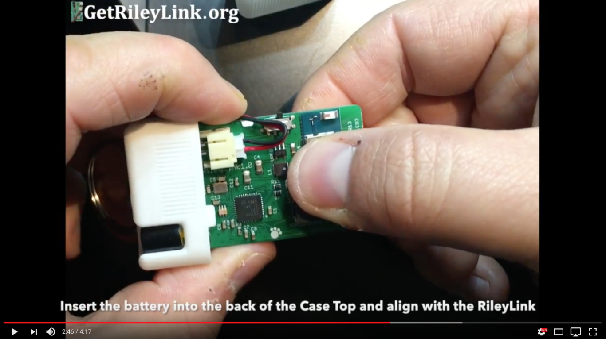
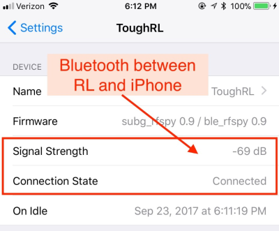

# Étape 5: Commander un RileyLink

!!!danger "Temps estimé"
    - 15 minutes pour commander un RileyLink
    - 15-20 minutes pour assembler le RileyLink une fois que vous l'aurez reçu par la poste
    - 15-20 minutes pour lire les infos sur le RileyLink

!!!info "Résumé"
    - Commandez votre [RileyLink Omnipod](https://getrileylink.org/product/rileylink433) ou [Medtronic RileyLink](https://getrileylink.org/product/rileylink916).
    - Assembler le RileyLink, après avoir remercié le facteur (ou le livreur)
    - Lisez les "détails supplémentaires" pour en savoir plus sur les diodes du RileyLink, la chargement, la portée, etc.

!!!warning "FAQs"
    - **"Ai-je besoin d'un RileyLink ?"** Oui. Loop ne fonctionnera pas sans un RileyLink. Les utilisateurs d'Omnipod ne seront pas en mesure de faire un bolus à partir de leur pod sans un RileyLink.
    - **« Que se passe-t-il si je perds mon RileyLink ou si je m’en éloigne? »** bonne question... répondu [ici](/faqs/rileylink-faqs/#what-happens-if-i-walk-away-from-my-rileylink).
    - **« Puis-je utiliser un RileyLink Omnipod avec une pompe Medtronic ? ou vice versa? »** bonne question... répondu [ici](/faqs/rileylink-faqs/#what-will-happen-if-you-use-a-916mhz-antenna-rileylink-with-an-omnipod-or-vice-versa).
    - **"Puis-je intervertir des RileyLinks à tout moment ?"** Oui, vous pouvez. Les RileyLinks peuvent être remplacés tout simplement sans avoir besoin de démarrer un nouveau pod ou de reconstruire l'application Loop. Il y a un endroit dans les paramètres Loop ou vous trouveriez simplement le nom de votre nouveau RileyLink et allumez la connexion Bluetooth pour commencer à l'utiliser.
    - **« À quel point le RileyLink doit-il être proche de moi ? Dois-je le porter avec moi ?** Bonne question...réponse [ici](/faqs/rileylink-faqs/#do-i-have-to-carry-the-rileylink-everywhere).
    - **« Pourquoi s'appelle-t-il RileyLink?** Riley est le nom de la fille de Pete Schwamb, et c'est le créateur du RileyLink. ».
    - **"Puis-je faire mon propre RileyLink ?"** Techniquement oui, cependant ce n'est pas un projet facile. Vous aurez besoin d'outils spécialisés et de patience. Si vous voulez explorer cette option, Je vous recommande vivement de consulter [Zulipchat](https://loop.zulipchat.com/#narrow/stream/148542-RileyLink) avec d'autres personnes qui ont fait leurs propres versions avec succès au cours des dernières années. Seulement 3 personnes ont construit leur propre RileyLinks jusqu'à présent...mais je suppose que techniquement cela est possible. Les fichiers PCB et le logiciel avec des instructions sur la façon de construire votre propre module matériel peut être trouvé sur le dépôt [RileyLink Github](https://github.com/ps2/rileylink).

## Qu'est-ce que RileyLink

Le RileyLink (RL) est un matériel open-source qui permet de relier une connexion Bluetooth Low Energy (BLE) à une communication sans fil à 916MHz ou 433MHz. Qu'est-ce que cela signifie pour vous? Cela signifie que RileyLink est l'élément de communication central entre votre pompe à insuline, votre CGM et votre iPhone.  

La boucle ne fonctionnera pas sans le RileyLink.</b>  

## Commander un RileyLink

C'est une étape facile. Vous devez commander un RileyLink à partir du site Web [GetRiley](https://getrileylink.org).

Il y a deux types de RileyLink ; [un pour les utilisateurs d'Omnipod](https://getrileylink.org/product/rileylink433) et [un pour les utilisateurs de Medtronic](https://getrileylink.org/product/rileylink916). Commandez le RileyLink spécifiquement pour la pompe avec laquelle vous allez utiliser Loop.

## Assembler le RileyLink

Votre RL sera livré avec la batterie déconnectée et les pièces qui ne sont pas déjà à l'intérieur du boîtier. Ce sera à vous de mettre la RL dans le boitier et de brancher la batterie.

Assurez-vous que la batterie lipo est bien branchée sur le connecteur. Alignez la petite teton correctement, et poussez assez fermement pour que la connexion soit serrée.  Une mauvaise connexion au câble de la batterie peut faire échouer les communications avec Loop.  Voir les photos ci-dessous, pour exemple.

!!!info "Les erreurs courantes des nouveaux utilisateurs"

    Les deux erreurs les plus courantes pour les nouveaux détenteurs de RL sont (1) ne pas enfoncer complètement le connecteur du câble de la batterie lipo et (2) ne pas charger la RL. Comparez votre câble de batterie lipo avec les photos; il faut un peu de vigueur pour pousser complètement cette prise comme dans les photos ci-dessous. N’oubliez pas de recharger votre RL chaque nuit.

<figcaption>Cable mal connecté à gauche, correctement inséré à droite</figcaption>

Enfin, la carte et la batterie s'insère assez bien dans le boîtier mince.  Cliquez sur l'image ci-dessous pour regarder une [vidéo d'assemblage](https://www.youtube.com/watch?v=-GHxxEJMCZc&feature=youtu.be) utile.

## Détails supplémentaires sur le RileyLink

### Communications radio

La LR communique avec la pompe par le biais de communications par radiofréquences.  De nombreux facteurs peuvent influer sur le bon fonctionnement de ces communications...les interférences d'autres dispositifs, la température, le blocage physique, etc.

Lorsque votre RL et votre pompe sont jumelés pour la première fois, Loop effectue une série de tests que vous ne verrez pas... Ce sont des tests de réglage. Fondamentalement, RL envoie des petites messages de test à la pompe et attend une réponse. Le RL essaie ce même « ping » à la pompe sur une gamme de différentes fréquences radio. La gamme de fréquences radio qu’il essaie est basée sur le type de pompe déclaré (Omnipod, Medtronic NA / CA, ou Medtronic WW).  Le RL enregistre ensuite les fréquences radio qui ont fourni la réponse la plus forte et utilise cette fréquence pour les futures communications avec la pompe.

Habituellement, cette meilleure fréquence est assez constante pour n’importe quelle couple pompe déclaré+RL, mais pendant les changements de température, il se peut que la meilleure fréquence n’est pas celle définie actuellement. Dans le cas où RL a des problèmes de communication avec la pompe, Loop possède le code interne une fonction qui dira automatiquement au RL « Hé, essaye ce nouveau réglage de pompe ... peut-être que cette nouvelle fréquence que nous devons essayer est meilleure." This retuning is started automatically if pump communications fail for 14 minutes (in other words, two looping cycles).

### Bluetooth communications

RL communicates with your iPhone and Loop app through Bluetooth (BT).

!!!info "Bluetooth Troubleshooting"

    If your iPhone has BT issues, your Loop will have failures.  There have been reports of BT audio devices (such as BT pairings in your car or home audio BT speakers) interfering with the Loop.  If you are finding Loop failures frequently happening at a particular location, you may try to troubleshoot if there are BT problems in the area.

Your BT signal strength can be seen in the Loop settings, under the RL menu, on the `Signal Strength` line. As you move closer and further away from your phone, you can watch that number dynamically change. This line is **not** displaying the signal strength of your pump communications discussed above.

### Lights

RL has several lights that you may notice from time to time. There is no 'power' light. If you suspect that your RL is not being powered, try turning it off and on using the small sliding switch. You should see lights in the middle of the board flash when you do this.  If they flash, that means the board has power.

* Red light: Charging light. The red light will remain on while RL is charging, and it will turn off when charging is complete. You may notice the red light turn on periodically even after charging is complete...it's just "topping off".

* Green light: Bluetooth connection light. The green light will remain on while you have a BT connection with your iPhone.  If that green light fails to stay on, you should troubleshoot your BT connections. Try restarting BT on your iPhone and/or turning the RL off/on by its power switch.

* Blue light: Pump communications.  If you have an older firmware on your RL, some of the blue lights will flash periodically as it communicates with the pump. It's just letting you know that it is busy talking and collecting info. You will also see increased blue flashes if you have "Enabled Diagnostic LEDs" for MDT users that have the RLs with updated firmware (shipping since late August 2018).

A solid blue light that consistently remains lit on the board could mean one of two things:

* A temporary issue that can be resolved by rebooting the RL physically (turning the switch off/on), or

* An electrical short or damage to the board.  Sweat and moisture are most likely culprits, so try to keep case free from those environments. Don't keep RL in sports bras or waistband next to skin, for example, while exercising.

If your blue light remains on despite trying a restart, it is time to pull out your backup RL.

### Charging

The battery that comes with RL is not likely charged completely when it is shipped, so feel free to charge it up.  You'll need a [mini-USB cable](https://www.amazon.com/AmazonBasics-USB-2-0-Cable--Male/dp/B00NH13S44) and [0.5A USB charging power supply](https://www.amazon.com/Cellet-Powered-Charger-iPhones-Smartphones-/dp/B00FE8WFCO) like your iPhone power supply.  RL takes about 2 hours to fully charge (the red light will turn off when fully charged, read note above about red light patterns) and should easily last at least a full day of constant Loop use.  Typically, it can go into the 30-hour range without any problems.  Most people charge their RL each night when they are sleeping.  You don't have to worry about leaving the RL plugged in "too long" for charging.  It will automatically stop charging the battery when it is fully charged.

Since the best practice is to charge your RL overnight while you sleep, and the battery lasts safely over 24 hours, there is no battery level indicator for the RL.  The RL's charge level is not viewable on Nightscout, nor within the Loop app.  If you forget to charge your RL overnight, you can recharge it with a portable USB battery in a pinch.  A [short mini-USB cable](https://www.adafruit.com/product/899) could be a good addition to a small gear bag.

### Range

The range that your RL will function is **heavily** dependent on the environment that you are in. Most people wear the RL in a pocket or carry a belt holster during the day. The radio frequency communications will have a shorter range than the BT communications, therefore RL will do better closer to the pump rather than the iPhone if you are deciding on options for carrying gear.

Problematic environments will be places like technical conferences, sports arenas, and other places where wireless communications are heavy and plenty.

### Lipo Battery

Keep your RL and lipo battery protected from damage.  Lipo batteries are unsafe when damaged or punctured, so the case is an important part of safe Looping. If your battery is damaged in some way, please disconnect it immediately, and dispose of it (they should be recycled). You can order new batteries on the [GetRileyLink website](http://getrileylink.org/)

### Removing Lipo Battery

To remove the lipo battery from the RL, please do so slowly and patiently. Work the battery connection side to side slowly to loosen it from the plug. Some people have reported success using small, curved needle-nose pliers such as hemostats. Others have used small flathead screwdrivers as shown in [this video](https://youtu.be/s2qNPLpfwww).

## Waiting for RileyLink

Yes, waiting for RL to arrive is extremely difficult if they are backorder.  PLEASE be patient, since Loop CANNOT work without RL.

If you're really dying to do something while RL ships, you can proceed with finishing these build directions all the way through Step 14...but after that you'll have to wait for the RileyLink.  You can't properly enter any settings or pump info in Loop app without the RileyLink.

## Next Step: Enroll in Apple Developer Program

Now you are ready to move onto Step 6 to [enroll in the Apple Developer Program](step6.md).
