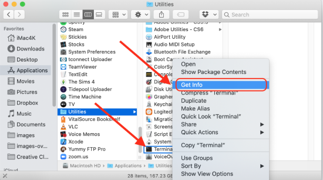
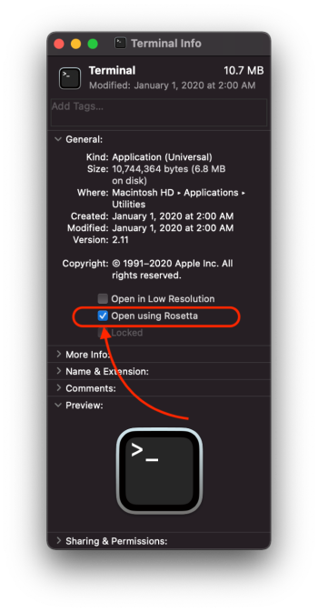
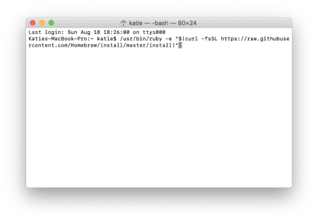
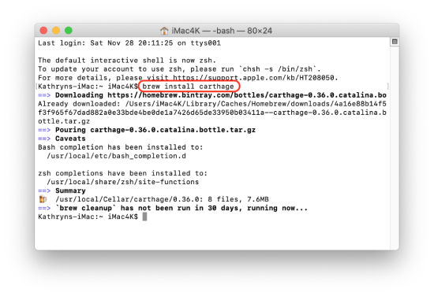

# Étape 7: Installer Homebrew

!!!danger "Temps estimé"

    - 10-15 minutes si vous connaissez le mot de passe de votre ordinateur
    - 35 minutes si vous ne vous souvenez pas de votre mot de passe et que vous devez le deviner

!!!info "Résumé"

    - Installez Homebrew en copiant et en parécissant simplement une longue ligne de charabia dans la laide application terminale.

!!!warning "FAQs"

    - **"Que se passe-t-il si je ne reçois pas de message "Installation réussie" ou "Installation successful"?** Si vous ne voyez pas de message d'installation réussie, veuillez essayer de copier-coller à nouveau. Si vous ne parvenez pas à installer Homebrew, votre version Loop échouera également. Tu ne peux pas sauter cette étape. La cause la plus courante d'erreurs est de ne pas copier ENTIEREMENT la ligne de code ... les gens oublient parfois de récupérer le dernier `"` à la fin de la ligne. De plus, vous devez utiliser un compte utilisateur sur l'ordinateur qui a des droits "admin" puisque ce processus est en train d'installer un programme sur l'ordinateur.

Respirer profondément ... cette étape ressemble à une sorte de « code programmeur » bizarre. Mais ce n'est pas le cas. Eh bien, si en fait ... mais nous allons simplement copier et dépasser une ligne étrange, puis on s’en va. Nous n’avons pas vraiment besoin d’en savoir beaucoup sur Homebrew lui-même ou ce que la ligne de code signifie exactement.

## L'utilisateur doit être un compte administrateur sur l'ordinateur

Homebrew est un programme qui nous permettra d'installer les paquets nécessaires pour construire Loop. Avant d’installer Homebrew, nous devons vérifier une chose... que le compte utilisateur sur l’ordinateur que vous utilisez pour construire Loop, est un **compte d’utilisateur avec les droits administratifs sur l’ordinateur**. « Comment pouvez-vous le savoir ? » Allez dans l'application Préférences Système de l'ordinateur, ouvrez la section Utilisateurs et groupes . Si le compte que vous utilisez ne dit pas "Admin" sous votre nom, alors vous devez cliquer sur le verrou et le modifier pour un compte administrateur avant de continuer. Si vous utilisez un ordinateur professionnel, il se peut que vous n'ayez pas les droits d'administration sur cet ordinateur. Alors, sachez que vous pouvez avoir des restrictions sur les ordinateurs appartenant à l'entreprise.

Remarque : Si vous êtes une (1) personne pointue en informatique et (2) avez déjà installé Homebrew sur un compte utilisateur différent précédemment. Veuillez utiliser ce compte utilisateur sur cet ordinateur pour compiler Loop. Ou bien, supprimez Homebrew de ce compte utilisateur et re-installez-le sur l'autre compte. Homebrew est un peu pointilleux.

## Installation de Homebrew

Ok, maintenant que nous avons confirmé le compte d’utilisateur, nous allons ouvrir l’application Terminal sur votre ordinateur. Il se trouve dans le dossier Applications puis regardez dans le sous-dossier Utilitaires... l'application Terminal est là comme indiqué dans la capture d'écran ci-dessous.

!!!info "Nouveaux utilisateurs de puces Apple M1: ÉTAPE IMPORTANTE"

    Si vous avez acheté un des nouveaux ordinateurs Apple qui ont la toute nouvelle puce Apple M1, vous devrez faire une petite étape pour commencer. Homebrew ne s'exécute pas nativement sur les nouvelles puces M1... donc nous devons ouvrir l'application Terminal en utilisant une petite application "convertisseur", appelée Rosetta. Ce n’est pas grave... il suffit de trouver l’application Terminal comme cela a été décrit ci-dessus et au lieu de l’ouvrir en cliquant deux fois ... Je veux que vous cliquez sur le nom de l’application Terminal juste une fois afin qu’il soit mis en surbrillance. Puis cliquez avec le bouton droit sur le nom de l'application Terminal pour afficher quelques choix supplémentaires. You will want to select the "Get Info" option.
    
    
    
    Now in the informational window that appears...you'll see a checkbox that says "Open using Rosetta". Check that box...that will allow Terminal app to open in such a way that we can install Homebrew in the next steps.  You can close that informational window, after you check the box for "Open using Rosetta", and proceed with the rest of the directions just like normal. Thanks!
    
    

Maintenant que vous avez localisé où se trouve l'application Terminal dans le dossier Utilitaires (et déjà activé la case à cocher Rosetta si vous êtes un utilisateur M1). .double-cliquez sur le nom de l'application Terminal pour que l'application s'ouvre. L’application Terminal est très simple lorsque vous l’ouvrez. C'est normal. Copiez et collez la ligne dans la petite boîte grise ci-dessous dans l'invite de commande Terminal.

 `/bin/bash -c "$(curl -fsSL https://raw.githubusercontent.com/Homebrew/install/HEAD/install.sh)"`

Votre écran devrait ressembler à quelque chose comme ça après l'avoir copié... Si il fait ça, aller aller de l'avant et appuyez sur la touche Retour pour continuer avec la commande d'installation.

Il y aura une message vous demandant si vous voulez continuer.  Appuyez sur Entrée pour continuer, puis il vous demandera votre mot de passe.  **Le mot de passe est le mot de passe de votre ordinateur.**

!!! danger « Ne paniquez pas »

    **Ne vous inquiétez pas que vous ne pouvez pas voir votre mot de passe pendant que vous tapez. C'est normal. L’application Terminal n’affiche pas les frappes lorsque vous entrez des mots de passe, mais elle enregistre toujours votre saisie de mot de passe. Si vous pensez que vous avez foiré parce que vous étiez confus, appuyez sur la touche supprimer un tas de fois, puis recommencer à zéro avec l’entrée de mot de passe .**

Attendez que le script fasse son truc... vous verrez les informations défiler et puis il s’arrêtera pendant un certain temps. Finalement, ce sera fait et vous verrez quelque chose qui dit "Installation réussie" ou “Installation successful” et vous aurez à nouveau un terminal prêt à nouveau.

!!!info "If you get an error about homebrew-core being a "shallow clone""

    Vous devrez suivre les instructions données dans l'erreur, et mettez à jour votre installation de homebrew avec la commande suivante :
    
    `git -C "/usr/local/Homebrew/Library/Taps/homebrew/homebrew-core" fetch --unshallow`

## Installer Carthage

Nous allons terminer avec une petite dernière installation de quelque chose qui s’appelle Carthage. C'est un assistant qui fait un peu de travail pendant la construction de Loop. Techniquement, Loop a un script automatisé qui utilisera Homebrew pour installer Carthage lorsque vous construirez Loop.

Maintenant que Homebrew a été installé avec succès, copier et coller la ligne dans la petite boîte grise ci-dessous dans l'invite de commande Terminal (similaire à ce que vous avez fait pour l'installation Homebrew ci-dessus).

`brew install carthage`

Vous devriez voir quelque chose comme ci-dessous lorsque la commande a fini de s'exécuter avec succès. Vos messages peuvent sembler légèrement différents (le numéro de version peut être plus récent, par exemple), mais le résumé devrait ressembler à voir une version de carthage installée et complète.

Vous pouvez maintenant fermer l'application Terminal. C'est fini avec ça. Vous n'avez pas besoin de refaire ces étapes pour les prochaines versions de Loop. Il s'agit d'un de ce qu' « il suffit de le faire qu'une fois ». Cependant, si vous récupérer un nouvel ordinateur, vous devrez répéter cette étape sur ce nouvel ordinateur.

## Désinstaller Homebrew

Si vous avez quelque chose qui ne va pas dans l’installation Homebrew, que vous souhaitez le supprimer et recommencer à zéro, la commande de désinstallation est la suivante:

`/bin/bash -c "$(curl -fsSL https://raw.githubusercontent.com/Homebrew/install/master/uninstall.sh)"`

Copiez et collez la ligne entière dans l'application Terminal. Ensuite, vous pouvez réessayer l’installation de Homebrew en utilisant la commande d’installation énumérée plus tôt dans cette page.

## Prochaine étape: Télécharger Xcode

Maintenant, vous êtes prêt à passer à l’étape 8 [télécharger Xcode](step8.md).
