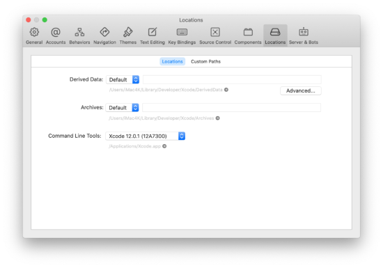

# Étape 9 : Préférences d'Xcode

!!!danger "Temps estimé"
    - environ 10-15 minutes pour installer les outils en ligne de commande
    - 5 minutes pour ajouter votre identifiant Apple, en supposant que vous vous rappeliez de votre mot de passe

!!!info "Résumé"
    - Ouvrez les Préférences Xcode et ajoutez votre identifiant Apple sous l'onglet "Comptes" ou "Account".
    - Vérifiez que les outils de ligne de commande ont été correctement installés dans les préférences Xcode sous l’onglet "Emplacements" ou "Locations".

!!!warning "FAQs"
    - **« Je ne vois encore qu’un compte avec `(équipe personnelle ou personal team)` à côté de lui, même si je me suis inscrit au programme de compte développeur payant... que dois-je faire? »** Vous devriez vérifier votre boîte e-mail spam/indésirable au cas où Apple vous ait envoyé un e-mail déplacé dans cette dossier la. Assurez-vous d’avoir attendu les 48 heures qu’Apple dit qu’il peut prendre pour obtenir la validation de votre compte. Si cela fait 48 heures et que vous ne voyez toujours rien dans votre e-mail, contactez le support Apple et demandez-leur le statut de votre inscription. Il peut être retardé par quelque chose de leur côté.

Puisque vous avez travaillé dans l'ordre, Xcode est deja installé sur votre ordinateur depuis l'étape 8. Vous vous êtes également inscrit au programme Apple Developer avec un compte payant, si tel était votre choix, à l’étape 6. Maintenant, nous devons référencer votre compte développeur dans Xcode.

Ouvrez Xcode depuis votre dossier Applications.

## Outils de ligne de commande

Il peut y avoir un court délai la première fois que vous ouvrez Xcode car il installera un paquet d'outils. Ne fermez pas cette fenêtre, laissez-la finir... nous aurons besoin de ces outils de ligne de commande. Conseils utiles : Lorsque l'installation des Outils en ligne de commande est terminée et que la fenêtre pop-up se ferme, vérifiez que vos Outils en ligne de commande sont correctement installés. Make sure that Xcode 12.0.1 (or newer) is selected there. Open Xcode's Preferences by clicking on the word **`Xcode` ** in the top menu bar (just to the right of the Apple icon in the upper-left corner) and selecting `Preferences` in the drop-down menu. The keyboard shortcut to open Xcode Preferences is `command-comma` if that's easier for you. Then select the `Locations` tab of Preferences window and you'll see the dropdown menu for Command Line Tools.

## Ajouter un ID Apple

Accédez à la fenêtre Préférences Xcode du haut, cliquez sur l’onglet `Accounts` , puis appuyez sur le `+` dans le coin inférieur gauche pour ajouter un compte Apple ID.

Si vous souhaitez utiliser un compte de développeur gratuit, il vous suffit d’entrer votre identifiant Apple dans cette section et Xcode va automatiquement inscrire votre identifiant Apple dans le programme de développeur gratuit. Si vous êtes déjà inscrit sur un compte payant et que vous avez la confirmation que votre compte est actif, entrez l'identifiant Apple du compte payant. La capture d’écran ci-dessous montre l’étiquetage des noms d’équipe selon que ce soit à partir d’un compte gratuit ou d’un compte payant. Les équipes gratuites auront `(équipe personnelle ou personal team)` après le nom.

Vous avez maintenant terminé la configuration de Xcode.  Excellent travail!  Vous n'aurez pas besoin de refaire les étapes de configuration du compte sur les versions suivantes ou les mises à jour de votre application Loop.  Xcode se souviendra de ces paramètres.

## Prochaine étape: Les réglages de test

Maintenant vous êtes prêt à passer à l'étape 10 pour [Tester vos paramètres](step10.md).
