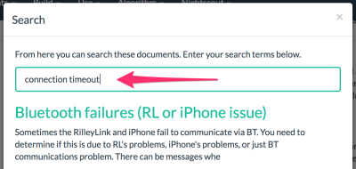

# Bienvenue dans Loop

 

## Introduction

[Loop](https://github.com/LoopKit/Loop) un modèle d’application pour construire un système automatisé d’administration d’insuline. C'est une pierre reposant sur le mur de travail accompli par beaucoup d'autres.  
L'application est construite sur [LoopKit](https://github.com/LoopKit/LoopKit). LoopKit est un ensemble de frameworks qui fournissent le stockage, la récupération et le calcul de données, ainsi que des contrôleurs de vue standard utilisés dans Loop.

!!!warning "Important" Veuillez comprendre que ce projet : - est hautement expérimental - n'est pas approuvé pour la thérapie **Vous assumez l'entière responsabilité de la construction et de l'exécution de ce système et vous le faite à vos propres risques.**

À l’aide du modèle d’application loop open-source, vous pouvez construire un système d’administration d’insuline qui utilise des technologies matérielles et logicielles commerciales et open-source spécifiques pour réunir la pompe à insuline, le moniteur de glucose continu (CGM) et l’algorithme de dosage de l’insuline pour créer un debit basal continu de l’insuline « Loop ».  Ce loop prédit la glycémie future en fonction des horaires de débit de basale, de l'apport en glucides, de l'insuline active dans le corps et des lectures MGC (CGM en anglais) actuelles.  Ces prévisions de glycémie fournissent en boucle les informations nécessaires pour recommander un taux basal temporaire pour atteindre une fourchette de glucose ciblée dans le futur.  Le système peut soit fonctionner comme une « boucle ouverte » en faisant des recommandations à l’utilisateur pour son approbation avant d’adopter soit comme une « boucle fermée » en définissant automatiquement le débit de basal temporaire recommandé. Vous devez entreprendre ce projet par étapes. For example, first “open loop” to familiarize yourself with Loop’s operation. Also, investigate the code to ensure you understand what it is recommending and why. Then when you progress to “closed-loop”, do so safely by starting with appropriate safety limits and only progress to higher limits after several days of no lows. Please ask questions at this point about why Loop is making the recommendations it does.  It should be similar to the therapy decisions you would make yourself.  If the recommendations it makes are different than you would make, try to figure out why.

## Development History

Loop has been developed as an open-source, shared project.  For a really interesting read about the history of Loop development, check out this [History of Loop and LoopKit](https://medium.com/@loudnate/the-history-of-loop-and-loopkit-59b3caf13805) post, written by Loop developer Nate Racklyeft.  The project continues to be a labor-of-love by a community of users; maintained and improved by volunteers.

## How to Use These Docs

* Use the navigation menu at the top of the screen to find the info you are looking for.
* A Table of Contents for the current page is always displayed on the left side of the screen.
* You can search the Loop Docs site by clicking the  icon. 

## Stay in the Loop!

[Sign up for the Loop Users announcement list](https://groups.google.com/forum/#!forum/loop-ios-users) to stay informed of critical issues that may arise. Join the Zulipchat at [https://loop.zulipchat.com](https://loop.zulipchat.com) There is also a [Looped Facebook Group](https://www.facebook.com/groups/TheLoopedGroup/?fref=nf) that you might wish to join for support.  When you request to join the group, please remember to check your messages box on facebook and respond to the message.

## Contribute

Please consider submitting any updates and improvements to the documentation that you want to share by submitting a Pull Request to the [loopdocs repo](https://github.com/LoopKit/loopdocs). For more information on how to contribute to an open-source project, this [How to Contribute to Open Source](https://opensource.guide/how-to-contribute/) guide may be useful. Also, please review the Loop [LICENSE](https://github.com/LoopKit/Loop/blob/master/LICENSE.md) and Loop [CODE_OF_CONDUCT](https://github.com/LoopKit/Loop/blob/master/CODE_OF_CONDUCT.md).
