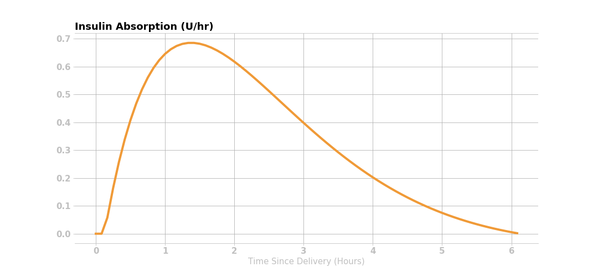
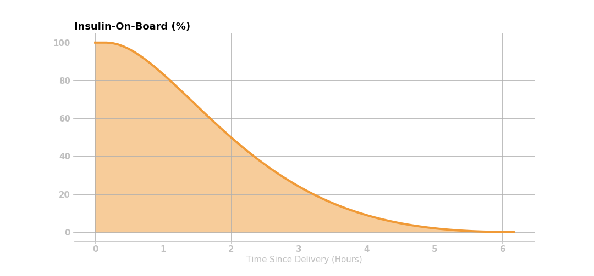
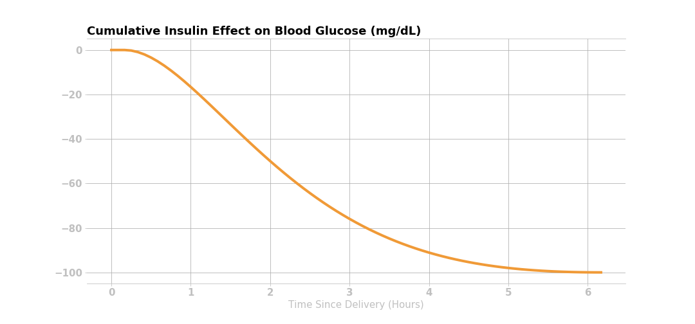
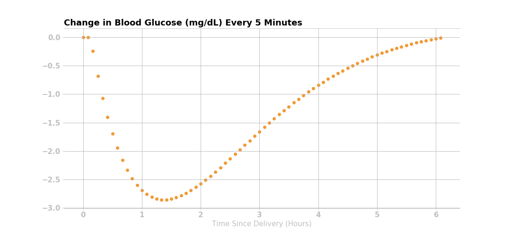
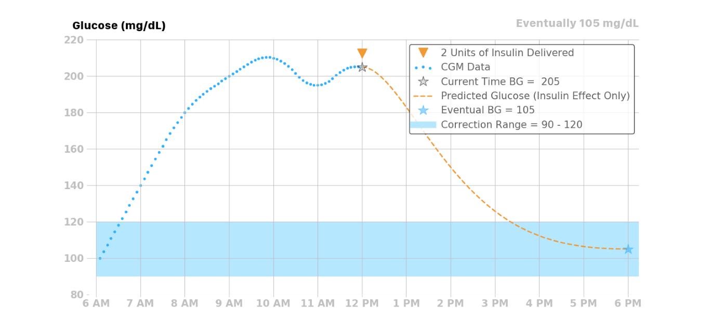
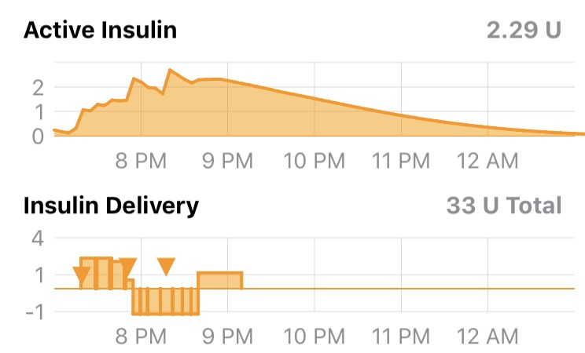
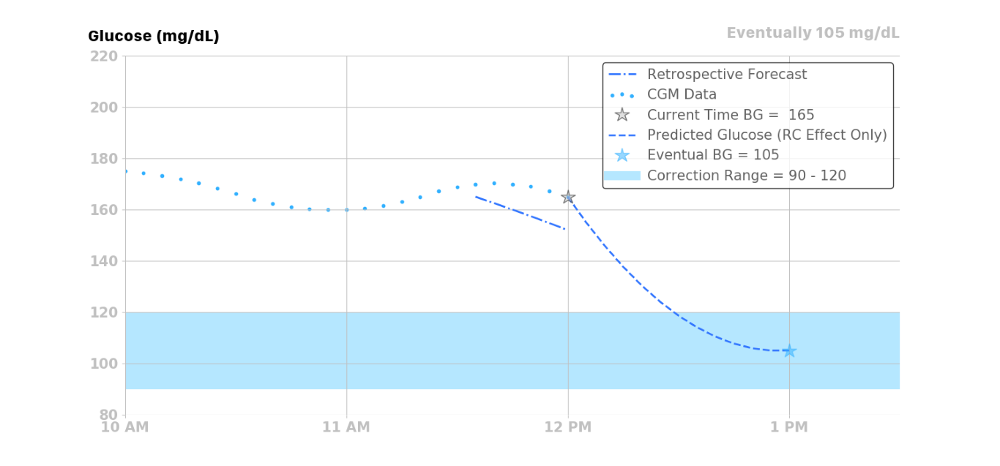

# Blood Glucose Prediction

La boucle utilise un algorithme pour maintenir la glycémie dans une plage de correction en prédisant les apports de quatre effets individuels (insuline, glucides, correction rétrospective, et dynamisme glycémique) à tout moment *m* pour recommander des corrections de débit de basal temporaire et des bolus.

Vous pouvez voir les contributions individuelles de ces effets en appuyant sur le graphique de glycémie prédictive sur l'écran d'état de Loop. Loop met à jour cette prédiction de glycémie toutes les cinq minutes quand une nouvelle valeur du MGC a été reçue et que le statut de la pompe a été mis à jour.

Juste une remarque, toute cette section est assez technique. Bien que ce n'est peut-être pas le sujet le plus intéressant pour de nombreux lecteurs, si vous cherchez la vue détaillée de l'algorithme de Loop, cette discussion est assez utile. Si vous voulez une compréhension générale, la vue d'ensemble et les recommandations basales temporaires suffiront probablement.

## Présentation

Avant de nous plonger dans chacun des quatre effets individuels, un aperçu général est probablement un bon début. Il y a quatre effets réunis ensemble pour produire la courbe finale de prédiction glycémique de Loop. Chaque effet individuel, ainsi que leur effet combiné, est illustré dans la figure ci-dessous. L’insuline, des bolus et des basals temporaires, aura un effet décroissant sur la prédiction. Les glucides auront un effet croissant sur la prédiction. L'effet dynamique de la glycémie peut avoir un effet positif ou négatif, selon la comportement de la glycémie dans les dernières valeurs du MGC. Comme le montre l'exemple ci-dessous, la glycémie tend légèrement vers le haut au moment de la prédiction. Par conséquent, la contribution de l’effet d'impulsion de la glycémie tire la prédiction générale des trois autres effets pendant une courte période. La correction rétrospective a un effet décroissant sur la prédiction, indiquant que l’augmentation récente de la glycémie n’était pas aussi grande que cela avait été précédemment prédit par Loop dans un passé récent.

Les sections ci-dessous fournissent des renseignements détaillés sur chacune des quatre contributions.

## Effet de l'Insuline

La plupart des utilisateurs de pompes et des fournisseurs de soins traditionnels connaissent déjà le concept de courbe de l'activité d'insuline, où l'effet de l'insuline dans le temps. L'insuline prend un peu de temps pour affecter la glycémie. L'effet d'insuline atteint généralement son pic une heure après avoir donné de l'insuline, puis se dégrade progressivement.

Loop fournit aux utilisateurs deux classes différentes de modèles d'insuline (c'est-à-dire un modèle exponentiel et le modèle Walsh). Tous les modèles exponentiels ont une durée d’activité d’insuline de 6 heures, alors que la durée de l’activité de l’insuline est personnalisable pour le modèle Walsh. Les courbes d'activité de l'insuline rapide et Fiasp sont modélisées comme des courbes exponentielles qui correspondent à la forme des courbes d'activité de l'insuline, et comme observé chez les adultes et les enfants.

La quantité d'effet d'insuline restante ou le pourcentage d'insuline active restante après la délivrance d'un bolus d'insuline, est modélisé mathématiquement dans Loop avec une courbe de décomposition exponentielle.

### Effet de l'insuline restante

Si le facteur de sensibilité à l'insuline (FSI) est de 50 mg/dL par unité d'insuline et que l'utilisateur donne 2 unités d'insuline, on s'attendrait à ce que la glycémie de l'utilisateur baisse de 100 mg/dL dans les 6 heures suivant la distribution d'insuline. Cet effet d'insuline peut être visualisé de différentes manières : l'insuline active attendue, la baisse prévue de la glycémie toutes les 5 minutes après l'injection, et la baisse cumulative prévue de la glycémie. Les chiffres ci-dessous utilisent le modèle d'insuline rapide - adulte en boucle.

### Insuline active

Ce chiffre montre que 2 unités d'insuline sont données initialement, et l'insuline active correspondante (cad, l'insuline active, IOB en anglais) se décompose en fonction de la courbe ci-dessous.

L'insuline active à tout moment est le produit de l'insuline d'origine délivrée et le pourcentage de l'activité d'insuline restante. Connaître l'insuline active attendue dans les 6 prochaines heures et le facteur de sensibilité à l'insuline (50 mg/dL, dans ce cas), Loop peut calculer la baisse prévue de la glycémie à partir de cette dose d'insuline, comme indiqué dans la figure ci-dessous.

REMARQUE : Le FSI est également une fonction du temps, ce qui signifie que si le FSI de l'utilisateur planifié change pendant le temps d'activité de l'insuline, elle modifiera la baisse prévue de la glycémie en raison de l'effet d'insuline.

### Changement prévu de la glycémie

Pour finir, en prenant la première dérivée (c.-à-d. le taux de changement) de la chute cumulée de la courbe de glycémie donne la variation prévue de la glycémie sur la durée de l'activité d'insuline. Pour chaque dose d’insuline administrée, Loop calcule la baisse prévue de la glycémie pour chaque période de 5 minutes pour la durée de l’activité de l’insuline, comme indiqué ci-dessous.

### Effet de l'insuline sur la Glycémie

Pour cet exemple, en supposant que la glycémie d'un utilisateur était de 205 mg/dL au moment de la distribution d'insuline, Loop prédisait une baisse de la glycémie en raison des deux unités livrées à 12 heures, comme le montre le chiffre ci-dessous.

### Taux de Basal Planifié

Dans la thérapie traditionnelle de pompe de basal/bolus, les taux basaux sont réglés pour s'adapter à la production endogène de glucose (EGP) de l’utilisateur qui fait augmenter la glycémie. Si les paramètres de basal d'un utilisateur étaient exactement corrects dans la thérapie traditionnelle de la pompe, l'utilisateur aurait un taux de glycémie parfaitement fixe toute la journée, tous les autres facteurs étant égaux.

En réalité, les personnes atteintes de diabète de type 1 et leurs soignants savent que les paramètres basaux ne sont jamais exactement corrects. Chaque jour est un peu différent et une myriade de facteurs qui affectent la glycémie (par exemple, le stress, les hormones, le sommeil, etc.) peuvent affecter les besoins en insuline. Certaines personnes ont des profils basaux différents pour s'adapter à ces variations. Certaines personnes configurent régulièrement et ajustent leur taux de basal et/ou le font lors de leurs visites à la clinique endocrinologique.

Puisque l'algorithme de Loop suppose que les taux de basal définis par l'utilisateur sont corrects, il calcule l'effet de l'insuline par rapport aux taux de basal planifiés. Si les débits de basal ne sont pas entièrement corrects, Loop peut compenser un peu grâce à la correction rétrospective et aux effets de la dynamique de la glycémie décrits plus loin dans cette page.

Le graphique de distribution d'insuline ci-dessous affiche un historique bar-graphique des débits de basal temporaires promulgués par Loop. L'affichage est relatif aux débits de basal programmés entrés dans les paramètres Loop. Un taux affiché dans ce graphique en tant que +0 indiquerait qu'aucun débit de basal temporaire n'a été défini et que le débit de basal fourni était le taux de basal planifié. Des valeurs positives indiquent qu'un taux de basal temporaire a été défini au-dessus du taux de basal planifié (c'est-à-dire plus d'insuline distribuée) et des valeurs négatives indiquent qu'un taux de basal temporaire a été défini en dessous du taux basal planifié (c'est-à-dire moins d'insuline distribuée).

Par exemple, si le débit de basal planifié de l'utilisateur est de 1 U/hr, et que la boucle donne un taux de basal temporaire de 3 U/hr, puis il calculera la chute prévue de la glycémie en raison de +2 U/h d'insuline.

De la même manière si Loop fixe un taux de basal temporaire de 0 U/h pendant 1 heure, alors l'effet d'insuline sera également relatif au taux de basal planifié actuel de 1 U/h, et Loop prédisait que le taux de glycémie de l’utilisateur augmenterait par la quantité de changement de -1 U/h d’insuline. Si la FSI de l’utilisateur est de 50 mg/dL, alors Loop prédit que la glycémie augmentera de 50 mg/dL sur la durée de l’activité de l’insuline (6 heures).

Voici un exemple réel où Loop définit de nombreux débits de basal temporaires au cours de la journée. Les barres orange sont les débits de base temporaires et la ligne orange solide est l'insuline active à tout moment de la journée.

### Effet total de l'insuline (combinaison de bolus et taux basal temporaires)

Loop combinera ou empilera l'insuline active de tous les bolus distincts (individuels) et les taux de basal temporaires sur la dernière durée d'activité de l'insuline (6 heures), pour prédire l'insuline active dans les 6 prochaines heures. Comme cela a été démontré ci-dessus, l'utilisation de la prediction d'insuline active de Loop peut prédire la baisse de glycémie au cours des 6 prochaines heures.

Enfin, l'effet combiné du bolus et de l'insuline basale sont visuellement représentés pour l'utilisateur par les graphiques d'insuline de Loop:

L'effet d'insuline peut être exprimé mathématiquement :

where BG is the expected change in blood glucose with the units (mg/dL/5min), ISF is the insulin sensitivity factor (mg/dL/U) at time t, and IA is the insulin activity (U/5min) at time <i>t</i>. Insulin activity can also be thought of as a velocity or rate of change in blood glucose due to insulin. The insulin activity accounts for the EGP and any active insulin from basals and boluses.

## Carbohydrate Effect

Carbohydrates will raise blood glucose, but the speed and degree to which they impact blood glucose are dependent on the type of carbohydrates. High glycemic index (GI) carbohydrates will raise blood glucose quickly over a shorter time, whereas low GI foods will raise blood glucose more slowly over a longer period. Foods like candy, juice, and fruits tend to be high GI foods, while pizza, burritos, and quesadillas are usually lower GI foods. Digestion issues like gastroparesis may also contribute to variations in carbohydrate absorption.

Because carbohydrate absorption can be quite variable, Loop has a model that dynamically adjusts the expected remaining time of carbohydrate absorption. To start with, Loop allows the user to input a rough guess of how long they think the food or drink will take to absorb. The user’s guess is used as a middle of the road estimate, and Loop’s algorithm will shorten or lengthen it based on observed blood glucose change.

For all carbohydrate entries, Loop assumes carbohydrates will not start absorbing for 10 minutes, so there is a 10-minute period of no absorption that is modeled prior to the absorption modeled in the next sections.

### Linear Carbohydrate Absorption

Loop takes a conservative view of how fast the remaining carbohydrates will absorb.  Because it is safer to under-deliver insulin for long-duration meals, Loop starts out at a minimum rate of absorption based on extending the entered carbohydrate duration by 50%. Said another way, the minimum carbohydrate absorption rate is the total number of grams of carbohydrates over 150% of the entered duration.

Using this initial minimum absorption rate, the remaining carbohydrates are modeled to absorb linearly. For example, if the user enters a 72g carbohydrate meal, and selects an estimated absorption time of 4 hours, then Loop will forecast a 12g/hr absorption rate for the next 6 hours. This rate can be termed the minimum absorption rate, which can be represented mathematically as:

where MAR is the minimum absorption rate (g/hr), CA is the number of carbohydrates (g) and d is the expected duration (hr) it will take the carbohydrates to absorb.

### Dynamic Carbohydrate Absorption

The linear model above is modulated by an additional calculation that uses recently observed blood glucose data to estimate how fast carbohydrates have been absorbing. The expected change in blood glucose due to insulin effects alone is compared to the actual observed changes in blood glucose. This difference is termed the insulin counteraction effect (ICE):

where, ICE (mg/dL/5 min) is the insulin counteraction effect, OA is the observed activity (mg/dL/5min) or observed change in blood glucose at time <i>t</i>, and IA is the insulin activity (mg/dL/5min).

Insulin counteraction effects are caused by more than just carbohydrates, and can include exercise, sensitivity changes, or incorrectly configured insulin delivery settings (e.g., basal rate, ISF, etc.). However, since the effect of carbohydrates is often dominant (after insulin), Loop can still make useful ongoing adjustments to its carbohydrate model by assuming that the increase in blood glucose is mainly carbohydrate absorption in the period following recorded meal entries.

The insulin counteraction effect is converted into an estimated carbohydrate absorption amount by using the current carbohydrate-to-insulin ratio and the insulin sensitivity factor at the time of the recorded meal entry.

where AC is the number of carbohydrates absorbed (g/5min), ICE is the insulin counteraction effect, CIR is the carbohydrate-to-insulin ratio (g/U), and ISF is the insulin sensitivity factor (mg/dL/U) at time <i>t</i>.

If multiple meal entries are active (i.e., still absorbing), the estimated absorption is split between each carbohydrate entry in proportion to each carbohydrate entry’s minimum absorption rate. For example, if 72g carbohydrates with an expected absorption time of 4 hours was consumed at 12 pm, and another 72g of carbohydrates with an expected absorption time of 2 hours was consumed at 3 pm, then the minimum absorption rate (see MAR equation above) would be 12 g/hr and 6 g/hr respectively, or 1 g/5min and 0.5 g/5min.

Examining just the simple linear carbohydrate effect of these two meals:

If we further expand this example, by assuming the following at 4pm:

* that there are still carbohydrates left to be absorbed from both meals,
* that the estimated insulin counteraction effect (ICE) is +15 , and
* the user’s CIR is 10 g/U and the ISF is 50 mg/dL/U,

then the estimated amount of carbohydrates absorbed at 4pm would be 3g:

Those 3g of carbohydrates would then be split amongst the meals proportional to their minimum absorption rates:

resulting in 2g of absorption being attributed to Meal 1 and 1g attributed to Meal 2.

### Minimum Carbohydrate Absorption Rate

If the estimated carbohydrate absorption of a meal entry is less than what would have been absorbed using the minimum absorption rate, then the minimum absorption rate is used instead. This is to ensure that meal entries expire in a reasonable amount of time.

### Modeling Remaining Active Carbohydrates

After the estimated absorbed carbohydrates have been subtracted from each meal entry, the remaining carbohydrates (for each entry) are then forecasted to decay or absorb using the minimum absorption rate. Loop uses this forecast to estimate the effect (active carbohydrates, or carbohydrate activity) of the remaining carbohydrates. The carbohydrate effect can be expressed mathematically using the terms described above:

## Retrospective Correction Effect

!!!note ""

    The retrospective correction effect allows the Loop algorithm to account for effects that are not modeled with the insulin and carbohydrate effects, by comparing historical predictions to the actual blood glucose.

In addition to the modeled effects of insulin and carbohydrates, there are many other factors that affect blood glucose (e.g., exercise, stress, hormones, etc.). Many of these effects are active for a period of time. By observing its own forecast error, Loop can estimate the magnitude of these effects and, by assuming that they will continue for some short period of time, incorporate them into the forecast to improve forecast accuracy.

To do this, Loop calculates a retrospective forecast with a start time of 30 minutes in the past, ending at the current time. Loop compares the retrospective forecast to the actual observed change in blood glucose, and the difference is summed into a blood glucose velocity or rate of difference:

where BG*vel* is a velocity term (mg/dL per 5min) that represents the average blood glucose difference between the retrospective forecast (RF) and the actual blood glucose (BG) over the last 30 minutes. This term is applied to the current forecast from the insulin and carb effects with a linear decay over the next hour. For example, the first forecast point (t=5) is approximately 100% of this velocity, the forecast point one-half hour from now is adjusted by 50% of the velocity, and points from one hour or more in the future are not affected by this term.

The retrospective correction effect can be expressed mathematically:

where BG is the predicted change in blood glucose with the units (mg/dL/5min) at time *t* over the time range of 5 to 60 minutes, and the other term gives the percentage of BG*vel* that is applied to this effect.

The retrospective correction effect can be illustrated with an example: if the BG*vel* over the past 30 minutes was -10 mg/dL per 5min, then the retrospective correction effect over the next 60 minutes would be as follows:

| Minutes relative to now (*t=0*) | Percent of BG*vel* Applied to RC Effect |  |
| ------------------------------- | --------------------------------------- | ----------------------------------------- |
| 5                               | 100%                                    | -10                                       |
| 10                              | 91%                                     | -9.1                                      |
| 15                              | 82%                                     | -8.2                                      |
| 20                              | 73%                                     | -7.3                                      |
| 25                              | 64%                                     | -6.4                                      |
| 30                              | 55%                                     | -5.5                                      |
| 35                              | 45%                                     | -4.5                                      |
| 40                              | 36%                                     | -3.6                                      |
| 45                              | 27%                                     | -2.7                                      |
| 50                              | 18%                                     | -1.8                                      |
| 55                              | 9%                                      | -0.9                                      |
| 60                              | 0%                                      | 0                                         |

Here’s an example below that shows the retrospective correction effect when the BG*vel* over the past 30 minutes was -10mg/dL/5min.

## Blood Glucose Momentum Effect

!!!note ""

    The blood glucose momentum effect incorporates a prediction component based on the assumption that recent blood glucose trends tend to persist for a short period of time. In other words, the best predictor of the future is the recent past.

The blood glucose momentum portion of the algorithm gives weight or importance to recent blood glucose to improve the near-future forecast. Loop calculates the slope of the last 3 continuous CGM readings (i.e., the last 15 minutes) using linear regression. Using multiple points helps filter out noise in the CGM data while still responding fast to changing situations. That momentum slope (Mslope) is the approximate or average rate of change over the last 15 minutes, though it is normalized to 5 minutes so that the units are (mg/dL/5min).

The momentum slope is then blended into the next 20 minutes of predicted blood glucose from the other effects (i.e., insulin, carbohydrates, and retrospective correction effects). This, in essence, makes the next 20 minutes of blood glucose prediction more sensitive to recent blood glucose trends. The blending of the recent trend slope into the next 20 minutes is weighted so that the first prediction point (5 minutes into the future) is highly influenced by the slope, and the influence of the slope gradually decays over the 20 minute time period. The momentum effect can be expressed mathematically as:

NOTE: The term  is also applied to the combined insulin, carbohydrates, and retrospective correction effects to get the delta blood glucose prediction.

The momentum effect can be illustrated with an example: if the last 3 blood glucose readings were 100, 103, and 106 mg/dL, then the slope would be 3 mg/dL per 5 minutes (0.6 mg/dL per minute). The amount of that recent trend or slope applied to the next 20 minutes of predictions (i.e., the next 4 predictions from the other effects) is roughly 100% (3 mg/dL per 5 min) at 5 minutes, 66% (2 mg/dL per 5 min) at 10 minutes, 33% (1 mg/dL per 5 min) at 15 minutes, and 0% (0 mg/dL per 5 min) at 20 minutes.

Also, if the combined effect from the insulin, carbohydrates, and retrospective correction is assumed to be a constant 6 mg/dL/5min over the next 20 minutes, then the expected overall effect and the predicted blood glucose can be calculated as follows.

| Minutes relative to now (*t=0*) | Percent of Slope Applied to Momentum Effect | Momentum Effect (3mg/dL/5min) | Percent of Other Effects Applied Overall Effect | Other Effects (Insulin, Carbohydrate, and Retrospective Correction) | Overall Effect (mg/dL/5min) | Predicted BG (mg/dL) |
| ------------------------------- | ------------------------------------------- | ----------------------------- | ----------------------------------------------- | ------------------------------------------------------------------- | --------------------------- | -------------------- |
| 5                               | 100%                                        | 3                             | 0                                               | 6                                                                   | 3                           | 109                  |
| 10                              | 66.6%                                       | 2                             | 33.3%<                                          | 6                                                                   | 4                           | 113                  |
| 15                              | 33.3%                                       | 1                             | 66.6%                                           | 6                                                                   | 5                           | 118                  |
| 20                              | 0%                                          | 0                             | 100%                                            | 6                                                                   | 6                           | 124                  |

This example is illustrated in the figure below.

It is also worth noting that Loop will not calculate blood glucose momentum in instances where CGM data is not continuous (i.e., must have at least three continuous CGM readings to draw the best-fit straight line trend). It also will not calculate blood glucose momentum when the last three CGM readings contain any calibration points, as those may not be representative of true blood glucose momentum trends.

## Predicting Glucose

As described in the momentum effect section, the momentum effect is blended with the insulin, carbohydrate, and retrospective correction effects to predict the change in blood glucose:

Lastly, the forecast or predicted blood glucose BG at time *t* is the current blood glucose BG plus the sum of all blood glucose effects BG over the time interval [t5, t]:

Each individual effect along with the combined effects are illustrated in the figure below. As shown, blood glucose is trending slightly upwards at the time of the prediction. Therefore, the blood glucose momentum effect’s contribution is pulling up the overall prediction from the other three effects for a short time. Retrospective correction is having a dampening effect on the prediction, indicating that the recent rise in blood glucose was not as great as had been previously predicted in the recent past.

