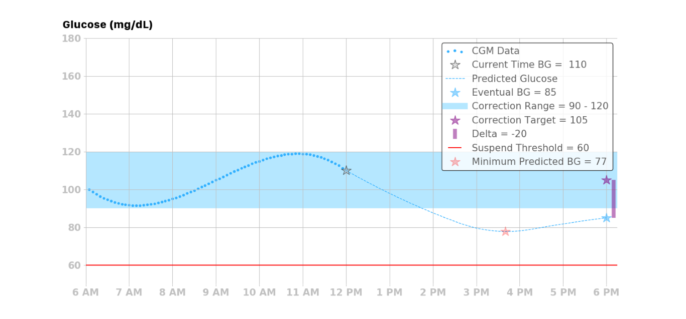
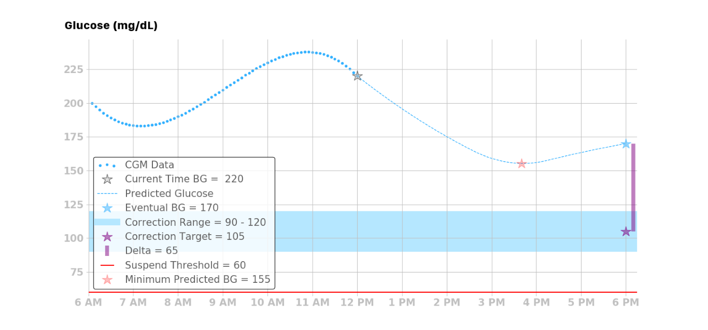
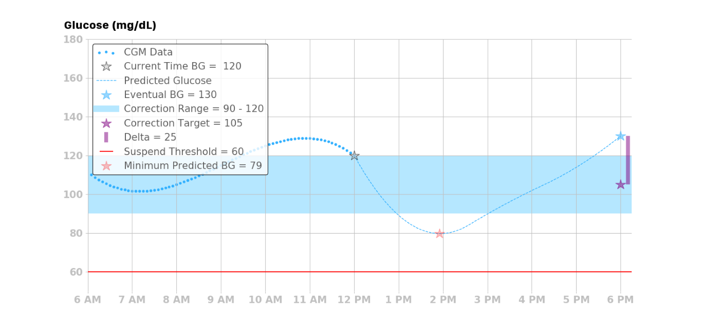

# Basal Adjustments

The Loop algorithm takes one of four actions depending upon the eventual blood glucose, predicted glucose, and suspend threshold. Note that all temporary basal rate commands are issued for 30 minutes, however they may be updated (re-issued) every 5 minutes. Said another way, Loop may enact a new temporary basal rate every 5 minutes. But, if communication with the pump is lost, the last issued temporary basal rate will last for at most 30 minutes before the pump reverts to the user’s scheduled basal rates. Note: If a user is operating Loop in open-loop mode, the Loop will only recommend basal dosing actions and will not automatically enact those recommendations.

## Four Possible Actions
Loop implements one of four possible basal actions: **decrease**, **increase**, **suspend**, or **resume** a scheduled basal rate.

###  Decrease Basal Rate
If the eventual blood glucose is less than the correction range and all of the predicted glucose values are above the suspend threshold, then Loop will issue a temporary basal rate that is lower than the current scheduled basal rate to bring the eventual blood glucose up to the correction target.

### Increase Basal Rate
If the eventual blood glucose is greater than the correction range and all of the predicted glucose values are both above the suspend threshold and equal to or above the correction range, then Loop will issue a temporary basal rate that is higher than the current basal rate to bring the eventual blood glucose down to the correction target.

### Suspend Basal Rate
If the minimum predicted blood glucose goes below the suspend threshold, then Loop will issue a temporary basal rate of zero units per hour, regardless of the eventual blood glucose.

### Resume Basal Rate
There are three situations where the Loop algorithm will resume the current scheduled basal rate.

If the eventual blood glucose is within the correction range, and all of the predicted glucose values are above the suspend threshold, then Loop will resume the current scheduled basal rate.

If the eventual blood glucose is above the correction range, and the predicted glucose values have a temporary excursion below the correction range but still above the suspend threshold, then Loop will resume the current scheduled basal rate.

If the Loop algorithm does not have ALL of the data it needs to make a prediction, it will let the remaining temporary basal rate run its duration (maximum of 30 minutes), and then the basal rate will default back to the current scheduled basal rate, thus returning to the same therapy pattern that they would receive using a traditional insulin pump.

## Determining the Temporary Basal Rate
To determine the corrective temporary basal rate to implement, Loop calculates a “dose” in the same way doses are calculated in both open-loop and traditional insulin pump therapy. It's also the same math many people on multiple-daily injection therapy use. The benefit of Loop (and all other close-loop algorithms) is that it does this math every 5 minutes, and is far less prone to error than humans doing the math. Loop also does its math based on predicting into the future, which traditional pumps and humans, do not always have the time or inclination to do.

The amount of insulin needed, or dose, is calculated using the desired reduction in blood glucose and the user’s ISF. For the Loop algorithm, the desired reduction in blood glucose is the delta between the eventual blood glucose and the correction target:

!!!note ""

    A major difference between traditional pump therapy and how the Loop calculates dose is that in pump therapy the current blood glucose is used to estimate the dose, whereas in the Loop algorithm the eventual and minimum blood glucose predictions are also used in determining dosing decisions.

Loop then converts the dose into a basal rate using the Loop’s temporary basal rate duration of 30 minutes:

where BR is the basal rate (U/hr), which is the amount of insulin needed over the next 30 minutes to bring the eventual blood glucose to the correction target. The basal rate, however, is the amount of basal rate needed beyond the user’s scheduled basal rate. As such, the required basal rate can be determined by:

where RBR is the required basal rate and SBR is the scheduled basal rate.

Finally, Loop compares the RBR with the user-specified maximum temporary basal rate setting to determine the temporary basal to issue:

* If RBR ≥ maximum basal rate, then Loop will issue the maximum basal rate  

* If RBR < maximum temporary basal rate, then Loop will issue RBR 

After running the temporary basal calculation described above, Loop checks whether there is already an appropriate basal running with at least 10 minutes remaining. If so, Loop will not reissue the temporary basal. However, if the recommended temporary basal differs from the currently running temporary basal — or the current scheduled basal if no temporary is running —  then Loop will replace the current basal rate with the recommended temporary basal rate. 

As mentioned at the beginning of this section, the process of determining whether a temporary basal should be issued is repeated every 5 minutes.

## Temporary Basal Rate Calculation Example
To illustrate how the Loop calculates the temporary basal rate to issue, consider the calculation for the following scenario:

* Eventual blood glucose = 200 mg/dL  

* Correction target = 100 mg/dL  

* ISF = 50 mg/dL/U  

* Current scheduled basal rate (SBR) is 1 U/hr  

* Maximum basal setting (set by user in Loop) = 6 U/hr  

 First, calculate the dose:

Then, convert the dose into a basal rate to be issued for the next 30 minutes:

Next, calculate the required basal rate:

Lastly, compare the required basal rate to the maximum temporary basal rate, and find that Loop will enact a temporary basal rate of 5 U/hr for 30 minutes since this temporary basal rate is below the maximum temporary basal rate of 6 U/hr, which was set by the user in Loop app settings.
