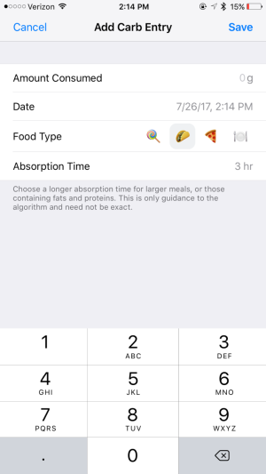
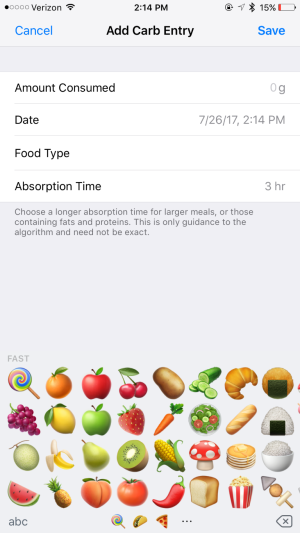
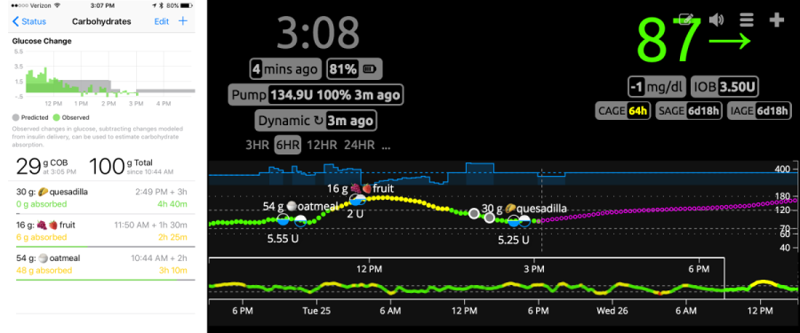
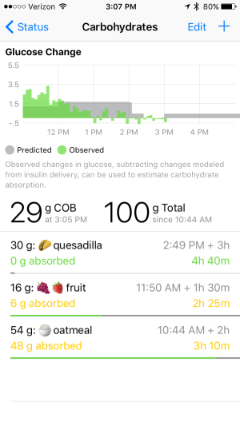

# Apport de Glucides

De nouvelles entrées de glucides peuvent être faites en utilisant l'outil Glucides vert dans la barre d'outils en bas de l'écran d'état.  N'utilisez pas l'assistant de bolus de votre pompe ou l'entrée de glucides de votre pompe pour enregistrer des glucides dans l'application Loop.  Vous ne devriez pas non plus utiliser le portail de soins de Nightscout pour entrer dans les glucides, car Loop ne lit pas à distance les entrées de glucides.

## Nouveaux Glucides

Pour commencer une nouvelle entrée de repas, entrez simplement le nombre de glucides à consommer dans la ligne de ` la quantité consommée`.  Par défaut, le temps d'absorption des glucides pour une nouvelle entrée de glucides correspond à l'icône de tacos.  Si vous n'avez pas fait de personnalisation aux icônes de sucettes, tacos ou pizza pendant votre compilation de Loop, alors le temps d'absorption par défaut des glucides s'affichera sous la forme de 3 heures.  L’entrée de temps par défaut est pour l’heure et la date actuelles.  Une fois que vous appuyez sur `Enregistrer` sur l'écran d'entrée de glucides, l'outil bolus de Loop s'ouvrira pour fournir un bolus recommandé.

## Éviter les entrées doubles de glucides

!!!info "Soyez attentif"

    Lorsque vous appuyez sur « Enregistrer » pour une entrée de glucides, Loop considérera l’entrée de glucides enregistré et l’utilisera pour le calcul des basals temp et bolus recommandés.  Soyez prudent s’il y a des tentatives répétées d’entrer plusieurs fois le même repas... Loop continuera à enregistrer les entrées de glucides sauf si vous appuyer sur annuler sur l’écran d’entrée Glucides.  
    **Annuler un bolus n’annule pas l’entrée de glucides.**  
    Si vous avez accidentellement fait plusieurs entrées pour les mêmes glucides, cliquez sur le graphique des glucides dans l’affichage principale de Loop et vous pouvez supprimer les entrées de glucides doublons en faisant glisser à gauche sur les entrées.

## Durée d’absorption des Glucides

Pour sélectionner la durée d'absorption de votre entrée de glucides, vous pouvez soit cliquer sur les émojis alimentaires par défaut ou entrer manuellement le temps d'absorption des glucides en sélectionnant la ligne `temps d'absorption` dans l'outil d'entrée des glucides.

Appuyer sur la ligne `type de nourriture` peut également être utilisé si vous n'êtes pas sûr d'un nouvel aliment.  Il existe d’autres emojis alimentaires regroupés en aliments à absorption rapide, moyenne et lente.  Cela peut être particulièrement utile pour les adolescents qui essaient d'apprendre de nouveaux aliments ou repas.  De plus, vous pouvez ajouter du texte à votre `type de nourriture` en sélectionnant le bouton `abc` dans le coin inférieur gauche de l'écran.

Les temps d'absorption des glucides par défaut dans l'application Loop sont des représentations moyennes pour les aliments à indice glycémique élevé, moyen et faible.  Depuis la version 1.4.0, l'algorithme intègre l'absorption dynamique des glucides.  Les versions précédentes de loop étaient basées sur une courbe qui supposait que le taux d’absorption des glucides commencerait lentement, augmenterait à un point médian, puis diminuerait.  Cependant, dans le monde réel, l’absorption des glucides est assez variable.  Le modèle d'absorption dynamique des glucides est en mesure de modéliser une partie de cette variabilité et de permettre à Loop de répondre plus raisonnablement lorsque l'absorption réelle des glucides ne correspond pas bien à l'heure d'absorption des glucides sélectionnée pour un repas.  Pour faire court, bien que l'entrée dans une période d'absorption de glucides fasse toujours partie de l'enregistrement des repas dans Loop, il est beaucoup moins critique de le faire correctement.  Maintenant, votre entrée sert de guide plutôt que de règle pour modéliser l'absorption des glucides.  Pour une explication plus détaillée du nouveau modèle dynamique d’absorption des glucides, veuillez lire à ce sujet [ici](https://github.com/LoopKit/Loop/pull/507).

Pour aider Loop à ajuster les glucides qui peuvent digérer plus lentement que votre estimation initiale, Loop appliquera d’abord un multiplicateur de 1,5 x à votre temps d’absorption des glucides entrés.  Ainsi, un repas entré à l'aide de l'icône tacos sera traité initialement comme un repas d'absorption de 4,5 heures.  Comme Loop observe les impacts de glycémie du repas, Loop raccourcira le temps d’absorption du repas si les glycémies montrent des impacts plus rapides que prévu, ainsi que d’ajuster les injections d’insuline (par exemple, augmenter les basals temporaires).  Vous pouvez observer la progression des observations de Loop sur votre repas en cliquant sur le graphique des glucides et en observant les effets de la contre-action de l'insuline.

## Mixer les glucides d'un repas

Vous n’avez pas à entrer tous les glucides pour un repas au même temps d’absorption ou de consommation.  If you want to enter some of the meal's carbs as faster, and some slower, you can log the meal over several individual carb entries.  For example, for meals that have sugary carbs as well as slow acting carbs (Chinese food), you may wish to do part of the carbs as lollipop and part of the carbs as pizza.

Pressing the `Save` button in the top right corner will save the carbs into the Loop app and bring up the Loop's bolus tool.  When entering multiple carb absorption durations for a single meal, press save on the carb entry and then press cancel on the bolus tool when it appears.  When you have entered your last carb entry for the meal, then use the bolus tool to deliver the bolus for the entire meal.  Loop will provide a recommendation based on all the saved carbs and their respective absorption durations in total.

## Prebolus

You can let Loop know you are going to prebolus a meal by adjusting the time of the carb entry on the “date” line of the carb entry.  If you are prebolusing by 20 minutes, simply add 20 minutes to the carb entry time.

## Edit Carbs

Clicking on the Carbohydrate chart in the Loop's main status screen will open the carb entry history and previous entries can be modified or deleted through this screen.  If you need to change a prebolus time, add/subtract carbs, adjust carb absorption times (even mid-meal), just go into that edit screen and tap on the carb entry you'd like to edit, or left-swipe to delete the entry entirely.  This can be a particularly useful tool when:

* You did not finish an entire meal that you bolused for,
* You did not get to eat meal at the time you originally expected,
* You ate more servings than originally entered, or
* You suspect your carb count was in error because BGs are rising more/less than expected.

## Third Party Apps

If you use a 3rd party app, such as My Fitness Pal, to enter and track carbs and that app also stores the carb values in HealthKit, Loop will read those values from Apple HealthKit and display and use them in calculating temp basal rates. Entries from 3rd party apps can not be removed from within Loop.  You will have to edit them in the third party app, or from the Health app. Because of this potential for confusion, it is recommended to turn off Loop's ability to read other apps' carbohydrate data from HealthKit. You are asked if you want to enable this when Loop is first installed. After installation, you can also go to the Settings App -> Privacy -> Health -> Loop and turn off `Read Data for Carbohydrates`.
