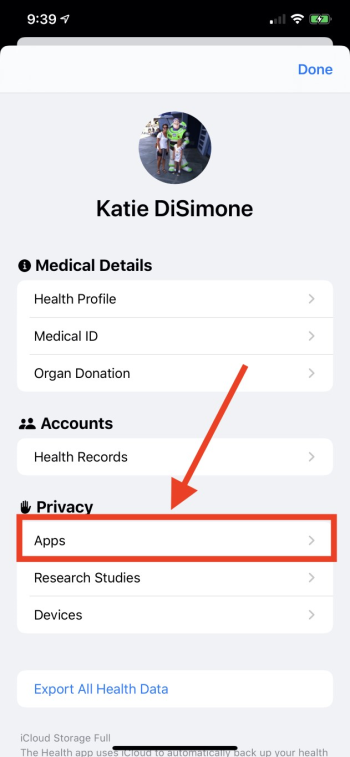
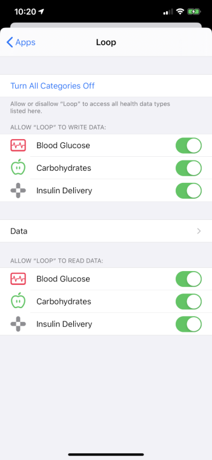
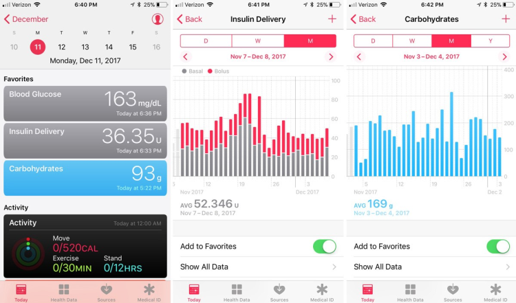

# Application Santé

L'application Loop utilise l'application Santé de l'iPhone pour stocker les données de glycémie, d'insuline et des glucides. Vous pouvez vérifier vos paramètres de l'application Santé pour Loop en ouvrant l'application Santé, cliquez sur la photo de votre compte dans le coin supérieur droit de l'application Santé, puis cliquez sur la ligne Applications dans la section Confidentialité.

Votre application Loop devrait avoir la possibilité de lire et d'écrire les trois catégories. Sans ces permissions, Loop ne fonctionnera pas correctement.

Les résumés de vos résultats de glucides, d'insuline et de glycémie peuvent être trouvés en cliquant sur l'option Parcourir dans la barre d'outils inférieure de l'application Santé. Les données sur la glycémie sont situées dans la section Signes Vitaux, les glucides sont dans la section Nutrition et les données sur l’insuline se trouvent dans la section Autres données.

Si vous appuyez sur l'étoile du curseur "Ajouter aux favoris" pour les catégories de données individuelles (insuline, glycémie, glucides), les données de ces catégories seront ajoutées à la vue Résumé de votre barre d'outils Santé pour une référence et un accès faciles et rapides.

Les données sommaires pour les catégories peuvent vous aider à suivre les tendances mensuelles, aider à identifier les périodes de sensibilité/résistance à l’insuline, évaluer l’utilisation quotidienne totale d’insuline, la ventilation de l’insuline basale vs bolus, et les consommations de glucides.  Vous pouvez trier vos tendances de données par jour, semaine, mois ou année et faire défiler dans le temps chacune de ces tendances.  Vous pouvez même rapidement utiliser ces données pour discuter lors des rendez-vous endocrinologiques... en fournissant à l'endocrinologue un ensemble très rapide et utile de points de données directement à partir de votre système Loop.

