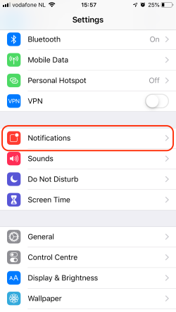
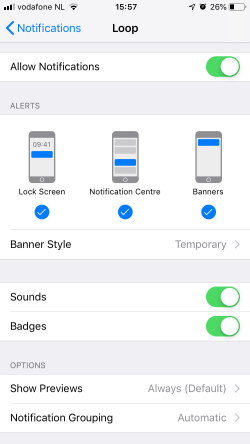
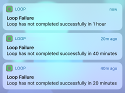

# Notifications de Loop

Loop fournit des notifications sur l’iPhone et la Watch qui apparaîtront sur l’écran (verrouillé) et vibreront, en fonction de vos paramètres de notification de Loop.

## Omnipod

**Omnipod**  
La plupart des alarmes sonores sont désactivées pour une utilisation beaucoup plus discrète de l'omnipod. Seuls les accusés ou alarmes audibles suivants sont actuellement utilisés :

- Reconnaissance du pod activé lors du remplissage du pod avec suffisamment d’insuline lors de l’appariement d’un nouveau Pod.
- Alerte d'expiration du pod à 72 heures/3 jours (que vous pouvez désactiver dans les [paramètres de statut du pod](../loop-settings/omnipod-pump.md#status))
- Réservoir vide du Pod (que vous pouvez couper en silence dans les paramètres de statut du pod )
- Reconnaissance de désactivation du Pod
- Alarme de panne de pod (également appelé hurleur) lorsque vous atteignez la vie maximale du Pod : 80 heures (3 jours + 8 heures) ou si une défaillance/occlusion se produit. (que vous pouvez réduire au silence en utilisant la commande [remplacer le pod](../loop-settings/omnipod-pump.md#pod-commands)) dans la page des paramètres du pod)

## Notification settings for Loop

You can customize the way notifications of Loop are behaving in the Settings App of the iPhone:

Settings of Loop:

## Loop Failure

At 20, 40, 60, and 120 minutes, there is a Loop Failure notification. This mostly happens when the connection is lost for a longer period of time between the CGM or the Rileylink and Loop.

## Bolus Failure

If Loop detects that a bolus was not able to be delivered, it will provide a notification.  Bolus failures are usually due to stale pump data.  Try fetching recent history from the RileyLink menu to update pump data.  Loop will also notify of partial bolus deliveries.

## Low Reservoir
**Medtronic**  
At 20% and 10% remaining reservoir volume, there is a Low Reservoir notification.
**Omnipod**  
At <30U, <20U, <10U

## Empty Reservoir

Loop will notify when the reservoir is empty. Loop will notify you every minute with this notification.
**Omnipod**  
Normally you will have 5-30 minutes to replace the pod, but do know the pod can [scream](https://soundcloud.com/eelke-jager/1f-nibble-f) at any moment from this point on.

## Pod Expiration (Omnipod)

You can customize the time of notification when to replace your pod any time from 1 hour up to 71 hours (3 days - 1 hour) [after staring a new pod](../loop-settings/omnipod-pump.md#expiration-reminder) or you change the time later in the [pod configuration settings]../loop-settings/omnipod-pump.md#configuration). The expiry alarm will always sound when the pod reaches a running full 3 days (72 hours) which you can silence [in the pod status settings](../loop-settings/omnipod-pump.md#status).

## Low Battery (Medtronic)

Loop will notify when battery levels have approximately 8-10 hours of battery life remaining.

## Remote Notifications

Loop does not have a remote notification to other devices.  If you are a remotely monitoring parent, you will want to read [here](../../nightscout/pushover.md#pushover) about setting up pushover alerts using your Nightscout site if you want proactive notifications of looping related information.
