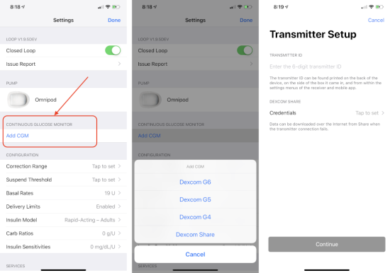
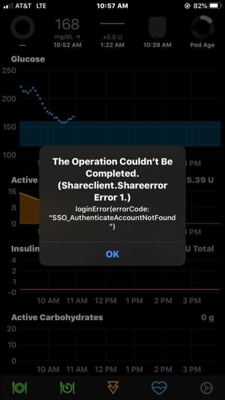

# Ajouter un Lecteur de Glycémie (MGC ou CGM)

Maintenant, nous devons ajouter une Moniteur de glycémie continue (MGC ou CGM en anglais) pour que Loop ait des données Glycémie. À partir de l'écran des paramètres de Loop, sélectionnez `Ajouter un CGM`.

La sélection standard des choix disponibles est :

* Dexcom G6
* Dexcom G5
* Dexcom G4
* Dexcom Share

!!!info ""

    Si vous avez ajouté une pompe Medtronic plus tôt dans le processus d'installation, alors vous verrez aussi une option pour le capteur Medtronic compatible qui fonctionne avec cette même pompe. Si vous utilisez un capteur MDT compatible, sélectionnez cette option et les données CGM seront téléchargées sur Loop lorsque l’état de la pompe sera mis à jour.

## A propos des identifiants Dexcom Share

!!!danger ""

    Notez que vous n'avez **PAS** besoin des informations de votre compte de partage répertoriées dans les paramètres de Loop si vous utilisez un système G4, G5 ou G6. L'identifiant de l'émetteur est suffisant. En fait, Je vous recommande de laisser votre compte de partage vide afin que vous ne deveniez pas accidentellement dépendants d'Internet pour les données MGC lorsque vous oubliez de mettre à jour votre identifiant de transmetteur lorsque vous démarrez un nouveau transmetteur. Il suffit de laisser les informations d’identification share vides.

Pour toutes les sélections, les identifiants Dexcom Share (en d'autres mots, identifiant du compte) est le même que ce que vous avez utilisé pour vous connecter à l'application Dexcom active sur votre iPhone. **Le compte Dexcom Share n'est pas toujours les mêmes informations de connexion que votre compte Dexcom Clarity .** Pour les utilisateurs G4, le compte Partage se trouve dans l'onglet Compte de l'application. Pour les utilisateurs de G5/G6, malheureusement, il n'y a aucune information dans l'application qui affiche le nom de votre compte. Les informations sont saisies lorsque vous vous connectez pour la première fois à l'application et ne sont plus jamais affichées, ni visibles sur les écrans d'informations. Si vous avez oublié vos informations de compte G5/G6, vous pouvez supprimer l'application Dexcom et la télécharger à nouveau pour essayer de vous connecter. Cela ne provoquera pas de redémarrage des sessions de capteurs en cours.

Si vous ne saisissez pas correctement vos identifiants Share, vous obtiendrez une erreur lorsque Loop tentera d'accéder à votre compte de partage pour récupérer les données du CGM. Ce message d'erreur ressemblera à l'image ci-dessous. Si vous voyez ce message, supprimez votre compte Partage des paramètres de Loop et réessayez... ou laissez-le comme ça et utiliser votre identifiant de transmetteur.

## Les CGM Dexcom G5 et G6

Les options Dexcom G5 et G6 ne nécessitent que l'ajout de l'identifiant de l'émetteur actif, et l'application Dexcom correspondante pour fonctionner sur l'iPhone Loop. Vous n'avez pas à ajouter vos identifiants de compte Dexcom Share, mais si vous le faites, assurez-vous qu'ils correspondent à ce que vous avez entré initialement dans votre application Dexcom.

Lorsque vous changez d'émetteurs, vous devrez sélectionner le bouton `Supprimer le MGC` en bas de la page d'information MGC de la boucle. Ensuite, vous allez à nouveau sélectionner votre système Dexcom et ajouter le nouvel identifiant du transmetteur. Vous ne pouvez pas simplement appuyer sur votre ancien identifiant de transmetteur pour le mettre à jour.

Si vous ne mettez pas à jour votre identifiant de transmetteur lorsque vous changez d'émetteurs actifs, votre Loop sera forcé d'aller sur votre serveur Dexcom Share pour obtenir vos données MGC et ne fonctionnera pas sans connexion cellulaire ou wifi. Quand Loop utilise les données des serveurs Dexcom Partage, un petit nuage apparaîtra au-dessus de la lecture de glycémie et devrait vous rappeler que vous avez peut-être oublié de mettre à jour votre identifiant de transmetteur.

## Dexcom G4

Les utilisateurs de Dexcom G4 auront besoin de l’application Dexcom G4 Share2 active sur leur iPhone et jumelée à leur récepteur Dexcom G4 Share.

## Dexcom Share

La choix Dexcom Share est principalement destinée aux personnes qui souhaitent tester la fonction Loop sans source CGM locale et qui n'exécutent pas l'application Dexcom sur leur iPhone Loop. Cette sélection nécessitera l'accès à un compte Dexcom Share avec des données en direct et une connexion internet active pour fonctionner.

## Utilisateurs de Spike

Les utilisateurs qui utilisent l’application Spike pour accéder à d’autres types de CGM (ou pour éviter d’utiliser l’application Dexcom), vous devrez suivre les instructions contenues dans l’application Spike afin de construire/modifier Loop avec Spike. Loop ne prend pas en charge l’application Spike de manière native et ne prévoit pas actuellement de le faire. Vous êtes responsable de la modification ou de l’adaptation de Loop afin d’utiliser Spike et d'ajouter cette nouvelle option disponible en tant que source CGM.

## Prochaine étape : Configuration

Maintenant que vous avez ajouté votre source MGC, nous avons besoin de compléter la configuration et les paramètres de votre Loop. S’il vous plaît [la page de configuration](configurations.md) pour obtenir des conseils avec cette partie importante de la configuration de loop.
