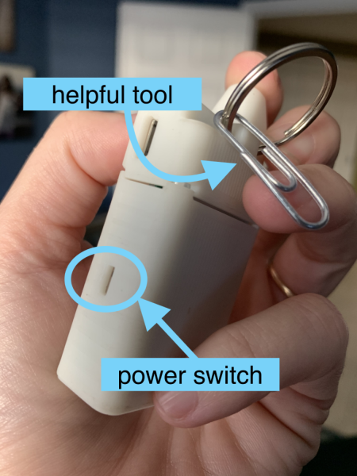
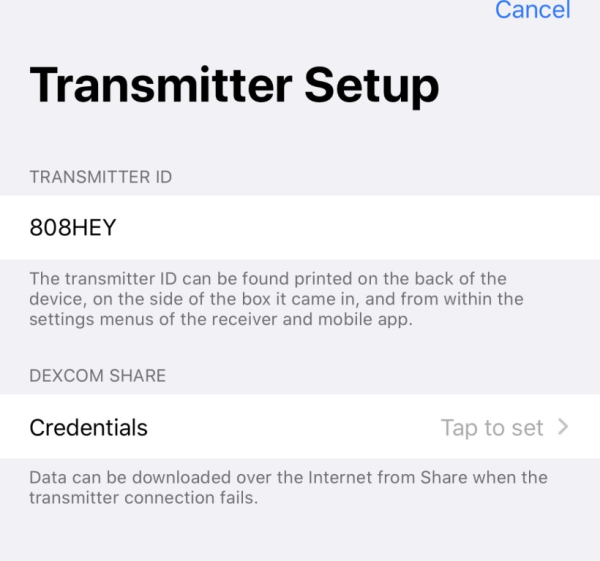

# Boucles rouges

Divisons cette page en deux parties. La première partie traite des boucles rouges individuelles. Comme si cela vient de se produire et que vous voulez le résoudre. La deuxième partie traitera des situations où vous avez à plusieurs reprises et « plus souvent » des boucles rouges et que vous pensez que cela arrive «trop souvent » (les deux bien sûr sont des termes subjectifs).

## Résoudre une boucle rouge

Vous êtes donc là pour retrouver votre boucle verte ? C’est rouge et ça ne marche pas ? Vous vous demandez ce qui se passe? Vous pouvez cliquer sur l’icône de la boucle rouge pour lire un message d’erreur que vous pouvez ou ne pouvez pas comprendre. Si vous le comprenez, super... qui devrait vous aider à résoudre le problème. Si vous ne le comprenez pas, alors il y a deux options pour corriger la boucle rouge ; la première est rapide et facile, la seconde est plus en profondeur. Examinons les deux.

Un petit mot : Ne pas rapidement décider de retirer un omnipod qui ne répond pas et qui a une boucle rouge. Habituellement, le problème est que le RileyLink a besoin d’une réinitialisation comme décrit ci-dessous dans l’option 1, plutôt que le pod devant être changé. Si vous ne corrigez pas le problème du RileyLink en premier, Le problème sera probablement present à la nouvelle tentative d'appairage de pod et vous aurez un tas de problèmes d'appairage du nouveau pod parce que le RileyLink ne fonctionne toujours pas. Alors, s'il vous plaît essayer de faire fonctionner le RileyLink correctement avant de décider d'abandonner une pod à cause d'une boucle rouge.

### Option 1 : Étapes faciles

!!!danger ""

    Vous ne vous souciez guère de l’origine du problème, vous voulez juste passer à autre chose aussi rapidement que possible? Ok, très bien, alors procédez comme suit:

    * Éteignez votre RileyLink à son interrupteur d'alimentation physique situé sur le côté du RileyLink. Utilisez un petit objet pointu pour déplacer soigneusement le curseur du port de chargement, puis remonter vers le port de chargement. Un trombone sur le porte-clés peut fournir l’aide dont vous avez besoin pour atteindre l’interrupteur dans le boîtier encastré, et a un double usage comme un outil [anti cri pour les pod](../../faqs/omnipod-faqs/#what-do-you-do-to-stop-a-screaming-pod).
    * Fermez votre application Loop (en la faisant glisser vers le haut dans le sélecteur d'applications de l'iPhone) et rouvrez-la.

    

    C'est à peu près tout ce que vous avez à faire pour l'option 1 pour restaurer une boucle verte en 5 minutes, 99% du temps. Vous pouvez confirmer que les choses sont de retour au boulot en revoyant une boucle verte et/ou en émettant une "commande de test" ou "presser des boutons" avec succès dans le menu RileyLink.

### Option 2 : Chercher la cause

!!!info ""

    Donc, si l’option 1 n’a pas fonctionné pour résoudre votre problème ... ensuite, vous aurez besoin de regarder un peu plus profondément. Il peut y avoir une variété de raisons pour lesquelles l'option 1 n'a pas fonctionné pour restaurer la fonction de votre boucle, pour que vous ayez besoin de remonter à l'origine du problème. Il y a quelques catégories de base :

    1. RileyLink est cassé
    2. Les valeurs MGC ne sont pas récupérées par Loop
    3. La pompe ne répond pas

## RileyLink est cassé

Comment pouvez-vous savoir si votre RileyLink a un problème? La réponse est principalement dans les lumières LED qui s'affichent sur le carte.

**Voyant rouge**: s'allume pendant la charge et s'éteindre/s'allumera périodiquement, alors qu'il est toujours branché, une fois la charge terminée.

**Voyant vert**: indique une connexion BT active avec le téléphone. Vous voulez que la lumière vert reste allumée tout le temps sur le RileyLink. Si le voyant vert n'est pas allumé, assurez-vous que le Bluetooth de votre iPhone est toujours activé.

**Lumière bleue**: La lumière bleue clignotera périodiquement lorsque le RileyLink et la pompe communiquent activement. Elle ne devrait PAS être allumée en continue. Si votre lumière bleue est bloquée, c'est une indication d'un problème sur la carte. Essayez de chercher des signes de dommages ou de débris qui peuvent causer un court circuit sur la carte. Nettoyez la planche avec de l’alcool [(débranchez d’abord la batterie](https://youtu.be/s2qNPLpfwww)). Si vous ne pouvez toujours pas éteindre la lumière bleue, contactez GetRileyLink pour obtenir un nouveau RileyLink.

## Les valeurs MGC ne sont pas récupérées par Loop

### Nouveau transmetteur

Si vous avez récemment modifié un émetteur, vous devez également mettre à jour les paramètres de votre Loop pour refléter le nouvel iD de l’émetteur. Allez à la section MGC des paramètres de Loop et `Supprimer le MGC` (c'est un bouton au bas de cette page). Puis, utilisez le `Ajouter le MGC` dans les paramètres de boucle pour inclure le nouvel identifiant du transmetteur.

### Émetteur de style Firefly

Si vous n'avez pas mis à jour votre application Loop depuis fin Juillet 2019 et que vous utilisez Dexcom G6, vous devrez mettre à jour votre application Loop pour pouvoir continuer à boucler sans connexion internet. En juillet 2019, nous avons commencé à voir sur le marché un nouveau style d'émetteurs Dexcom G6. Ces nouveaux émetteurs ont besoin d'un remaniement de certains codes de Loop pour continuer à « espionner » l'émetteur. Sans la mise à jour, votre Loop n'obtiendra pas de données MGC à moins qu'elle n'utilise celles des serveurs Share (ce qui n'est pas un mode de fonctionnement recommandé). Donc, mettez à jour votre application Loop si vous avez un nouveau type d'émetteur et que vous n'avez pas mis à jour depuis juillet 2019.

### Supprimer le compte Share

En fait, nous voyons beaucoup d'erreurs signalées parce que les gens ont des problèmes avec leurs informations de serveur de partage dans l'application Loop. **Veuillez supprimer les informations de votre compte de partage dans les paramètres de Loop.** En d'autres termes, la partie d'identification des informations du compte de partage, comme indiqué dans la capture d'écran ci-dessous, devrait dire `Appuyer pour définir` et ne pas avoir les informations de votre compte. Il est inutile de remplir cette portion car la recuperation en local et non via Internet d'un émetteur est de toute façon la source de MGC préférée. En fait, en laissant ces informations de coté, il vous aidera à vous rappeler de changer votre identifiant d'émetteur lorsque vous changez d'émetteur parce que les données MGC n'apparaîtront pas dans Loop. En n’incluant pas le compte Share dans Loop, vous vous empêcherez de devenir accidentellement dépendant d’Internet.

## La pompe ne répond pas

La solution évidente est de s'assurer que le RileyLink n'est pas si éloigné de la pompe ou du Pod et qu'ils ne peuvent pas communiquer. En supposant que vous ayez abordé ce problème, vous pouvez passer à d'autres étapes. Pour Pod Loopers, l'option 1 corrige presque toujours ce problème. Pour les Loopers de Medtronic, vous verrez parfois que la pompe ne répond pas et que vous pouvez voir des erreurs de décodage ou d'autres messages à propos des réponses de la pompe. Pour les utilisateurs de Medtronic, essayez ce qui suit :

1. Changer la batterie de la pompe. La faible batterie de la pompe provoquera une panne des communications radio.
2. Utilisez la commande `Changer le temps` dans le menu RileyLink pour mettre à jour l'horloge de la pompe. Si vous avez accidentellement modifié la durée de la pompe dans la pompe elle-même, l'application Loop et la pompe seront à nouveau synchronisées.
3. Si vous utilisez une pompe x23 ou x54, essayez de supprimer tous les identifiants dans le sous-menu « Autres périphériques » du menu « Connecter périphériques » de la pompe.  Ensuite, allez au menu RileyLink et utilisez la commande d'appairage MySentry pour obtenir un nouvel ID émis. Suivez les instructions indiquées dans l'écran de la commande d'appairage MySentry pour rechercher des périphériques. Un nouvel identifiant peut aider à prévenir les boucles rouges pour les utilisateurs x23 et x54, en particulier si elles ont commencé à se produire après une mise à jour récente de Loop.
4. Assurez-vous que les éléments suivants sont vérifiés dans la pompe :
    * Votre pompe ne peut pas être suspendue.  Reprendre l'injection d'insuline.
    * Le type de basal temporaire doit être réglé sur unité/heure, pas en pourcentage, dans le menu Basal de la pompe.

## Résoudre les boucles rouges fréquentes

Voici quelques choses à vérifier si vous avez des boucles rouges fréquentes :

* Avez-vous [nettoyé votre base de données mLab dans Nightscout](../nightscout/mlab_cleanup/) récemment ? Si votre base de données est en retard (ou Nightscout autrement ne fonctionne pas correctement), Loop peut être bouché avec un tas de téléchargements Nightscout inachevés. Cette condition obstruée peut provoquer des boucles rouges. Assurez-vous donc de vérifier régulièrement votre mLab et de le nettoyer. Essayez de supprimer votre compte Nightscout des paramètres loop et voir si votre Loop cesse d’avoir des boucles rouges. Si c'est le cas, vous devrez évaluer ce qui ne va pas dans votre site Nightscout et le corriger. La plupart du temps, votre base de données mLab doit être nettoyée.

* Votre batterie [RileyLink est-elle branchée jusqu'au bout](../build/step5.md#assemble-rileylink) sur la carte ?

* Votre RL a-t-il été entièrement chargé? Essayez de charger votre RL pendant une ou deux heures, assurez-vous que le voyant rouge s'allume pendant la charge. Essayez un nouveau chargeur.

* Étrangement, certaines personnes ont découvert que la désactivation des applications Siri pour Loop et Dexcom dans vos paramètres iPhone a aidé. Je ne sais pas si c'est une coïncidence ou une aide réelle encore, mais je vais le mentionner ici.

* Vérifiez les sources d'interférence sans fil. Si vous avez un certain environnement qui semble avoir plus de pertes que d'autres, il est probable qu'une source de communication sans fil interfère avec votre Loop. Beaucoup d'utilisateur Loop avec les Medtronic dans une pièce vont souvent interférer les uns avec les autres et obtenir des messages d'erreur de boucle rouge "cross-talk". S'il s'agit d'une chambre à coucher la nuit, causant des problèmes. essayez de déplacer d'autres appareils sans fil comme des routeurs ou des moniteurs pour bébés plus éloignés de l'endroit où vous et votre RileyLink se trouvent.

## Poster à l'aide

Avant de poster sur le groupe Looped pour obtenir de l'aide avec une boucle rouge, Veuillez vous assurer que vous avez essayé l'option 1 et que vous avez redémarré votre application RileyLink and Loop.

Avant de poster pour obtenir de l'aide, veuillez également vérifier votre statut mLab et Nightscout. Cette étape est souvent négligée et résout cependant de nombreux problèmes.

Lorsque vous publiez pour de l'aide, incluez deux captures d'écran de l'écran principal de Loop; l'un avec le message d'erreur de la boucle rouge et l'autre avec l'écran principal de la boucle simple. Inclure une description détaillée de ce que vous avez essayé de faire de la liste de dépannage ci-dessus. Par exemple, indiquer si vous avez vérifié l’iD de l’émetteur, supprimé les informations du compte Share des paramètres de Loop et mis à jour votre application Loop depuis le 19 juillet 2019 afin que nous puissions exclure certaines des causes des problèmes de MGC.
