# Setup Remote Overrides

You can now use your Nightscout site to remotely set and cancel your override presets in your Loop app. What?! Yes, really...you can set/cancel an override remotely for your child's Loop. (This feature does require that you built your Loop app using a paid Apple developer account, just FYI.)

!!!info "What you will need to do.."

    1. Update your Loop app (if you haven't done that since October 13, 2019 when remote overrides first became available)

    2. Create a Key for an Apple Push Notifications service (APNs)

    3. Update your Nightscout site and add some "config vars" lines in your Heroku settings.

## Step 1: Updating Loop app and iPhone settings

Remote overrides were in dev branch of Loop beginning October 13, 2019 and in master branch as of December 31, 2019. If you built one of those branches before those dates, you'll need to update your Loop app to be able to access remote overrides.  Be sure to review all the steps for updating your Loop app [here](../build/updating.md).

!!!danger "iPhone settings specific for remote overrides"

    For remote overrides to successfully deploy on a Looper's iPhone, they will need to have two settings on the iPhone enabled. First, Loop's slider in iPhone Settings, Notifications needs to be turned on.  Without notifications, the person trying to set a remote override will see the message about "no deviceToken" and no remote override will actually enact. Second, the Looper's iphone needs the slide on in iPhone Settings, General, Background App Refresh. If this is not enabled, the remote overrides will not enact if the Loop app is not actively open on the phone's main screen.

## Step 2: Apple Push Notifications

The next part of this will help your Loop app give permissions to your Nightscout site to remotely interact with it.

1. Login to your [Apple developer account](https://developer.apple.com/account/) with the Apple ID associated with your developer team that you used to sign your Loop app.
2. Click on "Certificates, Indentifiers & Profiles" and then, on the next page, click on "Keys" (located on the left-hand column). Click on the blue "Create a new key" **OR** the "+" icon to add a new key.

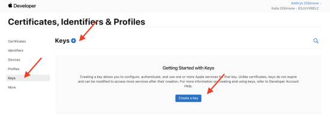

3. In the form that appears, click the checkbox for enabling "Apple Push Notifications service (APNs)" and enter a name for the key such as "Nightscout". Then click the "Continue" button in the upper right of the screen.

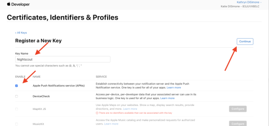

4. In the screen that follows, click the blue "Register" button.

5. In the screen that follows, click the blue "Download" button. This step will download a file with a name that starts with "AuthKey" and ends with ".p8".

6. Find your AuthKey download in your downloads folder. Double-click to open it and you will be presented a message asking how you'd like to open it. Click on "Choose Application..." and then select "TextEdit" as your application to open it with.

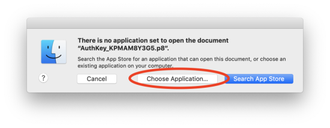   

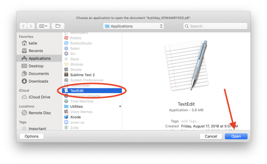

7. When the file opens, it will look similar to the screenshot below. In a few minutes, after we do a few other steps first, we will need to highlight **ALL OF THE CONTENTS** of that file and copy it because we will be pasting it in Heroku. Yes, allllll of the contents. So, easiest way is to click inside that file and then press `command-a` to highlight all the text and then `command-c` to copy it all to the clipboard. You don't have to do it right now...just keep that window open in the background for now until we need it a little further down. Then we will copy all that text.

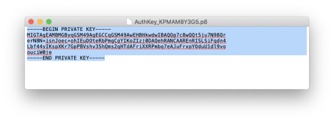

## Step 3: Update Nightscout site

You'll need to update your Nightscout site to use the latest version of cgm-remote-monitor. It is called Ketchup and the version number is 13.0.1. You can check your version number by looking at the bottom of your NS site's settings, near where the authentication button is located. The easiest way to do to update your Nightscout site is to follow the steps in the video below.

!!!danger

    Use this video for an easy process to update your Nightscout site:
    
    [**Easy Nightscout Update Video**](https://youtu.be/C0edTQhO21g)
    
    A quick note about the video instructions:
    
    If you don't see any branches to select to deploy and are missing the deploy button when you get to that step...you need to do one easy step. Select/click the "GitHub" icon from the middle of your Heroku screen. Then enter your GitHub account name to connect to that account. Once connected to your account, enter `cgm-remote-monitor` as the repo you'd like to use to connect with specifically. That will fix the issue and you'll then see the deploy buttons like in the video.

Once you have your Nightscout deployment updated to the latest master branch of cgm-remote-monitor, now we need to add a couple new variables.

Go to the `Settings` tab near the top of the screen on your Heroku app and then click on `Reveal Config Vars`.

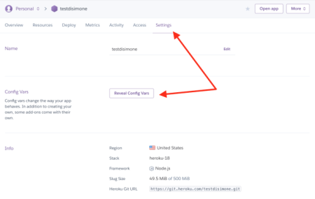

Scroll down the bottom of the Config Vars lines until you find the last blank one.  You are going to add three new rows of config vars for remote overrides as shown below:

| KEY                      | VALUE                                                                                                                                                                                                                                                                                                                        |
| ------------------------ | ---------------------------------------------------------------------------------------------------------------------------------------------------------------------------------------------------------------------------------------------------------------------------------------------------------------------------- |
| LOOP_APNS_KEY          | enter ENTIRE contents of the downloaded .p8 file including the BEGIN and END lines. Here's where you can use the `command-a` and `command-c` to hightlight and copy all the text in that file so you can paste it into Heroku here for this new variable you are creating. 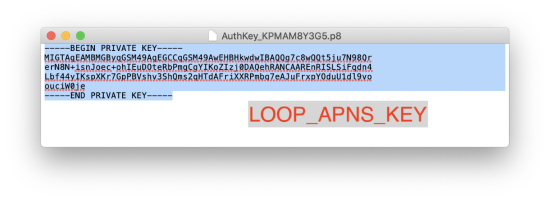 |
| LOOP_APNS_KEY_ID       | string of characters on the .p8 download file immediately following the underscore (  _  ) and not including the file extension ( .p8 ), or you can get it from your saved key in your developer account as shown next step, too 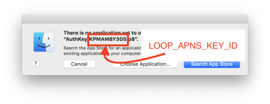                                                   |
| LOOP_DEVELOPER_TEAM_ID | get this value from Loop app signing or in your developer account's top right corner under your name 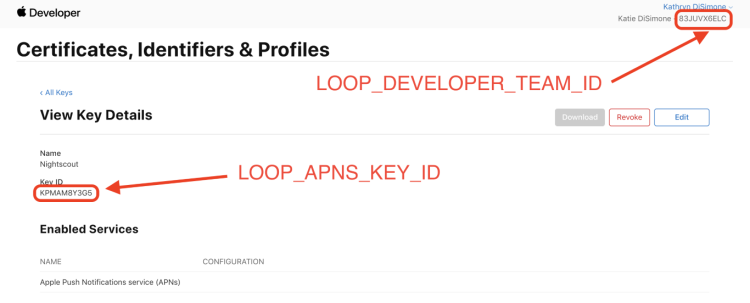                                                                                                                                                                                 |

When executed properly, you should have something that looks like this for your three new variables that you added:

## Step 4: FAQs on Remote Overrides

Don't forget to read Loopdocs pages about how regular overrides work. For remote overrides in particular:

1. **Can I set different override in Nighscout than I have programmed into Loop app?** Answer: No. You will only be able to enact override presets already programmed into the Loop app.
2. **If I didn't start the override in Nightscout (it was started in Loop itself), can I still use Nightscout to cancel it?** Answer: Yes. You can cancel a Loop-set override with a Nightscout-set cancel "temporary override" command in careportal.
3. **"Can I override a Loop-set override with a Nightscout-set override?"** Answer: Yes.
4. **If I have multiple Nightscout sites because I have multiple kiddos with T1D looping, do I need multiple APNs Keys?** Answer: No. If you have multiple kids looping, you can use the one APNs key in each of their Nightscout sites.
5. **How can I tell if it worked?** Answer: You should see your override pill in Nightscout, with the NEXT Loop cycle, reflecting that the desired override action took place. If you are near the Loop app, you should see the new override within less than 30 seconds or so.
6. **Can I set see on Nightscout when a temporary override has been set using the looper’s phone?** Yes. There will be a grey bar with the name of the override noted and the Loop Pill will display the targets and duration. Remember, there is a KNOWN issue with the grey bars, so use the pill as your best guide.

7. **Can a looper cancel a remote override**? Yes. They can tap the heart icon in Loop so that it is no longer highlighted. This turns off the override, regardless of where it was initiated.

8. **I set a remote override in Nightscout but the looper tapped the heart symbol in the Loop app, so the override turned off. Will the override get reinstated next time Loop completes with internet access?** No. The APN is only sent once. You can set the remote override again if need be.

9. **Can I schedule a remote override ahead of time using Nightscout?** No. When you set a remote override in Nightscout, it will begin immediately and last for whatever duration is programmed for that override in the Loop app. You can set an override for ahead of time using the Looping App only.

## Step 5: Using Remote Overrides

There are three ways you can trigger your override presets remotely; careportal, Shortcuts, and IFTTT.

### Careportal

To use remote overrides, I'm assuming you've setup your Nightscout site according to the directions [here](new_user.md#step-4-setup-your-heroku-nightscout-app) in Loopdocs. Especially the part about your ENABLE line including "override careportal loop" (in addition to other variables you'd be interested in). You'll also need to have your site authenticated so that your careportal is active to send remote overrides. You can authenticate your site by selecting the three horizontal lines in the upper right corner of your Nightscout site and scrolling to the bottom of the settings. There's an "authenicate" link at the very bottom. Once authenticated by entering your API Secret, then there will be a `+` in the upper right corner of your site. That is your careportal. Tap the careportal `+` and then scroll down in the "event type" menu to find "Temporary Override". Within there, you will find all your Loop override presets already loaded for you.

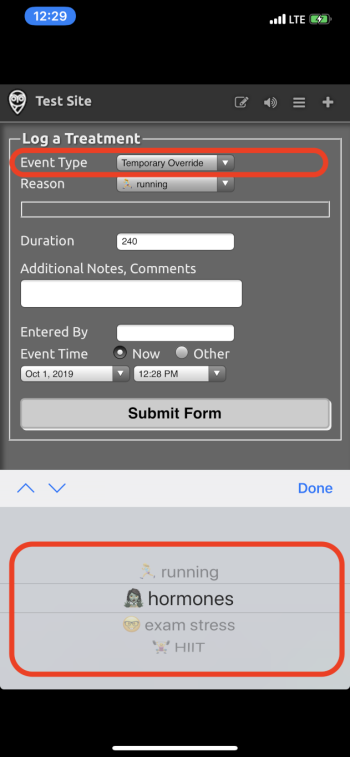

The Looper will see a banner notification that an override has been set (or canceled, as the case may be).

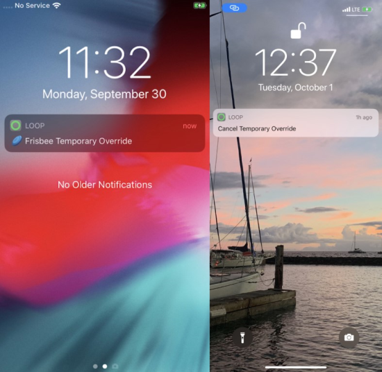

Canceling an override through Nightscout careportal is as simple as selecting the event type "Temporary Override Cancel" and submitting.

### Shortcuts

If you want to make your life SUPER AMAZING, check out using the iPhone's Shortcuts app. The Shortcuts app is for making little automations (like mini apps) that can integrate parts of your life. In this case, we've written a couple shortcuts for you that integrate Loop overrides with Nightscout.

!!!info "Important note" Before you click that download below...save some trouble. Download the Shortcuts app if you don't have it yet and choose to run any shortcut from the Gallery. It can be the laundry timer...I don't care, just pick one and run it.  THEN go to download the shortcut of your choice below. The shortcuts that aren't run through the Gallery option are called "untrusted". And you need a slider in your iPhone to trust the "untrusted" shortcuts you would be downloading here. But...in lovely iOS glitch...that slider doesn't appear unless you've run a trusted shortcut first. So, run one now. Then you'll have the slider in iPhone Settings, Shortcuts app to turn "Allow Untrusted Shortcuts" on when you will see a message "This shortcut cannot be opened because your Shortcuts security system settings don't allow untrusted shortcuts."

Click these links on your iphone and you'll be prompted to download the premade shortcuts (assuming you open the links in Safari browser in iPhone):

[Comprehensive Loop Shortcut](https://www.icloud.com/shortcuts/b8c0998a61e54b6eba2325fa78b4cf3a) *includes Set Remote Override, Cancel Override, Loop Troubleshooting Tips, Quick Text options, Manual BG entry, Bookmarks to websites, etc.*

And if you want to save one click to get to these one functions more directly: these shortcuts are simplified to offer only one function:

[Set Remote Override only shortcut](https://www.icloud.com/shortcuts/d52d7aefb62b47c1b2e71d3724a3b5ab)

[Cancel Override only shortcut](https://www.icloud.com/shortcuts/27be8282bce3433b83b4751cd8c43f6e)

**A couple notes about these shortcuts:**

1. You will need iOS 13 at a minimum on the phone you'd like to trigger these shortcuts from. Looper's phone can still be lower than iOS 13, but your phone as the shortcut user would need iOS 13.
2. You need to open those links in the Safari browser on your iPhone. When you do that click the button to get the shortcut. Then wait a bit, and the shortcut's inner guts will be there...scroll ALL the way down to the bottom to click the button to save the untrusted shortcut.
3. When you enter your Nightscout URL in the "URL" field of the Loop shortcut setup, make sure you don't include a trailing "/" or the API calls to Heroku will error out.
4. When a remote override is set properly, you'll see an "ok" message displayed. If there is an error, you'll see an error message. Most errors will be that you have an API secret wrong (make sure there isn't a space at the end of you API Secret that you don't see) or you failed to do the steps to setup NS and update your Loop app as described in steps 1-3 above.
5. You can absolutely customize these bits and pieces within the shortcut. Change the text messages, change the links...totally up to you.

### IFTTT

If you want to walk uphill both ways in the snow carrying bags of uneven groceries, you can also set overrides remotely by [setting up IFTTT](ifttt.md), too.

## Step 6: Known Issues

Just a brief mention so you are aware:

1. The override pill will display information about what override is currently active in the Looper's phone. BUT, there can be a slight delay as that information is only transmitted every 5 minutes at best (it is tied to Loop runs and Nightscout upload events in Loop). So, wait 5 minutes to see that the information has gone through a refresh cycle before assuming the override message failed to enact.
2. When you add a new override preset in Loop, that preset has to be uploaded to Nightscout before it will be available as a remote override. To trigger that upload, you can simply enact that new override for a few seconds and turn it off again. that will get the Nightscout upload going.

## Step 7: Common Errors

Once you've set up remote overrides, you may encounter errors when trying to run them via Nightscout or iOS Shortcuts.  Below are the most common and the typical solutions.

1. **Error: Loop notification failed: Could not find deviceToken in loopSettings** You might see this in either Nightscout or Shortcuts.  The error is most commonly caused by 3 issues: incorrect version of Loop, Loop is not pointing to the right Nightscout instance, or you haven't yet run an override locally (with the Loop app) before trying to run one remotely.  **Solution:** check you have the latest version of the Dev branch installed, confirm the Loop app is pointing to the right Nightscout site (and there are not extra spaces or a slash (/) at the end, and always run an override for a few seconds in the Loop app before you try to run one remotely.
2. **Error: cannot POST/api/v2/notifications/loop** You might see this in iOS Shortcuts.  This means Nightscout is not updated correctly and you are running a version of Nightscout that doesn't yet support remote overrides.  **Solution:** Follow the steps above again on how to update to the version of Nightscout that supports remote overrides.
3. **Error: {“status”:401,”message”:”Unauthorized”,”description”:Invalid\\/Missing”}** You might see this in iOS Shortcuts.  This is caused by having the incorrect API Secret in the Shortcut.  **Solution:** Double check the API Secret is correct and that there are no spaces at the end.
4. **Error: APNs delivery failed: InvalidProviderToken** You might see this in either Nightscout or Shortcuts.  This is caused because your LOOP_APNS_KEY_ID and LOOP_DEVELOPER_TEAM_ID are swapped in Heroku.  **Solution:** Double check what's listed in your Apple Developer Account and compare to the config variables in Heroku. Your Team_ID is next to your name in the top right corner.  The other code is your Key_ID. Get the IDs in the correct location in Heroku to resolve the error.
